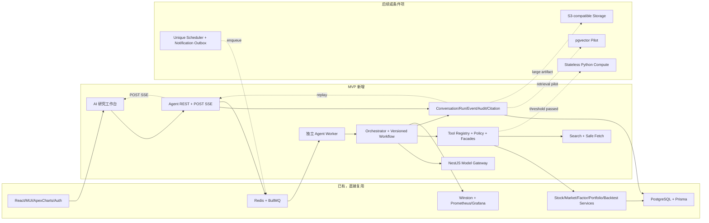

# 股票与量化 AI Agent 可落地方案

> 设计基线：2026-07-19。方案来自当前 NestJS 仓库、同级 React 前端、Prisma schema/migrations、运行中 PostgreSQL/Redis/Docker 和 Tushare 同步代码的实仓扫描；不是通用模板。实施从 [Batch 000](./tasks/batches/batch-000-platform-data-readiness.md) 与 [Batch 001](./tasks/batches/batch-001-agent-public-contracts.md) 开始。

## 1. 项目目标

在现有股票/量化系统中增加一个可审计、可恢复、受权限控制的 AI 研究工作台，完成内部金融数据查询、确定性量化计算、联网信息融合、多模型适配、会话/引用保存和流式展示；后续扩展定时研究、通知、报告和显式记忆。

系统不做自动交易。模型不接触 Prisma、SQL、Redis、文件系统、Tushare 管理接口或任意 URL；所有数据能力只能通过白名单 Tool Facade。

## 2. 当前项目结论摘要

- 后端是 NestJS 11 + Prisma 6 + PostgreSQL 17 + Redis/BullMQ 的模块化单体；业务 API 有 26 个 Controller、315 个端点，全部使用非空路径 POST。健康/就绪/指标是基础设施 GET 例外。
- 前端位于同级 `../client-code`，是 React 19 + TypeScript + Vite + MUI 7 + ApexCharts；认证 Fetch client、图表、Markdown 和路由可复用，但需要 POST Fetch-SSE reader 和 Agent feature state。
- Prisma 有 111 个 Model；运行库 111 张业务表、41 GB、332 个索引、22 个外键、无分区/pgvector。日线、估值、技术因子和筹码表已达千万级。
- Tushare 有 65 个计划驱动同步任务；当前 API、Worker、Scheduler 和 WebSocket 共进程，多副本没有分布式唯一调度。
- 已实证上线阻断：migration 链缺 10 张表 CREATE；周/月 `pct_chg` 与日线相差 100 倍单位；Dividend 16,260 条冗余；retry 假成功；QFQ 公式反向；财报/回测存在公告日前视、幸存者和 universe 缺陷；WebSocket 存在匿名连接、空 secret 回退路径和越权订阅风险。
- 现有 Docker 开发栈可运行；生产健康路径、`.dockerignore`、migration job、非 root 文件权限、Chromium、Redis eviction/ACL、多副本和备份/灰度尚未闭环。

证据、真实路径和数据量见 [当前项目分析](./overview/current-project-analysis.md) 与 [数据能力盘点](./overview/data-capability-inventory.md)。

## 3. 推荐架构与 Agent 模式

推荐“现有 NestJS 内的单个受控研究 Agent + 显式版本化工作流 + 白名单 Tool + BullMQ Worker”。PostgreSQL 是会话、Run、checkpoint、事件、Tool/模型调用、来源和引用的权威源；Redis 只负责队列、租约、实时加速与缓存。



关键选择：

| 问题 | 决策 |
| --- | --- |
| 编排位置 | 现有 NestJS `src/apps/agent/`，Worker 可独立进程部署 |
| Agent 模式 | 单 Agent；固定工作流节点和有限 Tool loop，不做自治多 Agent |
| LangGraph | MVP 不引入；复杂图/人工中断达到量化阈值再复审 |
| 工作流 | 自研小型显式状态机：版本、checkpoint、取消、重试、事件；不做通用 BPM/DSL |
| 模型网关 | NestJS 内部 DI Module；先 OpenAI-compatible adapter，后续再多供应商，不先拆服务 |
| Python | MVP 不需要；CPU/科学库 benchmark 通过才建无状态计算服务，禁止直连主库 |
| 向量数据库 | MVP 不需要；结构化金融数据走 SQL/Tool，报告/记忆先 FTS，后续只试点 pgvector |
| 消息队列 | 需要；复用 BullMQ，Agent 独立 queue/worker，生产 Redis 使用 noeviction/最小 ACL |
| SSE/WS | 正文和步骤走 POST SSE；WS 修复强鉴权后只做低频通知/多设备失效 |
| SQL | 无 Text-to-SQL MVP；条件试点也只能结构化计划→AST allowlist→只读副本 |

完整理由见 [技术选型](./overview/technology-selection.md) 和 [ADR](./decisions/README.md)。

## 4. 数据流概览

1. React 发送 `messages/send`；API 在一个事务中追加用户/assistant 占位消息、Run、初始事件和投递意图。
2. BullMQ Worker 按 `runId` 获取数据库 lease，恢复冻结的 workflow/prompt/model/tool policy 版本。
3. Orchestrator 产生结构化计划；Policy 验证角色、scope、预算、次数、参数和资源归属。
4. Tool 通过真实领域 Facade 查询金融数据或执行确定性计算；搜索先 `search_web`，抓取只接受签名 URL token。
5. 每个 Tool/模型/来源/引用与状态事件先持久化；模型只接收有界事实包，不接数据库原语。
6. POST SSE 从 `AiRunEvent` 重放并 tail；刷新或断线按 sequence 恢复。
7. 前端只渲染白名单内容块并显示来源、数据截止、单位、复权、质量和风险。

流程细节见 [Agent 工作流](./overview/agent-workflow-design.md) 与 [公共协议](./api/README.md)。

## 5. MVP 范围

MVP 对应 [Batch 000–018](./tasks/README.md)：

- 会话/消息/Run/Step/Event/Tool/模型/来源/引用持久化。
- OpenAI-compatible Model Gateway + fake provider。
- Tool Registry/Policy/审计与 15 个只读 Tool。
- 股票/市场/财务/资金流/自选/组合/已有回测查询，绩效和估值分位确定性计算，受控搜索/抓取。
- 单个版本化研究 workflow、独立 BullMQ Worker、取消/超时/恢复/有限重试。
- 全 POST REST、POST Fetch SSE、事件重放。
- React AI 会话、Tool/引用、Markdown/Table/Chart/Kline/Financial/Risk 展示。
- 金融 golden case、跨租户、注入/SSRF、模型回归和端到端测试。

MVP 明确不做：多 Agent、独立 Python、向量库、任意 SQL、模型自由提交回测、自动交易、外部群发、自动长期记忆、任意网页浏览或模型生成 UI 配置。

## 6. 第一批 Tool

```text
resolve_security                 get_stock_price_history
get_stock_overview               get_financial_statements
get_financial_indicators         get_stock_moneyflow
get_market_snapshot              get_sector_membership
get_user_watchlist               get_portfolio_risk
get_backtest_result              compute_performance_metrics
compute_valuation_percentile     search_web
fetch_web_page
```

`save_research_report` 是后续需确认的写 Tool；Schedule/Notification 使用结构化 API/workflow command，不让模型自由调用。定义、Schema、真实 Service/Model 和门禁见 [Tool 方案](./tools/README.md)。

## 7. 复用、改造与新增

直接复用：Auth/JWT/roles/user context、`Stock*Service`、`MarketService`、Index/Industry/Factor、Portfolio/Watchlist/Backtest、Report/ResearchNote、Notification、Prisma、Cache、BullMQ、Winston、Prometheus/Grafana、前端 Auth client/MUI/ApexCharts/Markdown。

必须改造：领域 Module 只读 Facade exports；财报/概览 point-in-time；行情单位/QFQ；回测 universe/公告时点；WebSocket 鉴权/ACL/adapter；Scheduler 唯一执行；Redis/Worker 隔离；报告异步存储；Transform/metrics 支持 raw stream；生产 Docker/migration/权限/健康；前端 API reader 和 K 线公共组件。

必须新增：`src/apps/agent/`、`src/apps/web-search/`、`src/queue/agent/`、Agent Prisma models/migrations、前端 `src/sections/agent/`/`src/api/agent/`/`src/types/agent/`、Agent metrics/evaluation 和生产 StoragePort。

建议 MVP 后端目录见 [总体架构](./overview/architecture-overview.md)，精确新增/修改文件由 [30 个批次](./tasks/README.md) 负责。

## 8. 实施阶段与并行

| 阶段 | 批次 | 完成能力 |
| --- | --- | --- |
| 可信基线 | 000–001 | migration/数据口径 gate，公共契约 |
| MVP 基础 | 002–010、前端 015–017 并行 | 状态/审计/模型/Tool、前端 UI |
| MVP 汇合 | 011–014 → 018 | 编排、Worker、API/SSE、E2E 闭环 |
| 主动研究 | 019–023、025、029 | 记忆、定时、通知、报告、多模型、观测、可信回测 |
| 生产 | 026 | 安全、扩容、存储、备份、灰度/回滚 |
| 条件 | 024、027、028 | Python、pgvector、SQL；只在门禁通过时实施 |

最先并行：000（数据库/Tushare）与 001（协议）；随后 002/004/015，之后 005/006/016，再让 007–010 与 017 并行。完整路线见 [实施路线](./overview/implementation-roadmap.md) 和 [依赖图](./tasks/dependency-map.md)。

## 9. 已确认与尚未确认

已确认：真实前后端位置和技术栈；111 个 Model/业务表；核心表数据量/覆盖；65 个同步计划；业务全 POST 约定；认证/Redis/队列/WS/监控/Docker 现状；上述迁移、单位、重复、点时、回测、WS 和部署风险；MVP 技术决策和批次 DAG。

尚未确认（对应批次有 discovery gate）：

- 首个正式模型、第二模型供应商、区域/数据保留/训练使用政策与实际价格表。
- 搜索供应商、抓取合规/robots/版权保留策略。
- 外部通知首渠道、对象存储产品、secret manager 和生产域名/TLS/Ingress。
- 生产并发、单用户/全局成本额度、日志/会话/事件/审计保留期限。
- 部分 Tushare 自然键是否已经丢源记录；未调用在线 API 消耗积分核验。
- Python、pgvector、SQL Explorer 是否有足够收益；当前默认答案均为“不需要”。

这些不确定项不阻塞供应商无关的接口、fake provider 和 MVP 内核。

## 10. 关键风险与十个易错点

1. fresh migration 缺表，却在已有库用 `db push` 看似正常。
2. 周/月 `pct_chg` 与日线单位不同，收益出现 100 倍误差。
3. QFQ 公式、最新因子排序或复权截止日错误。
4. 财报按报告期而非公告可用日查询，产生前视。
5. ALL_A 用当前上市状态、指数退出不剔除、策略忽略 universe，产生幸存者偏差。
6. 模型得到 SQL/Prisma/userId/任意 URL，形成越权或注入。
7. SSE 先发布后落库，断线无法 replay；或把 Redis 当权威状态。
8. 多副本 cron/通知无唯一键和水位 gate，重复执行或读半同步数据。
9. WebSocket 匿名/空 secret/只按 jobId 订阅，泄露其他用户结果。
10. 过早引入多 Agent、LangGraph、Python、向量库和独立网关，端到端审计反而未完成。

完整安全 gate 见 [安全与风险控制](./overview/security-and-risk-control.md)。

## 11. 推荐阅读顺序

1. 本文。
2. [当前项目分析](./overview/current-project-analysis.md) 与 [数据能力盘点](./overview/data-capability-inventory.md)。
3. [总体架构](./overview/architecture-overview.md)、[技术选型](./overview/technology-selection.md)、[ADR](./decisions/README.md)。
4. 负责前端读 [前端方案](./frontend/README.md)；负责后端读 [后端方案](./backend/README.md)；数据库读 [数据库方案](./database/README.md)。
5. 所有人以 [API](./api/README.md)、[Tool](./tools/README.md)、[工作流](./workflows/README.md) 为公共语义。
6. 实施前读 [路线](./overview/implementation-roadmap.md)、[任务](./tasks/README.md)、[依赖](./tasks/dependency-map.md) 和 [验收标准](./tasks/acceptance-criteria.md)。

## 12. 完整文档导航

### 总览

- [总体架构](./overview/architecture-overview.md)
- [当前项目分析](./overview/current-project-analysis.md)
- [数据能力盘点](./overview/data-capability-inventory.md)
- [Agent 工作流设计](./overview/agent-workflow-design.md)
- [技术选型](./overview/technology-selection.md)
- [安全与风险控制](./overview/security-and-risk-control.md)
- [实施路线](./overview/implementation-roadmap.md)

### 前端

- [前端入口](./frontend/README.md)
- [前端架构](./frontend/architecture.md)
- [交互流程](./frontend/interaction-flow.md)
- [流式协议消费](./frontend/streaming-protocol.md)
- [状态管理](./frontend/state-management.md)
- [组件设计](./frontend/component-design.md)
- [图表与数据可视化](./frontend/chart-and-data-visualization.md)
- [错误与恢复](./frontend/error-and-recovery.md)
- [API 接入](./frontend/api-integration.md)

### 后端

- [后端入口](./backend/README.md)
- [后端架构](./backend/architecture.md)
- [Agent Orchestrator](./backend/agent-orchestrator.md)
- [模型网关](./backend/model-gateway.md)
- [Tool System](./backend/tool-system.md)
- [金融数据服务](./backend/financial-data-service.md)
- [量化计算服务](./backend/quantitative-compute-service.md)
- [联网搜索服务](./backend/web-search-service.md)
- [会话与记忆](./backend/conversation-and-memory.md)
- [定时任务与通知](./backend/scheduler-and-notification.md)
- [数据库设计](./backend/database-design.md)
- [API 设计](./backend/api-design.md)
- [可观测性](./backend/observability.md)
- [安全](./backend/security.md)
- [部署](./backend/deployment.md)

### Tool 与工作流

- [Tool 入口](./tools/README.md)
- [Tool 清单](./tools/tool-inventory.md)
- [Tool 开发标准](./tools/tool-development-standard.md)
- [Tool 公共类型](./tools/schemas/common-types.md)
- [内部数据 Tool Schema](./tools/schemas/internal-data-tools.md)
- [量化 Tool Schema](./tools/schemas/quantitative-tools.md)
- [联网研究 Tool Schema](./tools/schemas/web-research-tools.md)
- [Tool 错误](./tools/schemas/tool-errors.md)
- [工作流入口](./workflows/README.md)
- [交互对话](./workflows/interactive-chat.md)
- [股票研究](./workflows/stock-research.md)
- [市场新闻分析](./workflows/market-news-analysis.md)
- [定时研究](./workflows/scheduled-research.md)
- [条件预警](./workflows/alert-monitoring.md)
- [回测研究](./workflows/backtest-workflow.md)

### API 与数据库

- [API 入口](./api/README.md)
- [REST API](./api/rest-api.md)
- [SSE 事件](./api/sse-events.md)
- [WebSocket 事件](./api/websocket-events.md)
- [错误码](./api/error-codes.md)
- [状态模型](./api/state-model.md)
- [消息内容块](./api/content-blocks.md)
- [数据库入口](./database/README.md)
- [现有 Schema 分析](./database/existing-schema-analysis.md)
- [Agent Schema 变更](./database/proposed-schema-changes.md)
- [索引与性能](./database/indexes-and-performance.md)
- [数据 Lineage](./database/data-lineage.md)

### ADR

- [ADR 入口](./decisions/README.md)
- [ADR-001：编排位置](./decisions/adr-001-agent-orchestration-location.md)
- [ADR-002：SSE 与 WebSocket](./decisions/adr-002-sse-vs-websocket.md)
- [ADR-003：TypeScript/Python 边界](./decisions/adr-003-typescript-python-boundary.md)
- [ADR-004：Tool 访问控制](./decisions/adr-004-tool-access-control.md)
- [ADR-005：会话记忆](./decisions/adr-005-conversation-memory-strategy.md)
- [ADR-006：消息队列](./decisions/adr-006-message-queue-selection.md)
- [ADR-007：向量数据库](./decisions/adr-007-vector-database-necessity.md)
- [ADR-008：多 Agent](./decisions/adr-008-multi-agent-strategy.md)
- [ADR-009：模型网关边界](./decisions/adr-009-model-gateway-boundary.md)

### 任务

- [任务入口](./tasks/README.md)
- [依赖图](./tasks/dependency-map.md)
- [公共验收标准](./tasks/acceptance-criteria.md)
- [000 数据与迁移门禁](./tasks/batches/batch-000-platform-data-readiness.md)
- [001 公共契约](./tasks/batches/batch-001-agent-public-contracts.md)
- [002 会话消息 Schema](./tasks/batches/batch-002-conversation-and-message-schema.md)
- [003 审计引用 Schema](./tasks/batches/batch-003-agent-audit-and-citation-schema.md)
- [004 模型网关](./tasks/batches/batch-004-model-gateway-foundation.md)
- [005 Run 事件存储](./tasks/batches/batch-005-run-state-and-event-store.md)
- [006 Tool 内核](./tasks/batches/batch-006-tool-registry-and-policy.md)
- [007 股票市场 Tool](./tasks/batches/batch-007-stock-market-query-tools.md)
- [008 财务资金 Tool](./tasks/batches/batch-008-financial-fund-flow-tools.md)
- [009 确定性量化 Tool](./tasks/batches/batch-009-deterministic-quant-tools.md)
- [010 搜索与引用](./tasks/batches/batch-010-web-search-and-citations.md)
- [011 Orchestrator](./tasks/batches/batch-011-agent-orchestrator-workflow.md)
- [012 BullMQ Worker](./tasks/batches/batch-012-agent-bullmq-worker.md)
- [013 REST API](./tasks/batches/batch-013-conversation-rest-api.md)
- [014 POST SSE](./tasks/batches/batch-014-post-sse-stream-and-replay.md)
- [015 前端流客户端](./tasks/batches/batch-015-frontend-stream-client-and-contracts.md)
- [016 前端对话壳](./tasks/batches/batch-016-frontend-chat-shell.md)
- [017 富响应块](./tasks/batches/batch-017-frontend-rich-response-blocks.md)
- [018 MVP E2E](./tasks/batches/batch-018-mvp-e2e-and-model-regression.md)
- [019 摘要与记忆](./tasks/batches/batch-019-conversation-summary-and-memory.md)
- [020 定时任务](./tasks/batches/batch-020-scheduled-agent-tasks.md)
- [021 通知渠道](./tasks/batches/batch-021-outbound-notification-channels.md)
- [022 报告与日志](./tasks/batches/batch-022-research-report-and-investment-journal.md)
- [023 多模型路由](./tasks/batches/batch-023-multi-provider-routing-and-fallback.md)
- [024 Python 计算条件项](./tasks/batches/batch-024-python-quant-compute-service.md)
- [025 观测/成本/评测](./tasks/batches/batch-025-ai-observability-cost-and-evaluation.md)
- [026 安全与生产部署](./tasks/batches/batch-026-security-hardening-and-production-deployment.md)
- [027 向量检索条件项](./tasks/batches/batch-027-vector-retrieval-pilot.md)
- [028 受控 SQL 条件项](./tasks/batches/batch-028-controlled-sql-explorer.md)
- [029 回测点时性修复](./tasks/batches/batch-029-backtest-bias-and-adjustment-remediation.md)
