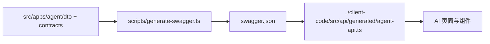

# Agent 公共协议

本目录是前后端唯一协议入口。实现时以后端 NestJS DTO + Swagger 为规范源，前端由 OpenAPI 生成类型；禁止手写第二套冲突类型。

## 导航

- [REST API](./rest-api.md)
- [SSE 事件](./sse-events.md)
- [WebSocket 事件](./websocket-events.md)
- [错误码](./error-codes.md)
- [状态模型](./state-model.md)
- [消息内容块](./content-blocks.md)

## 固定约定

- Controller 端点全部使用带非空路径的 `@Post('...')`；查询条件放 Body。
- JSON 响应沿用 `{ code, data, message? }`；SSE 为原始 `text/event-stream`，不经过 `TransformInterceptor`。
- Agent 新增资源 ID（conversation/run/message/event/citation 等）为不透明字符串。复用现有领域时保留真实类型：`Watchlist.id` 是整数，`Portfolio.id`/`BacktestRun.id` 是 cuid 字符串。时间戳为 ISO 8601 UTC；所有公共交易日/报告期参数使用 ISO `YYYY-MM-DD`，进入现有 Service/Tushare 边界时才转 `YYYYMMDD`。
- 金额必须同时给 `currency`、`unit`；比例必须给 `scale`（`PERCENT` 或 `DECIMAL`）。数据库 `null` 不转成 `0`。
- 每个回答块携带 `asOf`、`sourceType`、`citationIds`；模型推断不得标成数据库事实。

## 规范源和生成链

协议变化必须同批更新 DTO、本文档、Swagger 快照、前端生成类型及契约测试。
