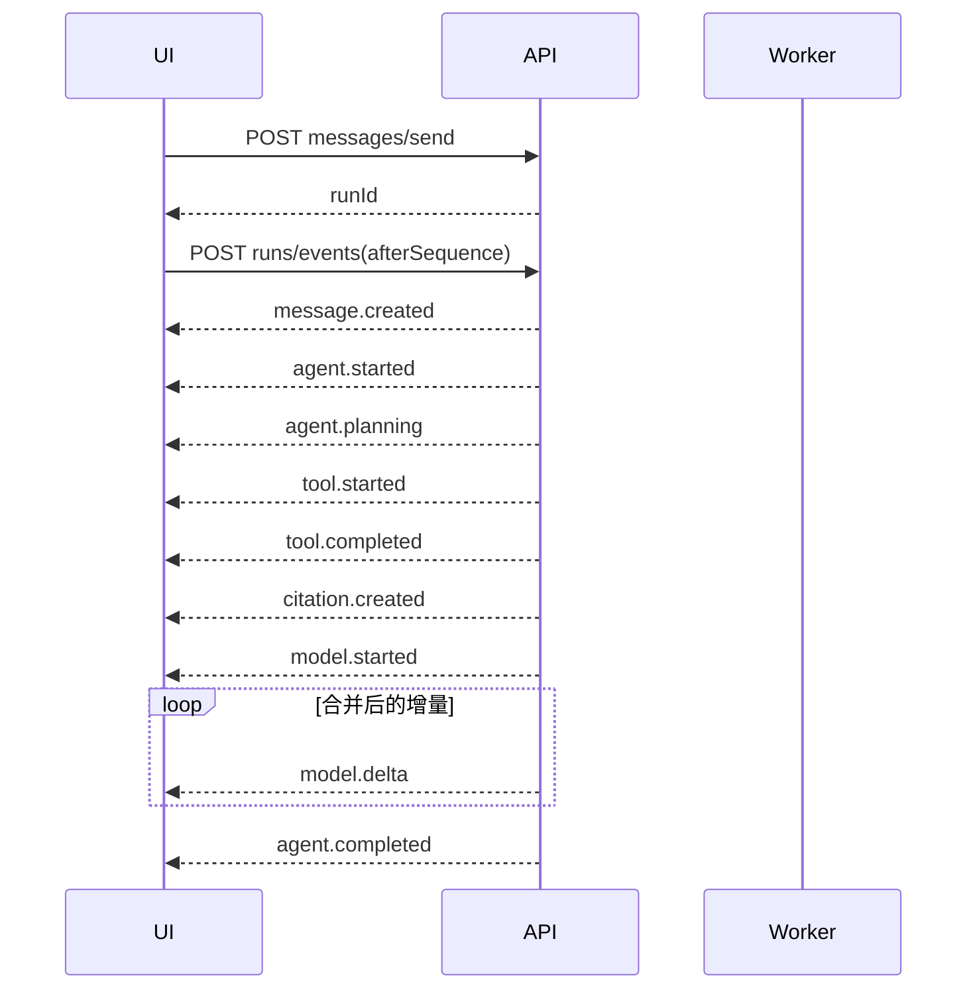

# SSE 流式协议

## 1. 连接方式

前端使用 `fetch('/api/agent/runs/events', { method: 'POST', headers, body, signal })`，逐行解析 SSE。不得使用原生 `EventSource`。服务端新增 `@RawStreamResponse()` 元数据，使原始流绕过 `TransformInterceptor`。

```text
id: 42
event: tool.completed
retry: 3000
data: {"schemaVersion":"1.0","eventId":"evt_01J...","sequence":42,"type":"tool.completed","runId":"run_01J...","conversationId":"cm_01J...","messageId":"msg_01K...","occurredAt":"2026-07-19T02:11:31.102Z","traceId":"tr_01J...","payload":{...}}

```

## 2. 公共事件结构

```ts
type AgentEvent<TType extends AgentEventType, TPayload> = {
  schemaVersion: '1.0'
  eventId: string
  sequence: number
  type: TType
  runId: string
  conversationId: string
  messageId?: string
  occurredAt: string
  traceId: string
  payload: TPayload
}
```

同一 Run 的 `sequence` 严格递增且唯一；并行 Tool 的完成顺序不保证，前端必须按 `sequence` 消费并用 `toolCallId` 归并。终态事件必为该 Run 最后一条业务事件。

## 3. 事件字典

| 事件 | 关键 payload | 说明 |
| --- | --- | --- |
| `message.created` | `messageId, role, status` | assistant 占位消息已持久化 |
| `agent.started` | `workflowKey, workflowVersion, modelPolicy` | Run 开始 |
| `agent.planning` | `intent, capabilities, planSummary` | 仅公开阶段摘要，不暴露隐藏推理 |
| `agent.progress` | `stepKey, label, completed, total` | 可确定进度；未知总量时 `total=null` |
| `tool.started` | `toolCallId, toolName, inputSummary, attempt` | Tool 输入已校验、权限已通过 |
| `tool.completed` | `toolCallId, outputSummary, rowCount, truncated, asOf, citationIds, durationMs` | 结构化结果完成 |
| `tool.failed` | `toolCallId, error, attempt, willRetry` | 不允许模型补造数据 |
| `model.started` | `modelCallId, provider, model, purpose` | 一次模型调用开始 |
| `model.delta` | `modelCallId, blockIndex, delta` | 仅可展示文本增量 |
| `citation.created` | `citation` | 引用完成验证并持久化 |
| `report.generated` | `reportId, title, format` | 研究报告已保存 |
| `agent.completed` | `finalMessageId, usage, cost, dataCutoff, warnings` | 成功终态 |
| `agent.failed` | `error, failedStep, retryable` | 失败终态 |
| `agent.cancelled` | `cancelledBy, reason` | 取消终态 |

错误结构：

```ts
type StreamError = {
  code: number
  message: string
  retryable: boolean
  category: 'VALIDATION' | 'AUTH' | 'MODEL' | 'TOOL' | 'SEARCH' | 'TIMEOUT' | 'INTERNAL'
  safeDetails?: Record<string, unknown>
}
```

## 4. 正常事件顺序



Tool 可多次、串行或并行出现。模型也可经历“规划模型 → Tool → 回答模型”多次调用。

## 5. 持久化与断点恢复

- `AiRunEvent` 保存所有状态、Tool、Citation、终态事件。
- `model.delta` 每 100 ms 或 1 KiB 合并一次再持久化，降低写放大；完整正文持续更新 `AiMessage.content`。
- 建议默认值（待合规确认）：热事件保留 7 天；终态/Tool/引用审计表按各自生命周期保存，生产上线前由数据保留、隐私和合规评审确认。
- 刷新后先查 Run 状态，再以 `Last-Event-ID` 或 `afterSequence` 重连。若事件已清理，服务端发当前快照后继续实时流。
- Header 和 Body 都传游标时，以 `Last-Event-ID` 对应 sequence 为准。
- 无业务事件 15 秒发送 `: heartbeat` 注释；heartbeat 不占 sequence、不落库。

## 6. 客户端幂等

- `eventId` Set 做短期去重，`sequence <= lastAppliedSequence` 直接忽略。
- `model.delta` 以 `(modelCallId, blockIndex, sequence)` 追加，禁止按文本内容去重。
- `tool.completed` 用 `toolCallId` 覆盖同一 Tool 卡片状态。
- 收到终态后关闭流；网络中断不等于 Run 失败。

## 7. 取消、超时和失败

取消请求成功后 UI 显示“正在取消”；直到 `agent.cancelled` 才进入终态。单 Tool 默认 10 秒、抓取 20 秒、模型调用 120 秒、交互 Run 180 秒；长任务进入 BullMQ 并显示可恢复进度。重试沿用相同 `toolCallId`/`modelCallId` 主记录并增加 `attempt`，不得重复产生业务写入。
