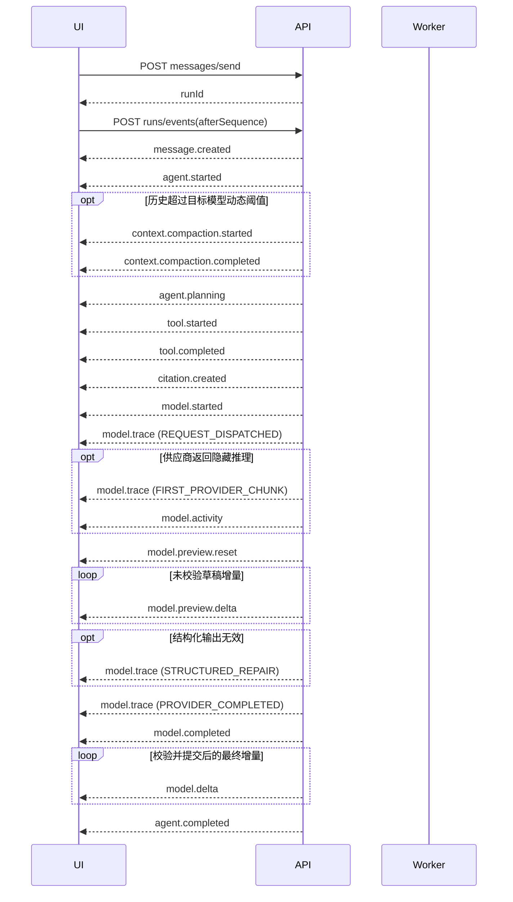

# SSE 流式协议

## 1. 连接方式

前端使用 `fetch('/api/agent/runs/events', { method: 'POST', headers, body, signal })`，逐行解析 SSE。不得使用原生 `EventSource`。服务端新增 `@RawStreamResponse()` 元数据，使原始流绕过 `TransformInterceptor`。

```text
id: evt_01J...
event: tool.completed
retry: 3000
data: {"schemaVersion":"1.0","eventId":"evt_01J...","sequence":42,"type":"tool.completed","runId":"run_01J...","conversationId":"cm_01J...","messageId":"msg_01K...","occurredAt":"2026-07-19T02:11:31.102Z","traceId":"tr_01J...","payload":{...}}

```

## 2. 公共事件结构

```ts
type AgentEvent<TType extends AgentEventType, TPayload> = {
  schemaVersion: '1.0'
  eventId: string
  sequence: number
  type: TType
  runId: string
  conversationId: string
  messageId?: string
  occurredAt: string
  traceId: string
  payload: TPayload
}
```

同一 Run 的 `sequence` 严格递增且唯一；并行 Tool 的完成顺序不保证，前端必须按 `sequence` 消费并用 `toolCallId` 归并。终态事件必为该 Run 最后一条业务事件。

## 3. 事件字典

| 事件                  | 关键 payload                                                                    | 说明                                      |
| --------------------- | ------------------------------------------------------------------------------- | ----------------------------------------- |
| `message.created`     | `messageId, role, status`                                                       | assistant 占位消息已持久化                |
| `agent.started`       | `workflowKey, workflowVersion, modelPolicy`                                     | Run 开始                                  |
| `agent.planning`      | `intent, capabilities, planSummary`                                             | 仅公开阶段摘要，不暴露隐藏推理            |
| `agent.progress`      | `stepKey, label, completed, total`                                              | 可确定进度；未知总量时 `total=null`       |
| `context.compaction.started` | `model, reason, estimatedTokens, targetTokens`                         | 正在按目标模型整理历史会话                |
| `context.compaction.completed` | `model, summaryVersion, sourceMessageCount, sourceTokenCount`          | 新摘要版本已安全提交                      |
| `context.compaction.failed` | `model, code, retryable, message`                                      | 会话整理失败；不包含原始消息或摘要正文    |
| `tool.started`        | `toolCallId, toolName, inputSummary, attempt`                                   | Tool 输入已校验、权限已通过               |
| `tool.completed`      | `toolCallId, outputSummary, rowCount, truncated, asOf, citationIds, durationMs` | 结构化结果完成                            |
| `tool.failed`         | `toolCallId, error, attempt, willRetry`                                         | 不允许模型补造数据                        |
| `model.started`       | `modelCallId, provider, model, purpose`                                         | 一次模型调用开始                          |
| `model.trace`         | 请求预算、首个供应商 chunk 类型、结构化修复、供应商完成原因                     | 可诊断生命周期；不含 Prompt、正文或推理   |
| `model.fallback`      | `fromProvider, fromModel, toProvider, toModel, reasonCode`                      | 尚无可见正文时切换模型                    |
| `model.activity`      | `modelCallId, phase, processedCharacters`                                       | 仅表示推理仍活跃，不含原始推理文字        |
| `model.preview.reset` | `modelCallId, attempt`                                                          | 新建或修复重试前清空未校验草稿            |
| `model.preview.delta` | `modelCallId, attempt, delta`                                                    | `markdown` 的未校验草稿增量，非最终答案   |
| `model.completed`     | `modelCallId, provider, model, usage, durationMs, repaired, finishReason`       | 模型输出已通过结构化校验                  |
| `model.failed`        | `modelCallId, provider, model, error, durationMs, willFallback`                 | 本次调用失败；可据此识别切换或最终失败    |
| `model.delta`         | `modelCallId, blockIndex, delta`                                                | 引用校验、落库完成后的权威最终正文增量    |
| `citation.created`    | `citation`                                                                      | 引用完成验证并持久化                      |
| `report.generated`    | `reportId, title, format`                                                       | 研究报告已保存                            |
| `agent.completed`     | `finalMessageId, usage, cost, dataCutoff, warnings`                             | 成功终态                                  |
| `agent.failed`        | `error, failedStep, retryable`                                                  | 失败终态                                  |
| `agent.cancelled`     | `cancelledBy, reason`                                                           | 取消终态                                  |

`model.trace` 是可诊断执行轨迹，按 `modelCallId + attempt` 展示。`REQUEST_DISPATCHED` 仅含消息数、输入估算、输出上限和模型窗口；`FIRST_PROVIDER_CHUNK` 仅含 chunk 类别；`STRUCTURED_REPAIR` 表示上一轮结构化结果无效；`PROVIDER_COMPLETED` 仅含 finish reason。它不允许包含 `reasoning_content`、hidden reasoning、Prompt、模型正文或其摘要。

`model.activity` 只允许保存规范化计数，不允许出现 `reasoning_content`、hidden reasoning、Prompt 或其摘要。`model.preview.*` 只用于等待体验，前端必须明确标注“引用校验前”，不得写入正式消息正文、引用或报告；收到首个 `model.delta` 或任一终态后立即清除。

错误结构：

```ts
type StreamError = {
  code: number
  message: string
  retryable: boolean
  category: 'VALIDATION' | 'AUTH' | 'MODEL' | 'TOOL' | 'SEARCH' | 'TIMEOUT' | 'INTERNAL'
  safeDetails?: Record<string, unknown>
}
```

## 4. 正常事件顺序


```mermaid
sequenceDiagram
  participant UI
  participant API
  participant Worker
  UI->>API: POST messages/send
  API-->>UI: runId
  UI->>API: POST runs/events(afterSequence)
  API-->>UI: message.created
  API-->>UI: agent.started
  opt 历史超过目标模型动态阈值
    API-->>UI: context.compaction.started
    API-->>UI: context.compaction.completed
  end
  API-->>UI: agent.planning
  API-->>UI: tool.started
  API-->>UI: tool.completed
  API-->>UI: citation.created
  API-->>UI: model.started
  API-->>UI: model.trace (REQUEST_DISPATCHED)
  opt 供应商返回隐藏推理
    API-->>UI: model.trace (FIRST_PROVIDER_CHUNK)
    API-->>UI: model.activity
  end
  API-->>UI: model.preview.reset
  loop 未校验草稿增量
    API-->>UI: model.preview.delta
  end
  opt 结构化输出无效
    API-->>UI: model.trace (STRUCTURED_REPAIR)
  end
  API-->>UI: model.trace (PROVIDER_COMPLETED)
  API-->>UI: model.completed
  loop 校验并提交后的最终增量
    API-->>UI: model.delta
  end
  API-->>UI: agent.completed
```

Tool 可多次、串行或并行出现。模型也可经历“规划模型 → Tool → 回答模型”多次调用。

## 5. 持久化与断点恢复

- `AiRunEvent` 保存所有状态、Tool、Citation、终态事件。
- `model.trace`、`model.completed`、`model.failed` 仅持久化受控模型元数据、用量和规范化错误；原始 `reasoning_content` 在 Provider Adapter 内丢弃，不进入公共 chunk、事件、审计或消息。
- `model.activity` 只按阈值稀疏持久化累计字符数。
- `model.preview.delta` 从结构化输出的根级 `markdown` JSON string 增量提取，单事件最大 2 Ki 字符、单次预览最大 8,000 字符；结构化修复用递增 `attempt` 和 `model.preview.reset` 隔离旧草稿。
- `context.compaction.*` 只保存模型、token 计数、摘要版本、来源数量和安全错误，不保存原始消息、摘要正文、Prompt 或隐藏推理。
- `model.delta` 在引用校验和引用落库完成后，于终态事务内按 UTF-8 不超过 1 KiB 分块持久化；完整权威正文写入 `AiMessage.content`。
- 建议默认值（待合规确认）：热事件保留 7 天；终态/Tool/引用审计表按各自生命周期保存，生产上线前由数据保留、隐私和合规评审确认。
- 刷新后先查 Run 状态，再以 `Last-Event-ID` 或 `afterSequence` 重连。若事件已清理，服务端发当前快照后继续实时流。
- SSE `id` 固定为持久事件的 `eventId`。服务端只在 Body 指定的同一 `runId` 内解析 `Last-Event-ID`，再映射为权威 sequence；跨 Run 或不存在的 eventId 返回 400。
- Header 和 Body 都传游标时，以 `Last-Event-ID` 对应 sequence 为准。
- 无业务事件 15 秒发送 `: heartbeat` 注释；heartbeat 不占 sequence、不落库。

## 6. 客户端幂等

- `eventId` Set 做短期去重，`sequence <= lastAppliedSequence` 直接忽略。
- `model.delta` 以 `(modelCallId, blockIndex, sequence)` 追加，禁止按文本内容去重。
- `model.preview.delta` 仅在 `(modelCallId, attempt)` 相同时追加；`model.preview.reset` 替换旧预览，正式 `model.delta` 开始后不再展示预览。
- `tool.completed` 用 `toolCallId` 覆盖同一 Tool 卡片状态。
- 收到终态后关闭流；网络中断不等于 Run 失败。

## 7. 取消、超时和失败

取消请求成功后 UI 显示“正在取消”；直到 `agent.cancelled` 才进入终态。单 Tool 默认 10 秒、抓取 20 秒、模型调用 120 秒、交互 Run 180 秒；长任务进入 BullMQ 并显示可恢复进度。重试沿用相同 `toolCallId`/`modelCallId` 主记录并增加 `attempt`，不得重复产生业务写入。
