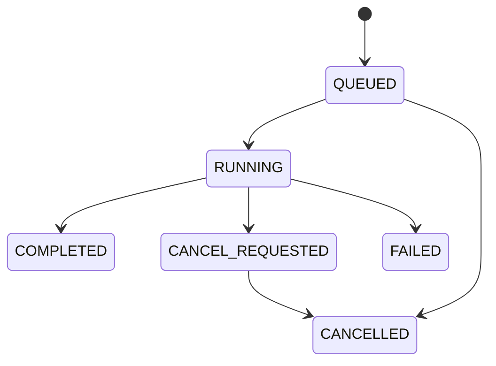

# Agent 状态模型

本文是会话、消息、Run、Step、Tool 和模型调用状态的公共定义。数据库枚举、SSE payload、REST response 和前端 reducer 必须由同一契约生成。

## 状态定义

```ts
type ConversationStatus = 'ACTIVE' | 'ARCHIVED'

type MessageStatus =
  | 'PENDING'
  | 'STREAMING'
  | 'COMPLETED'
  | 'FAILED'
  | 'CANCELLED'

type AgentRunStatus =
  | 'QUEUED'
  | 'RUNNING'
  | 'CANCEL_REQUESTED'
  | 'COMPLETED'
  | 'FAILED'
  | 'CANCELLED'

type AgentStepStatus =
  | 'PENDING'
  | 'RUNNING'
  | 'COMPLETED'
  | 'FAILED'
  | 'CANCELLED'
  | 'SKIPPED'

type ToolCallStatus =
  | 'PENDING'
  | 'AUTHORIZING'
  | 'RUNNING'
  | 'RETRY_WAIT'
  | 'SUCCEEDED'
  | 'FAILED'
  | 'CANCELLED'
  | 'REJECTED'

type ModelCallStatus =
  | 'PENDING'
  | 'STREAMING'
  | 'RETRY_WAIT'
  | 'SUCCEEDED'
  | 'FAILED'
  | 'CANCELLED'
```

## Run 转换



`COMPLETED`、`FAILED`、`CANCELLED` 是终态。重试不把同一 Run 从终态改回运行态；显式 retry/regenerate 创建新 attempt 或新 Run，并保留旧记录。

## 不变量

- 状态转换必须同时写 `statusVersion` 和对应持久事件；乐观锁失败返回冲突。
- Run 在 Tool/模型执行期间仍为 `RUNNING`；当前节点与等待对象由 Step/ToolCall/ModelCall 状态表达，避免并行调用使 Run 状态歧义。
- `CANCEL_REQUESTED` 后迟到的 Tool/模型结果可审计，但不能把 Run 或 Message 改为 completed。
- Message 的 `STREAMING` 只表示已提交的增量可见；完整内容块在完成事务中验证。
- Tool/Model 每次 retry 增加 `attempt`；主 `toolCallId/modelCallId` 稳定，不重复计算业务副作用或费用。
- Step `SKIPPED` 只由 workflow 条件边产生，必须记录 reason code。
- 前端只根据上述状态和 [SSE 事件](./sse-events.md) 更新，不根据展示文本猜状态。

## 状态与事件映射

| 事件 | Run | Message/调用 |
| --- | --- | --- |
| `message.created` | `QUEUED` | assistant `PENDING` |
| `agent.started` | `RUNNING` | assistant `STREAMING` |
| `tool.started` | `RUNNING` | Tool `RUNNING` |
| `tool.completed` | `RUNNING` | Tool `SUCCEEDED` |
| `tool.failed` + `willRetry=true` | `RUNNING` | Tool `RETRY_WAIT` |
| `model.started` | `RUNNING` | Model `STREAMING` |
| `agent.completed` | `COMPLETED` | assistant `COMPLETED` |
| `agent.failed` | `FAILED` | assistant `FAILED` |
| `agent.cancelled` | `CANCELLED` | assistant/active call `CANCELLED` |
