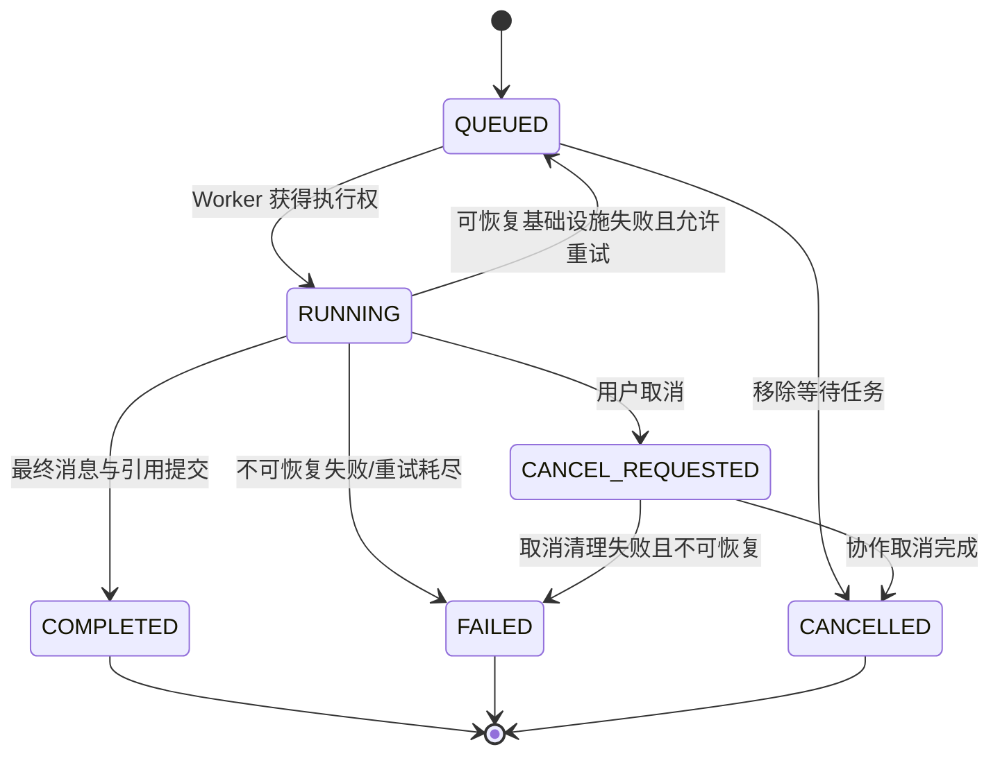

# Agent Orchestrator 设计

## 1. 职责

`AgentOrchestratorService` 是单次 Run 的应用级协调器，负责加载固定版本、推进状态机、调用 Model Gateway/Tool Registry、写检查点、响应取消并生成终态。它不负责：

- 直接查询 Prisma 或现有金融表。
- 直接调用模型供应商 SDK、搜索 API 或任意网页 URL。
- 在 Prompt 中实现权限、成本或数据范围限制。
- 暴露模型隐藏推理；只发布可展示的阶段摘要。
- 自由创建子 Agent 或让模型递归委派。

## 2. 输入与输出

运行入口只接收不可变标识：

```ts
type ExecuteRunCommand = {
  runId: string
  queueAttempt: number
}
```

Orchestrator 从数据库装载 `userId`、会话/消息、page context、allowed capabilities、model policy、workflow/prompt/tool policy 版本、成本额度和数据截止要求。队列 payload 不携带上述敏感正文。

输出是持久化副作用：Run/Step/Tool/Model 状态、事件、引用、最终消息及 usage/cost。流式事件结构不在此处定义，统一使用 [SSE 事件](../api/sse-events.md)。

## 3. Run 状态机

逻辑状态如下；数据库枚举与合法转换以[数据库设计](./database-design.md)为准。



转换要求：

- 每次更新携带 `expectedStatusVersion`，使用乐观锁；重复转换按幂等结果处理。
- 终态 `COMPLETED/FAILED/CANCELLED` 不可离开，终态事件是该 Run 最后一条业务事件。
- Worker 先用数据库租约抢占 Run；同一 Run 同时只允许一个有效 executor。
- `CANCEL_REQUESTED` 不是终态；API 只有收到 `agent.cancelled` 后才展示完成取消。

## 4. 工作流定义

MVP 工作流用 TypeScript 声明并以不可变版本注册：

```ts
interface WorkflowDefinition<TInput> {
  key: string
  version: number
  inputSchemaVersion: string
  maxSteps: number
  maxParallelTools: number
  nodes: readonly WorkflowNode[]
}

type WorkflowNode =
  | { kind: 'CLASSIFY'; key: string }
  | { kind: 'PLAN'; key: string }
  | { kind: 'TOOL'; key: string; allowedTools: readonly string[] }
  | { kind: 'PROGRAM'; key: string; handler: string }
  | { kind: 'SYNTHESIZE'; key: string }
  | { kind: 'VERIFY'; key: string }
  | { kind: 'PERSIST'; key: string }
```

模型可以返回结构化 `PlanDraft`，但程序必须完成以下编译检查后才执行：Tool 是否在当前 Workflow 白名单、参数是否有可满足的来源、最大步数、依赖是否无环、并行节点是否只读、成本是否在额度内、外部搜索是否获授权。模型文本不能动态生成可执行类名、SQL、URL 抓取策略或通知渠道。

首批工作流：

| workflow key                 | 用途                   | 关键节点                                                  |
| ---------------------------- | ---------------------- | --------------------------------------------------------- |
| `research_answer`            | 普通股票/量化问答      | classify → plan → Tool/compute → synthesize → verify      |
| `internal_external_research` | 内部数据与联网信息融合 | internal tools ∥ search → fetch/verify → synthesize       |
| `watchlist_daily_research`   | 用户定时自选股研究     | load authorized scope → bounded fan-out → report → notify |
| `portfolio_risk_review`      | 持仓风险分析           | ownership → risk Tool → deterministic checks → explain    |

定时/条件触发由[调度与通知](./scheduler-and-notification.md)创建 Run；不会开放成模型自由 Tool。

## 5. 节点执行与检查点

每个节点遵循固定协议：

1. 读取最新 Run 状态并检查取消、deadline、workflow version 和预算。
2. 用 `(runId, nodeKey, logicalAttempt)` 查询已有 checkpoint；成功则复用，禁止重复副作用。
3. 原子标记 Step 为运行中并追加公开阶段事件。
4. 执行一个受控 port；长循环和分页每批检查 abort signal。
5. 在一个事务中保存结果摘要、来源、Step 终态和下一事件 sequence。
6. 失败时分类，决定节点重试、Provider 降级、Run 重排队或终止。

大 Tool 输出不写入 BullMQ job 或模型消息正文；数据库/对象存储保存完整结果，模型上下文只放预算内摘要与引用 ID。

## 6. Tool 串并行

- 无依赖、只读且属于相同 `asOf` 的 Tool 可并行，默认上限 3；用户数据 Tool 与外部搜索也受各自 bulkhead 限制。
- 写 Tool、报告保存、通知和状态变更一律串行并使用幂等键。
- 并行完成顺序不保证；事件按 Run sequence 串行追加，前端用 `toolCallId` 归并。
- Tool 失败后不得把空值或模型猜测当作结果。必需 Tool 失败使节点失败；可选 Tool 失败写 warning 并在最终答案明确数据不足。
- `save_research_report` 不属于 MVP 自由调用，第一后续阶段加入时必须 `requiresConfirmation=true`。

Tool 执行管线见 [Tool 系统](./tool-system.md)。

## 7. 重试、降级与错误

| 失败类               | 策略                                                           |
| -------------------- | -------------------------------------------------------------- |
| 参数/权限/数据不存在 | 不重试；映射稳定 Tool error，再映射公共 Agent 错误码           |
| 数据过期             | 不由模型忽略；允许工作流选择明确的较旧截止日，必须输出 warning |
| Tool/搜索 timeout    | 仅幂等只读调用有限重试，指数退避+jitter，受 Run deadline 约束  |
| Provider 429/5xx     | Gateway 内短重试；仍失败时按路由策略新建 ModelCall 降级        |
| Worker 崩溃          | BullMQ 重投；从最后成功 checkpoint 恢复                        |
| DB 成功、入队失败    | Outbox dispatcher 补偿；确定性 jobId 去重                      |
| 不可恢复内部错误     | 写脱敏 `agent.failed`；完整堆栈只在受控日志                    |

公共错误码和值只引用 [Agent 错误码](../api/error-codes.md)。

## 8. 取消与超时

- API 原子写 `CANCEL_REQUESTED`；等待 job 可移除，active job 只发协作取消信号。
- Orchestrator 为每次 Tool、搜索和模型调用创建子 `AbortController`，父 Run signal 级联。
- 默认时限沿用 [SSE 协议](../api/sse-events.md)：普通 Tool 10 秒、抓取 20 秒、模型 120 秒、交互 Run 180 秒；工作流可以收紧，不能绕过系统上限。
- 计算循环、数据库分页和 provider stream 必须设置 cancellation checkpoint；不能只在步骤结束后检查。
- 取消后迟到的 Provider/Tool 结果只记录为审计摘要，不得覆盖 Run 终态或追加终态后的业务事件。

现有 `BacktestRunService.cancelRun()` 对 active BullMQ job 不是协作取消，存在数据库先标记取消、Worker 后写完成的竞态；Agent 不复用这套取消语义，回测能力开放前需补 cancel token/checkpoint。

## 9. 文件落点

新增：

```text
src/apps/agent/domain/run-state-machine.ts
src/apps/agent/domain/workflow-definition.ts
src/apps/agent/application/agent-orchestrator.service.ts
src/apps/agent/application/run-event.service.ts
src/apps/agent/application/run-cancellation.service.ts
src/apps/agent/workflows/workflow-registry.service.ts
src/apps/agent/workflows/definitions/research-answer.workflow.ts
src/apps/agent/workflows/definitions/internal-external-research.workflow.ts
src/apps/agent/workers/agent-execution.processor.ts
src/apps/agent/infrastructure/agent-run.repository.ts
src/apps/agent/infrastructure/agent-outbox.repository.ts
```

修改：

- `src/constant/queue.constant.ts`：新增 `AGENT_EXECUTION_QUEUE` 及稳定 job name。
- `src/app.module.ts`：注册 `AgentModule`；通过运行角色避免 API 进程加载 Worker。
- `src/queue/queue.module.ts`：公共 BullMQ 连接配置与现有回测 processor 解耦。

物理 Prisma 文件由[数据库设计](./database-design.md)指定，本文件不重复表结构。

## 10. 测试与验收

新增测试：

```text
src/apps/agent/test/run-state-machine.spec.ts
src/apps/agent/test/agent-orchestrator.service.spec.ts
src/apps/agent/test/workflow-registry.service.spec.ts
src/apps/agent/test/agent-execution.processor.spec.ts
src/apps/agent/test/run-recovery.integration.spec.ts
src/apps/agent/test/run-cancellation.integration.spec.ts
```

必须覆盖：

- 所有合法/非法状态转换、乐观锁冲突和终态不可变。
- Worker 在每个节点前后崩溃后恢复，Tool/报告写入不重复。
- 三个并行 Tool 乱序完成时事件 sequence 唯一递增。
- Tool timeout、Provider 429、搜索失败分别走正确重试/降级路径。
- 取消等待 Run、运行中 Tool、模型 stream 与迟到结果。
- 成本/步数/并发上限在入队与每次调用前均生效。
- Workflow/Prompt/Tool 版本缺失时稳定失败，不自动使用最新版。
- 测试全部使用 fake Model Gateway 与 fake Tool Registry；CI 不访问真实供应商。
