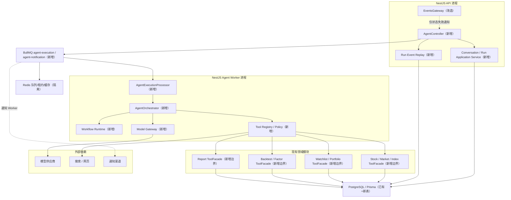

# 后端架构

## 1. 目标与约束

后端目标是在不复制现有金融业务逻辑的前提下增加可恢复、可取消、可审计的 Agent 执行能力。约束来自当前仓库：

- `src/app.module.ts` 是 NestJS 模块聚合入口；HTTP 全局前缀由 `src/main.ts` 配置为 `/api`。
- 业务 Controller 全部使用带非空路径的 POST；Agent 延续该约定。
- PostgreSQL/Prisma 是持久状态权威源；Redis/BullMQ 只负责投递、租约和短期缓存。
- 已有金融 Service 大量直接依赖 `src/shared/prisma.service.ts`，没有 Repository 层；Agent 通过领域 `*ToolFacade` 收敛依赖，不进行一次性大重构。
- 模型只处理意图、受限计划和解释；金融事实与计算由程序产生。

## 2. 推荐形态



模块化单体保留同进程 DI 和事务优势；独立启动入口提供运行时隔离。它不是“所有职责永远绑在一个进程”。

## 3. 方案比较

| 方案                      | 当前兼容性 | 可控/审计                   | 成本与故障面            | 结论                                            |
| ------------------------- | ---------- | --------------------------- | ----------------------- | ----------------------------------------------- |
| 单 Agent + 多 Tool        | 高         | 高，前提是有工作流和 Policy | 最低                    | 作为 MVP 推理层                                 |
| 主 Agent + 专业子 Agent   | 中         | 中，存在上下文与成本重复    | 模型调用与恢复点增加    | 不进 MVP                                        |
| 确定性工作流 + 受控 Agent | 最高       | 最高                        | 需维护显式状态机        | **推荐主架构**                                  |
| 事件驱动 Agent 系统       | 高         | 高                          | 需要 Outbox、幂等和补偿 | BullMQ/事件用于异步边界，不把所有内部调用事件化 |
| 高自主多 Agent            | 低         | 低                          | 最高                    | 排除                                            |

框架与语言选择见 [ADR-001](../decisions/adr-001-agent-orchestration-location.md)、[ADR-003](../decisions/adr-003-typescript-python-boundary.md)和[ADR-008](../decisions/adr-008-multi-agent-strategy.md)。

## 4. 模块与依赖方向

```text
api -> application -> domain
                      ^
infrastructure -------|
workers -> application
tools/adapters -> 领域 ToolFacade
model-gateway/adapters -> 供应商 SDK
```

约束：

1. `domain/` 不依赖 NestJS、Prisma、BullMQ 或供应商 SDK。
2. `application/` 只依赖 domain port，不直接调用 Provider Adapter。
3. `tools/adapters/` 只能依赖已导出的领域 `*ToolFacade`；禁止注入 Controller、`PrismaService`、通用 Redis client 或任意 HTTP client。
4. `infrastructure/` 实现 Repository、Outbox、队列和事件发布 port。
5. API 只负责身份、DTO、幂等命令与流传输；不得在 Controller 内运行模型或金融查询。
6. Worker 从数据库重新装载 Run 快照；BullMQ job 只携带 `runId`、`attempt` 和不可变版本标识，不携带 Prompt 正文或持仓数据。

## 5. 状态所有权

| 状态                       | 权威存储        | Redis 是否可丢         | 写入者                           |
| -------------------------- | --------------- | ---------------------- | -------------------------------- |
| 会话、消息、消息版本       | PostgreSQL      | 是                     | Conversation application service |
| Run、Step、Tool/Model call | PostgreSQL      | 是                     | Orchestrator + repositories      |
| Run 事件序列与引用         | PostgreSQL      | 是                     | Event append service             |
| 队列等待/重试              | BullMQ/Redis    | 否；但可由 DB 补偿重建 | Outbox dispatcher / Worker       |
| 分布式租约、并发令牌       | Redis           | 是；过期后可重获       | Scheduler / quota service        |
| 短期查询缓存               | Redis           | 是                     | Tool cache                       |
| 报告与网页快照元数据       | PostgreSQL      | 是                     | Report/Search service            |
| 大文件正文                 | Storage adapter | 取决于生命周期         | Report/Search service            |

数据库物理字段、索引与生命周期只在[数据库设计](./database-design.md)维护。

## 6. 一次 Run 的数据流

1. `AgentController` 接收 `POST /api/agent/messages/send`；用户身份只取自 JWT。
2. Application service 在事务内写用户消息、assistant 占位消息、Run 与 Outbox；`(userId, clientRequestId)` 保证幂等。
3. Dispatcher 用确定性 jobId 投递 `agent-execution`；API 返回 `runId` 和规范流地址。
4. Worker 按 `runId` 加载固定的 workflow、prompt、model policy、Tool policy 和数据截止要求。
5. Orchestrator 逐节点执行；Tool 经过 Registry/Policy，Model 经过 Gateway；每个外部副作用前后写检查点。
6. 状态变化先以单调 sequence 落 PostgreSQL，再通知流消费者；SSE 断线从数据库重放。
7. 完成时持久化结构化消息块、引用、usage、cost、warnings 和数据截止时间；终态之后不得追加业务事件。

详细状态与取消见 [Agent 编排器](./agent-orchestrator.md)，公共事件见 [SSE 事件](../api/sse-events.md)。

## 7. 进程职责

| 启动角色              | 包含                                                | 不包含                             |
| --------------------- | --------------------------------------------------- | ---------------------------------- |
| `api`                 | HTTP、POST-SSE、鉴权、状态查询、Socket.IO 通知      | Agent 执行 processor、用户调度扫描 |
| `agent-worker`        | `agent-execution` processor、编排、Tool、模型、搜索 | 对外 HTTP、Cron                    |
| `notification-worker` | `agent-notification` processor、渠道适配器          | 模型生成                           |
| `scheduler`           | 到期扫描、条件扫描、租约、Outbox 补偿               | 对外 HTTP、模型直接调用            |

MVP 可以在开发环境用一个进程加载全部角色，但生产必须可以按角色开关；具体运行配置由部署文档负责，本文件不重复部署方案。

## 8. 真实代码改造清单

新增核心目录：

```text
src/apps/agent/
├── agent.module.ts
├── api/
├── application/
├── domain/
├── infrastructure/
├── model-gateway/
├── tools/
├── workflows/
├── workers/
└── observability/
src/apps/web-search/
src/apps/scheduled-research/
```

修改现有文件：

- `src/app.module.ts`：按运行角色引入 Agent、Search、ScheduledResearch 模块。
- `src/constant/queue.constant.ts`：增加 Agent 两个队列和稳定 job name。
- `src/queue/queue.module.ts`：只保留公共 BullMQ 根连接；Agent processor 由对应模块注册，避免 QueueModule 继续膨胀。
- `src/main.ts`：注册 SSE Transform 旁路、显式启动角色和优雅关闭。
- 各现有领域 `*.module.ts`：新增并仅导出稳定 `*ToolFacade`；不扩大内部 Service 的公共面。

## 9. 扩展阈值

- 当工作流超过 15 个、单流程超过 20 个节点，或人工中断类型超过 3 类，复审 LangGraph JS/专用工作流引擎。
- 当单任务 CPU 超过 30 秒、数据点超过 100 万或需要 scipy/cvxpy/sklearn，按[量化计算服务](./quantitative-compute-service.md)拆无状态 Python 服务。
- 当多个应用共享模型调用、密钥必须进程级隔离或网关需独立扩容，才拆模型网关服务。
- 当结构化/全文检索 Recall@10 低于评测目标且文档超过 10 万，才试点 pgvector。

## 10. 架构验收

- 编排、Tool、Provider Adapter 的依赖方向可用静态导入测试或 ESLint boundary 规则验证。
- Worker 重启后只凭 PostgreSQL checkpoint 和队列 job 可以恢复，不依赖内存消息历史。
- 禁用任一模型/搜索供应商不影响会话历史和 Run 状态读取。
- Tool 单元测试不启动 HTTP；Controller 契约测试不调用真实模型。
- API、Worker、Scheduler 可分别启动且不会重复注册消费者或 Cron。
