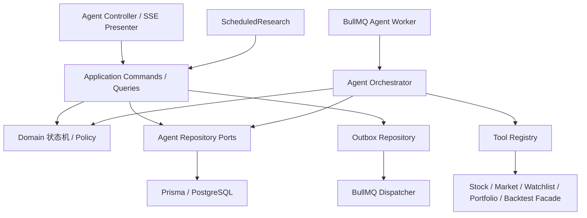

# Agent 后端数据库设计

## 1. 权威边界

PostgreSQL 是以下状态的唯一权威源：Conversation/Message、Agent Run/Step/Event、Tool/Model 审计、来源/引用、报告/记忆、Schedule/Execution、Notification Delivery、Prompt/Workflow 版本和 Outbox。Redis/BullMQ 只保存可重建的队列、分布式提示租约与短缓存；jobId 不是业务主键，Redis 丢失不能丢 Run 或重复业务副作用。

现有金融事实继续由原 Prisma Model 与领域 Service 负责。Agent 不能直接注入 `PrismaService` 查询金融表，只能调用 owner-scoped Facade 和 15 个 canonical Tool；MVP 无 SQL Tool、Text-to-SQL 或 pgvector。

物理字段、关系和保留建议见[拟议 Schema 变更](../database/proposed-schema-changes.md)，现有 111 Model 风险见[现有 Schema 分析](../database/existing-schema-analysis.md)。

## 2. 模块与依赖方向



依赖规则：domain 不依赖 Nest/Prisma/BullMQ；application 依赖 repository port；infrastructure 实现 port；Tool adapter 依赖领域 Facade，不依赖底层表。Controller 不拼事务，Processor 不绕过 Orchestrator 更新终态。

## 3. 文件落点

Prisma：

```text
prisma/agent/_enums.prisma
prisma/agent/conversation.prisma
prisma/agent/run.prisma
prisma/agent/tool-and-model-call.prisma
prisma/agent/source-and-citation.prisma
prisma/agent/report-and-memory.prisma
prisma/agent/schedule-and-notification.prisma
prisma/agent/version-and-outbox.prisma
```

`prisma/user.prisma`、`prisma/portfolio/report.prisma`、`prisma/research/research_note.prisma`、`prisma/notification.prisma` 只增加对应反向 relation；不复制 User/Report/ResearchNote/Notification 表。一次 migration 生成后人工审查表名、enum、FK delete、unique、partial index 和 `timestamptz`。

后端：

```text
src/apps/agent/domain/run-state-machine.ts
src/apps/agent/domain/tool-call-state-machine.ts
src/apps/agent/domain/agent-policy.ts
src/apps/agent/application/conversation-command.service.ts
src/apps/agent/application/run-command.service.ts
src/apps/agent/application/run-event.service.ts
src/apps/agent/application/agent-orchestrator.service.ts
src/apps/agent/application/report-command.service.ts
src/apps/agent/infrastructure/repositories/agent-conversation.repository.ts
src/apps/agent/infrastructure/repositories/agent-run.repository.ts
src/apps/agent/infrastructure/repositories/agent-audit.repository.ts
src/apps/agent/infrastructure/repositories/agent-outbox.repository.ts
src/apps/scheduled-research/infrastructure/schedule.repository.ts
src/apps/scheduled-research/infrastructure/notification-delivery.repository.ts
```

Repository 方法以业务命令命名，如 `createMessageRun()`、`claimRun()`、`appendRunEvent()`、`completeToolCall()`；禁止暴露任意 model delegate 或 `$queryRawUnsafe` 给 Orchestrator。

## 4. 状态机

### 4.1 Run

```text
QUEUED -> RUNNING -> COMPLETED
                  -> FAILED
                  -> CANCEL_REQUESTED -> CANCELLED
QUEUED -> CANCELLED
```

终态 `COMPLETED/FAILED/CANCELLED` 不可离开，终态 Event 必须是最后一条业务事件。每次转换条件包含 `statusVersion`；成功后 `statusVersion + 1`。基础设施恢复只重新投递 queue job/恢复 checkpoint，Run 继续保持 `RUNNING`，不回退为 `QUEUED`。公共 API 和 SSE 只使用这六个状态，不引入 `SUCCEEDED/WAITING_RETRY` 别名。

### 4.2 子状态

```text
Message:  PENDING -> STREAMING -> COMPLETED | FAILED | CANCELLED
Step:     PENDING -> RUNNING -> COMPLETED | FAILED | CANCELLED | SKIPPED
ToolCall: PENDING -> AUTHORIZING -> RUNNING -> RETRY_WAIT -> RUNNING
                                      -> SUCCEEDED | FAILED | CANCELLED
          AUTHORIZING -> REJECTED
ModelCall:PENDING -> STREAMING -> RETRY_WAIT -> STREAMING
                              -> SUCCEEDED | FAILED | CANCELLED
Schedule: ACTIVE <-> PAUSED -> DELETED
Execution:PENDING -> CLAIMED -> QUEUED -> RUNNING -> SUCCEEDED | FAILED | CANCELLED | SKIPPED
Delivery: PENDING -> SENDING -> DELIVERED | FAILED | SUPPRESSED
Outbox:   PENDING -> PROCESSING -> PUBLISHED | RETRY | DEAD
```

状态转换只在 domain state machine 定义，并由 Repository CAS 执行。迟到的 Tool/Model 回调可以写脱敏审计结果，但不能覆盖终态或追加终态后的业务 Event。

## 5. 核心事务

### 5.1 创建消息和 Run

`POST /api/agent/messages/send` 在一个短事务中：

1. 以 `(conversationId,userId,status!=DELETED)` 校验 owner；锁定行只用于更新 lastMessageAt，不把模型调用放进事务。
2. 规范化请求并计算 `requestHash`。按 `(userId,clientRequestId)` 查幂等结果；相同 hash 返回首次结果，不同 hash 返回冲突。
3. 创建 USER Message、ASSISTANT 占位 Message、`AiAgentRun(status=QUEUED,statusVersion=1)`，固定 Prompt/Workflow/Tool policy 版本。
4. 更新 Conversation messageCount/lastMessageAt。
5. 追加 `message.created` RunEvent 并创建 `AiOutboxEvent(AGENT_RUN_QUEUED)`。
6. 提交后由 Outbox dispatcher 以 `jobId=agent-run:{runId}` 投递；API 立即返回固定的四个 id。

数据库成功但队列失败时 Outbox 重试；队列重复时 Run unique/CAS 保证不重复执行。禁止“先入队、后建 Run”。

### 5.2 领取与续租 Run

Worker 领取使用单条条件更新：

```sql
UPDATE ai_agent_runs
SET status='RUNNING', status_version=status_version+1,
    lease_owner=$worker, lease_expires_at=clock_timestamp()+$lease,
    heartbeat_at=clock_timestamp(), started_at=COALESCE(started_at,clock_timestamp())
WHERE id=$runId AND status='QUEUED'
  AND (lease_expires_at IS NULL OR lease_expires_at < clock_timestamp())
RETURNING *;
```

续租必须匹配 `(id,leaseOwner,status=RUNNING)`；Worker 失去租约立即停止提交新副作用。补偿器只回收过期、非终态 Run，并按 attempt/deadline 决定回到 QUEUED 或 FAILED。

### 5.3 追加 Event

同一事务锁定或原子更新 Run 的 `nextEventSequence`，取得 sequence 后插入 `AiRunEvent`。unique `(runId,sequence)` 是最终防线。并行 Tool 完成顺序可以不同，但 Event 按数据库 sequence 排序。

终态事务先确认当前状态和 lease owner，写最终 Event 后把 Run 置终态；Repository 拒绝终态后 append。`model.delta` 按约 100 ms 或 1 KiB 合并持久化，降低写放大；按建议默认值（待合规确认）的 7 天重放窗口过期后返回 Run/Message/Tool/Citation 快照。

### 5.4 Step 与 ToolCall

开始 Tool：

1. unique `(runId,logicalNodeKey,invocationIndex)` 查已有记录；SUCCEEDED 直接复用。
2. PENDING→AUTHORIZING，完成 JSON Schema、ACL、配额、确认和数据范围检查。
3. AUTHORIZING→RUNNING 后提交事务，再调用 Facade/外部服务；不能持数据库事务跨网络。
4. 结果规范化为 ToolFactPacket；一个事务写结果 hash/blobRef、dataVersion、quality、Citation source、状态和 `tool.completed/failed` Event。

幂等只读重试沿用同一 toolCallId 并增加 attemptCount；每次 attempt 的时间/错误写 Event。未来 `save_research_report` 还需业务 idempotency key 和用户确认，不能只靠 ToolCall unique。

### 5.5 ModelCall 与流式消息

调用前创建 ModelCall 并预留成本；Provider 请求在事务外执行。流式 delta 只追加用户可见文本，完整系统 Prompt/API key/hidden chain-of-thought 不落库。成功/失败更新 token、费用、hash、latency；Provider 降级创建可关联的新 ModelCall，重试次数受 Run deadline/预算限制。

### 5.6 完成 Run

成功终态在一个事务中：

1. 校验 Run=`RUNNING`、lease owner、statusVersion 和未请求取消。
2. 完成 ASSISTANT Message contentBlocks，写 Citation 和可选 AiResearchReport。
3. 完成最后 Step，写 usage/cost/resultSummary。
4. 追加 `agent.completed` 最终 Event，把 Run 改 `COMPLETED`，清理 lease。
5. 若需后台通知，创建 Delivery/Outbox；通知失败不能把研究 Run 改 FAILED。

失败/取消执行同一原子原则，分别追加 `agent.failed/agent.cancelled`。先更新 Run 再写 Message/Event 会造成可见半状态，禁止拆成三个独立事务。

## 6. 调度事务

### 6.1 到期扫描

Scanner 在数据库事务中使用 `FOR UPDATE SKIP LOCKED` 取少量 `ACTIVE AND nextRunAt<=now()` Schedule：

1. 用 IANA timezone、TradeCal、trigger rule 计算 scheduledFor/nextRunAt。
2. 插入 Execution；unique `(scheduledTaskId,scheduledFor)` 抑制多副本重复。
3. 更新 Schedule.nextRunAt。
4. 插入 Outbox；提交后投递确定性 execution job。

Redis lease 只减少争抢，不能替代 unique 和行锁。Schedule 暂停只阻止未来 Execution，不强制取消已运行 Run。

### 6.2 Execution 与数据就绪

Execution 按 `PENDING→CLAIMED` 原子领取并写 lease。检查 TradeCal、实际目标表覆盖、verified watermark、qualityRuleVersion 和用户配额：就绪则创建 Run 并进入 QUEUED/RUNNING；非交易日或超过 freshness window 进入 SKIPPED 并保存原因。现有 TushareSyncLog SUCCESS 不能独立作为 readiness。

同 Schedule 默认不重叠；数据库检查已有非终态 Execution，按 `SKIP/QUEUE_ONE` policy 处理。进程崩溃由 lease expiry 补偿，不重建已有 `(scheduleId,scheduledFor)`。

## 7. 通知事务

生成投递时先检查 channel owner/status、用户偏好、冷却与抑制规则。创建 `AiNotificationDelivery(PENDING)` 和 Outbox 同事务；站内渠道在同一消费事务创建现有 `Notification` 并回填 `notificationId`，unique idempotency 防重复收件箱消息。

外部 Provider 在事务外调用：领取 `PENDING/FAILED`→SENDING，成功写 DELIVERED/providerMessageId，限流/5xx 写 FAILED/nextAttemptAt，退订/重复写 SUPPRESSED。credential 只存密钥管理引用，错误和收件人仅保留脱敏 fingerprint。重试 Delivery，不能重跑研究 Run。

## 8. 查询与租户隔离

所有公共 Repository 方法首参是认证上下文中的 userId；DTO 中出现 userId 直接拒绝。典型查询：

- 会话页：`WHERE user_id=? AND status... ORDER BY last_message_at DESC,id DESC`，游标携带两列。
- 消息页：先 owner-check Conversation，再按 `(createdAt,id)` 游标；Citation 批量加载，避免 N+1。
- Run/Event：`WHERE run_id=?` 前先通过 Run.userId 校验；Event 使用 `sequence > afterSequence ORDER BY sequence LIMIT n`。
- Tool payload：普通用户只返回脱敏摘要；完整审计另设管理员端点、理由和 AuditLog。
- Schedule/Channel/Delivery：每层都 user scoped；“不存在”和“非本人”返回同一公共语义。

当前系统没有 PostgreSQL RLS，不应在文档中假装已有。MVP 由应用 owner filter、强 FK、集成测试和最小数据库权限保证；若未来增加 RLS，必须验证 Prisma connection pool 的 session tenant 设置不会串租户。

## 9. 锁、隔离与幂等

- 默认 `READ COMMITTED`；唯一约束、CAS、行锁和 Outbox 足以表达大多数不变量。只有明确跨行不变量才使用 Serializable，并实现有限重试。
- 网络/模型/Tool 不在数据库事务内；事务设置 local lock/statement timeout。
- 乐观锁字段：Run.statusVersion、可编辑 Schedule.version、Prompt/Workflow draft version。
- 租约字段：owner、expiresAt、heartbeatAt；比较用数据库 `clock_timestamp()`，不用不同容器本地时钟。
- 稳定幂等：消息/Run `(userId,clientRequestId)`、ToolCall `(runId,node,invocation)`、Execution `(scheduleId,scheduledFor)`、Delivery `(execution,channel,recipient,contentVersion)`、Outbox `(aggregate,eventType,eventVersion)`。
- PostgreSQL advisory lock 可用于 Tushare 全局同步或一次性 migration，不用作持久业务状态；进程级 `running` boolean 不足以支持多副本。

## 10. 时间、数值与 JSON

- 新 Agent 事件/审计/租约/调度/投递：`DateTime @db.Timestamptz(6)`。
- 交易日、报告期、asOf：`DateTime @db.Date`；API 输出 `YYYY-MM-DD`。
- 每个市场上下文保存 IANA `marketTimezone`，A 股为 `Asia/Shanghai`。
- token/sequence 使用 BigInt；金额/费用使用 Decimal，禁止 Float 账务。
- JSONB 有 schemaVersion 和尺寸上限；可检索/约束字段提升为正常列，不靠任意 JSON 查询。
- 现有 timestamp without timezone 迁移先抽样比对 PostgreSQL Asia/Shanghai、Node UTC 与历史写入路径，不能统一加减 8 小时。

## 11. 数据库角色与安全

建议生产角色：

| 角色 | 权限 |
| --- | --- |
| `migration_owner` | schema DDL/migrate；不跑 API |
| `api_app` | 用户/Agent 命令查询所需表的有限 SELECT/INSERT/UPDATE；无同步写权限 |
| `agent_worker` | Agent 审计/状态写和经批准公共数据 SELECT；无 DDL |
| `sync_worker` | Tushare 表、sync infra 写；无用户消息/渠道 secret 读取 |
| `scheduler_worker` | Schedule/Execution/Outbox/Delivery 有限写 |
| `analytics_ro` | 只读副本/白名单视图；不接普通 Agent Tool |

迁移账号与运行账号连接串分离；生产禁用 `db push`。渠道凭据、附件和大 Tool 结果使用加密对象/secret storage，数据库只存 reference/hash。日志、JSON、错误、URL query 在写入前脱敏。

## 12. Outbox dispatcher

Dispatcher 小批领取：

```sql
SELECT id FROM ai_outbox_events
WHERE status IN ('PENDING','RETRY') AND available_at<=clock_timestamp()
ORDER BY available_at,id
FOR UPDATE SKIP LOCKED
LIMIT $batch;
```

事务内标 PROCESSING/lease，事务外投递 BullMQ，随后写 PUBLISHED；失败写 RETRY、指数退避+jitter，超限写 DEAD 并告警。消费者仍必须幂等，因为“发布成功、状态更新前崩溃”会重复投递。Outbox payload 只放不可变 id/version，不放消息正文、凭据或巨型 Tool 输出。

## 13. 归档与清理

保留期限采用[拟议 Schema 变更](../database/proposed-schema-changes.md#11-生命周期归档与清理)的建议默认值，生产上线前由合规/隐私策略确认。清理 Worker 使用主键/时间游标、`SKIP LOCKED` 和小批事务；事件过期后 SSE 返回当前快照，不能把“事件已清理”误报为 Run 不存在。

隐私删除顺序：禁用用户访问/调度/渠道 → 撤销 Memory → 删除附件/消息正文/私有来源对象 → 匿名化需保留审计 → 清除关联缓存。Prompt/Workflow 发布版和公共金融事实不随单个用户级联删除。

## 14. 迁移与发布顺序

1. 修复现有 migration 链缺少 10 张表 CREATE、`valuation_daily_medians` 提前 INSERT 和 `backtest_runs_strategy_id_idx` 反向漂移。
2. 去重 Dividend、验证 nullable unique，自然键约束先 `NOT VALID`/并发索引路径再受控 VALIDATE；完成周/月单位和 QFQ 回填。
3. migration A：Agent enum、Prompt/Workflow、Conversation/Message、Run/Step/Event。
4. migration B：Tool/Model、Source/Citation、Report/Memory及 FK/check。
5. migration C：Schedule/Execution、Channel/Delivery、Outbox/Evaluation、partial/include index。
6. 部署只写 Repository 与暗读校验；再启用 Outbox、Agent Worker、SSE；最后启用 Scheduler/外部通知。
7. 任一阶段可通过关闭模块/Worker 回退应用；已创建的 append 审计表不 destructive rollback。

生产索引若需 `CREATE INDEX CONCURRENTLY`，使用独立可恢复 runbook 并把最终状态纳入 migration 历史；不能用手工未记录 DDL。

## 15. 空库与升级验证

每次 CI 创建全新 PostgreSQL：

1. 仅从 migration 目录执行 `prisma migrate deploy`，禁止先 `db push`。
2. `prisma validate`、`prisma generate`，再对 migration 最终状态和 `prisma/` datamodel 做 diff，必须为空。
3. SQL 断言 111 个旧 Model 表和全部 Agent 表、enum、FK、unique、check、partial index 都存在。
4. 插入最小 User/Conversation/Message/Run/Tool/Citation/Schedule/Delivery 链，验证删除 Restrict/SetNull 与时区。
5. 并行运行 20 个 message-send、Run claim、sequence append、schedule scan、delivery create，断言幂等无重复。
6. 从当前生产结构备份副本升级，比较行数、主键 checksum、孤儿、重复、索引和 schema diff。
7. 模拟 Redis 清空、Worker 在事务前后崩溃、租约过期和 Outbox 重投，验证可恢复。

禁止把“当前库与 schema diff 为空”当作迁移通过；当前正是运行状态一致、空库链仍缺 10 个 CREATE。

## 16. 测试矩阵

```text
src/apps/agent/test/conversation-tenancy.integration.spec.ts
src/apps/agent/test/message-run-idempotency.integration.spec.ts
src/apps/agent/test/run-state-machine.spec.ts
src/apps/agent/test/run-event-sequence.integration.spec.ts
src/apps/agent/test/run-recovery.integration.spec.ts
src/apps/agent/test/tool-call-idempotency.integration.spec.ts
src/apps/agent/test/citation-integrity.integration.spec.ts
src/apps/scheduled-research/test/scheduler-failover.integration.spec.ts
src/apps/scheduled-research/test/notification-delivery.integration.spec.ts
src/apps/agent/test/privacy-purge.integration.spec.ts
```

必须覆盖跨用户伪造 id、发布版本不可变、非法状态转换、终态后迟到结果、重试沿用逻辑 id、并行 sequence、DST/法定休市、数据 readiness、通知 provider 429/timeout、partial unique NULL、对象存储失败和大 payload 拒绝。

性能验收见[索引与性能](../database/indexes-and-performance.md)，来源与 asOf 契约见[数据血缘](../database/data-lineage.md)。
