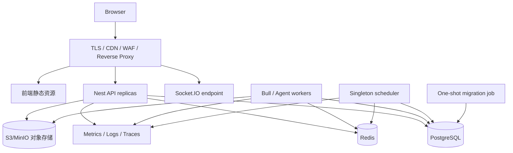

# Agent 后端部署设计

> 目标：在保留当前 NestJS、PostgreSQL、Redis、Bull、Prisma 与前端 Vite 架构的基础上，形成可迁移、可扩缩、可观测、可回滚的生产部署。公开接口仍以 [API 总览](../api/README.md) 为准。

## 1. 当前部署基线

仓库已有：

- `docker-compose.yml`：PostgreSQL 17、Redis 7.4、NestJS 开发热更新，以及可选 Prometheus/Grafana profile；
- `dockerfiles/app/Dockerfile.prod`：多阶段、非 root 的生产镜像基础；
- `.github/workflows/ci.yml`：迁移漂移、构建与测试；
- `src/shared/health/`、`src/shared/metrics/`、Winston JSON 轮转日志与 ALS traceId；
- `dockerfiles/postgresql/postgresql.prod-2g.conf`：生产参数样例，但当前未接入部署。

这些还不是完整生产方案。必须先修复以下阻断项：

1. 生产镜像 HEALTHCHECK 请求 `/api/health`，而当前全局前缀排除后真实入口为 `/health`。
2. 非 root 镜像未明确创建并授权 `/app/logs`、`/app/storage`；当前 logger 与报告渲染会写这些目录，可能 EACCES。
3. 报告文件只保存本地路径（`prisma/portfolio/report.prisma`、`src/apps/report/services/report-renderer.service.ts`），多实例无共享对象存储，也无生产持久卷约定。
4. API、Bull worker、`@Cron` 调度与 Tushare 同步运行在同一进程；扩容会重复定时任务，进程内 `running` 标志不能提供分布式互斥。
5. Socket.IO 无 Redis adapter；连接分散到多实例后，通知无法可靠广播。
6. 当前 compose 是开发配置，启动逻辑含 `prisma db push --accept-data-loss`，不得进入生产。
7. CI 没有镜像构建/签名/漏洞扫描、发布、迁移审批、部署与回滚阶段。
8. PDF/浏览器渲染对 Chromium、字体和系统库的依赖未在生产镜像中形成可验证清单。

旧的 `docs/operations/生产环境部署.md` 部分现状描述已经过时；本文件作为 Agent 生产部署基线，实际变更后也应同步更新运维总文档。

## 2. 目标拓扑

浏览器使用同一站点访问静态资源、`/api` 与 `/socket.io`，与当前 HttpOnly、SameSite=Strict 刷新 Cookie 相容。流式 POST 需由代理关闭响应缓冲、允许长连接并保留 SSE 必需响应头；代理超时大于协议心跳窗口。

## 3. 环境档位

| 档位 | 适用 | 形态 |
| --- | --- | --- |
| 本地开发 | 单开发者 | 现有 compose，热更新；数据库可重建 |
| 单机生产 | 个人/小团队 | production compose：edge、web、api、worker、scheduler、migration、PG、Redis、对象存储、监控；持久卷与备份 |
| 高可用生产 | 多用户 | 托管 PG/Redis/对象存储，多个 API/worker、副本调度器唯一，负载均衡与集中观测 |

开发 compose 与生产 compose 分开维护。生产配置使用不可变镜像标签/摘要、只读根文件系统（必要写目录单独挂载）、资源限制、restart policy 和显式 healthcheck。

## 4. 进程角色拆分

新增明确进程角色，例如 `APP_ROLE=api|worker|scheduler|all`：

- **api**：HTTP、SSE、Socket.IO、鉴权与轻量查询；不执行 Bull 消费和业务 Cron。
- **worker**：Agent 工具、回测、报告等 Bull 队列；按队列和资源特征进一步拆副本。
- **scheduler**：唯一触发定时任务，只入队，不承担长计算。
- **all**：仅本地开发兼容。

Nest 模块按角色条件加载，避免只是环境变量存在但 Provider 仍被实例化。调度唯一性使用 PostgreSQL advisory lock、Redis 分布式锁或平台 singleton Job；锁须有租约、续约和 owner 诊断。Tushare 同步的进程内 `running` 只能作为最后一道本地保护。

Worker readiness 应检查 Redis/数据库及必要模型/工具配置；API readiness 不应因一个可选外部行情源短暂失败而整体摘流，而应在详细 health 中标记降级。

## 5. 数据库迁移

生产发布流程只能运行 `prisma migrate deploy`，由一次性 migration job 使用专用迁移权限执行。禁止 `db push`，更禁止 `--accept-data-loss`。

部署顺序采用 expand/contract：

1. 备份与迁移预检；
2. 先发布向后兼容 schema；
3. 发布兼容新旧 schema 的应用；
4. 完成回填并验证；
5. 后续版本再删除旧列/约束。

迁移失败立即停止新版本流量，不自动反复执行破坏性 SQL。大表索引、回填和锁时间在预生产用接近真实规模验证。数据库设计与 Agent 数据模型以 `docs/agent/database/` 为准。

## 6. 文件、报告与对象存储

引入 `ObjectStorage` 抽象，生产使用 S3 兼容存储，单机可用 MinIO；数据库保存对象 key、桶、内容类型、大小、校验和和过期策略，不保存容器本地绝对路径。下载使用鉴权 API 或短时签名 URL，并校验租户/用户权限。

本地 `/app/storage` 仅用于渲染临时文件：使用独立临时目录、容量限制、任务结束清理和容器 ephemeral volume。报告成品上传成功后再更新数据库状态。对象存储配置生命周期规则，区分永久报告与临时中间物。

Winston 生产默认写 stdout/stderr，由平台采集；若保留文件轮转，必须显式创建/chown `/app/logs` 并挂载有界卷，但不把本地日志当唯一审计记录。

## 7. PDF 与浏览器渲染

生产镜像显式安装并固定 Chromium/Puppeteer 所需系统库与中文字体，构建时验证可执行文件路径。以非 root 用户运行，设置内存/CPU/超时、页面大小、并发数和临时目录；外部 URL、脚本和网络请求默认禁用或白名单，防止 SSRF。

CI 运行一个最小中文报告 smoke test，验证字体、图表截图、PDF 生成、上传和清理。重型渲染放在专用 worker 队列，避免阻塞 API event loop。

## 8. Redis、队列与 Socket.IO

Redis 生产启用认证、TLS/私网、持久化与容量/淘汰策略。缓存、Bull 队列、分布式锁和 Socket.IO adapter 使用不同 key prefix，关键环境可使用不同实例，避免缓存驱逐影响队列。

Socket.IO 多实例启用 Redis adapter；握手必须校验访问令牌，无效即拒绝连接。订阅回测等房间前做资源所有权检查，重放机制必须有服务端处理器、保留窗口和限额。事件职责见 [WebSocket 事件](../api/websocket-events.md)。

Bull 设置有限重试、指数退避、任务超时、幂等键、死信/失败保留与并发上限。Agent 高成本任务按用户/租户和模型设置队列配额，防止一个用户耗尽 worker。

## 9. 前端与边缘代理

前端 `../client-code` 构建为不可变静态资源，hash 资源长期缓存，HTML 短缓存。推荐同域：

- `/`：Vite 构建产物并做 SPA fallback；
- `/api`：Nest HTTP 与 POST Fetch SSE；
- `/socket.io`：WebSocket/长轮询升级。

代理对 SSE 关闭缓存与响应缓冲，禁用内容转换，保持连接；对普通 API 保持合理 body/time 限制。只允许明确生产 Origin，设置 HSTS、CSP、`X-Content-Type-Options`、frame 限制与 Referrer Policy。前端接入方案见 [Agent 前端](../frontend/README.md)。

仅把前端演示部署到 GitHub Pages/MSW 不能代表生产闭环；Playwright 后端镜像也应固定版本，不依赖浮动 `latest`。

## 10. 健康检查与发布门禁

修正 `dockerfiles/app/Dockerfile.prod` 的健康路径，或统一应用路由，确保 Docker、反向代理与编排平台请求同一真实 endpoint。建议：

- liveness：进程 event loop 可响应，不访问所有外部依赖；
- readiness：数据库、Redis 和必要启动迁移已就绪；
- detailed health：队列积压、对象存储、模型/行情源等降级信息，仅授权访问。

启动期间先 readiness=false，迁移由独立 job 完成后再放流。终止时先摘除 readiness，停止接收新运行，给 SSE/HTTP 宽限期，停止 worker 取新任务并等待/重排在途任务。

## 11. 配置与密钥

补齐并校验 `.env.example`，按角色建立启动时 schema 验证。密钥来自 Secret Manager/平台 secret，不进入镜像、compose 文件、日志或前端环境变量。至少分类管理：数据库、Redis、JWT/刷新 Cookie、Tushare/模型供应商、对象存储、加密/签名、观测导出。

支持密钥轮换：JWT/签名使用 key id 和重叠有效期；供应商 key 轮换不重建代码。生产关闭详细异常响应、Prisma query 明文和敏感请求体日志。

## 12. 可观测性与告警

保留现有 Prometheus、Grafana、Winston JSON 和 traceId，新增 OpenTelemetry 跨 API—队列—worker trace 传播。核心指标：

- 请求率、错误率、延迟、SSE 活跃数/时长/断线恢复率；
- Agent 排队、首事件/首可见内容/总耗时、取消率、模型/工具错误率与 token/成本；
- Bull 等待/活跃/失败/重试、最老任务年龄；
- PostgreSQL 连接/慢查询/锁/复制与磁盘；
- Redis 内存/驱逐/连接/命令延迟；
- 报告渲染耗时、失败、临时盘与对象存储错误。

接入集中日志、追踪后端和 Alertmanager/平台告警；告警按用户影响与持续时间分级，附 runbook 和 dashboard。日志默认不记录 prompt、完整回答、Cookie、Authorization、工具密钥或证券账户敏感数据。

## 13. CI/CD、灰度与回滚

流水线阶段：锁依赖与代码检查 → 单元/集成/E2E → 迁移漂移 → 镜像构建 → SBOM/漏洞与 secret 扫描 → 签名 → 推送不可变摘要 → 预生产迁移与 smoke → 人工批准 → 生产迁移 → canary → 全量。

Canary 先导入少量无状态 API 流量，worker 按队列独立灰度。监控错误率、SSE 中断、队列积压、模型成本与数据库锁。应用回滚只切回兼容旧 schema 的镜像；数据库不做自动 down migration，依赖 expand/contract 和前向修复。

每次发布记录镜像摘要、契约版本、迁移版本、前端版本和配置版本，便于一次定位前后端不兼容。

## 14. 备份与灾难恢复

- PostgreSQL：自动快照 + WAL/PITR，跨故障域保存并定期恢复演练。
- 对象存储：版本控制、生命周期、删除保护与跨区域策略按业务等级配置。
- Redis：队列场景开启合适持久化，但数据库仍是运行/消息真相源；验证 Redis 丢失后的重建与任务幂等。
- 配置与密钥：基础设施即代码和受控 secret 备份，不备份明文到 Git。

定义并演练 RPO/RTO、单库恢复、误删报告、Redis 丢失、模型供应商不可用和整站回滚。备份成功告警不等于可恢复，至少季度做隔离恢复验证。

## 15. 验收清单

- 生产不执行 `db push`，migration job 可重复、安全失败。
- 健康路径真实可用，优雅停机不会无提示截断运行。
- API/worker/scheduler 可独立扩容，Cron 有分布式唯一性。
- 多实例 Socket 通知可达，鉴权与资源所有权检查通过。
- 报告跨实例可下载，本地临时文件会清理，中文 PDF smoke 通过。
- SSE 穿过生产代理无缓冲，断线恢复与超时配置验证通过。
- 日志、指标、trace、告警和 runbook 可用，敏感内容未采集。
- 数据库与对象存储完成恢复演练，发布可 canary、可回滚。

实施归入 [batch-026](../tasks/batches/batch-026-security-hardening-and-production-deployment.md)。
