# 调度与主动通知

## 1. 当前实现与问题

当前仓库已具备 Nest Schedule、BullMQ、交易日历和站内通知，不需要引入 Agenda/Quartz/Celery：

- `src/app.module.ts` 全局注册 `ScheduleModule.forRoot()`。
- `src/tushare/sync/sync.service.ts` 动态注册大量 plan schedule，并有每小时补偿检查；`src/tushare/sync/sync-registry.service.ts` 管理同步计划。
- `src/apps/screener-subscription/screener-subscription.scheduler.ts` 注册日/周/月任务并投递 `screener-subscription` 队列。
- `src/apps/event-study/event-signal.scheduler.ts`、`src/apps/alert/price-alert.service.ts`、`market-anomaly.service.ts` 在工作日 19:00 扫描。
- `src/constant/queue.constant.ts` 已有 `backtesting`、`screener-subscription`、`event-study`。
- `src/apps/notification/notification.service.ts` 保存 `Notification` 并经 `EventsGateway` 推站内消息。
- `TradeCal` 数据和 `src/tushare/sync/sync-helper.service.ts` 已能判断交易日。

现有 Cron 是进程本地注册，没有 leader/分布式租约；多副本会重复执行。19:00 多个扫描还可能与 18:30 后未结束的数据同步竞争。Agent 定时研究不能继续堆 `@Cron`，也不能依赖“预计同步已完成”的固定时间。

## 2. 推荐架构

新增 `ScheduledResearchModule`，使用“数据库 schedule + 单一到期扫描器 + 分布式租约 + BullMQ + Outbox”：

```mermaid
flowchart LR
  SCAN["Scheduler scanner"] --> LEASE["Redis lease + DB optimistic claim"]
  LEASE --> CAL["Trade calendar / data readiness"]
  CAL --> OUTBOX["Execution + Outbox transaction"]
  OUTBOX --> AQ["agent-execution queue"]
  AQ --> RUN["固定 Workflow Run"]
  RUN --> NOUT["Notification Outbox"]
  NOUT --> NQ["agent-notification queue"]
  NQ --> ADAPTER["站内 / WeCom / Email / Webhook / Feishu / DingTalk"]
  ADAPTER --> DELIVERY["Delivery 状态与审计"]
```



PostgreSQL 保存 schedule/execution/delivery 权威状态；Redis lease 只减少竞争，数据库原子 claim 保证正确性。具体表结构见[数据库设计](./database-design.md)。

## 3. 触发类型

| 类型        | 输入                                | 执行规则                                  |
| ----------- | ----------------------------------- | ----------------------------------------- |
| `CRON`      | cron、IANA timeZone、tradingDayOnly | 服务端计算 nextRunAt；DST/节假日测试      |
| `CONDITION` | 版本化结构化规则                    | 扫描已同步数据；不接受代码、Prompt 或 SQL |
| `EVENT`     | 白名单领域事件 key                  | Outbox 消费；事件有 sourceId/version      |

条件 DSL 只支持字段白名单、比较、AND/OR、持续次数、冷却期和数据 freshness；例如价格/成交量/资金流/估值/技术指标。模型可帮助用户生成草稿，但创建/修改走 [REST API](../api/rest-api.md) 的结构化 DTO 和用户确认，不开放 `create_schedule` Tool。

首批场景：交易日前/收盘后简报、自选股新闻/公告摘要、每周组合风险、价格/成交量/资金流异常。观点变化、产业链和一致预期若缺可靠源数据，只能延后，不能由模型凭历史会话猜测。

## 4. Schedule 与 Execution 状态

逻辑状态：

```text
Schedule: ACTIVE <-> PAUSED -> DELETED
Execution: PENDING -> CLAIMED -> QUEUED -> RUNNING -> SUCCEEDED | FAILED | CANCELLED | SKIPPED
Delivery: PENDING -> SENDING -> DELIVERED | FAILED | SUPPRESSED
```

- `(scheduleId, scheduledFor)` 唯一，防 scanner/副本重复创建。
- BullMQ jobId 由 executionId 确定；重复投递复用同一执行。
- `CLAIMED` 带 owner/leaseUntil；进程死亡后补偿器只回收过期 claim。
- 暂停阻止未来 execution，不强制取消已运行任务；删除是软删除并保留审计。
- 每次执行固定 workflow/prompt/tool policy 版本；配置升级不改历史。
- `SKIPPED` 必须有原因：非交易日、数据未就绪超过窗口、用户停用、配额不足或去重抑制。

## 5. 交易日和数据就绪

- `tradingDayOnly` 使用 `TradeCal`，不是简单周一到周五；交易所和 `Asia/Shanghai` 明确。
- 市场/财务研究先读取 Tushare 数据水位、目标分片行数/校验和与质量门禁。只有 snapshot 达到 schedule 的 freshness 才运行。
- 数据未就绪先有限延迟重试；超过 freshness window 标 `SKIPPED/FAILED` 并通知，不自动使用旧数据生成“今日”报告。
- Agent Scheduler 不调用 `TushareSyncService.triggerManualSyncAsync()`；同步和研究保持独立，避免用户任务放大 Tushare 频控。
- 现有 `TUSHARE_SYNC_CRON` 配置未实际控制 plan schedule，应单独治理；Agent 不依赖该环境变量。

现有同步日志的 SUCCESS 不能直接视为 readiness：旧日期 retry 会被最新断点越过后假成功，空响应路径可删掉旧数据，部分分片失败仍可落 SUCCESS，`checkTimeliness()` 也把比较结果误当滞后天数。`ScheduledResearchDataReadinessService` 必须读取实际目标表覆盖、水位、质量规则版本和分片校验；这些 P0 未修复时，依赖该数据集的 schedule 只能跳过并告警。

## 6. 并发、配额和取消

- 全局、用户、schedule、workflow 四层并发；同一 schedule 默认不重叠，上一 execution 未终态时按策略 `SKIP` 或 `QUEUE_ONE`。
- 创建时校验单次 `maxCostCny`，执行前检查用户日额度，每次 ModelCall 前再复核；额度不足不降级到无来源的廉价回答。
- Run 取消沿用 [Agent 编排器](./agent-orchestrator.md)；暂停 schedule 不等于取消当前 Run。
- 重试仅针对幂等执行步骤；模型/搜索按各自策略，通知按渠道策略。业务结果已成功但通知失败时只重试 Delivery，不重跑研究。
- DLQ 通过长期保留 failed BullMQ job + 数据库失败记录实现；管理员补偿按 execution/delivery ID 幂等执行。

## 7. 通知渠道

| 渠道                      | MVP/阶段       | 边界                                                                   |
| ------------------------- | -------------- | ---------------------------------------------------------------------- |
| 站内 + Socket.IO 失效通知 | MVP            | 复用 `NotificationService`，但失败必须返回/落 Delivery，不能继续吞异常 |
| Webhook                   | MVP 或第一后续 | HTTPS allowlist、签名、timestamp/nonce、重放防护、secret 加密          |
| 邮件                      | 第一后续       | 正式 SMTP/API provider、退信/投诉/退订状态                             |
| 企业微信机器人/应用消息   | 第一后续       | 仅官方企业能力；按账号资质、接收范围和频控接入                         |
| 飞书/钉钉                 | 第一后续       | 官方机器人/应用 Adapter，签名与速率限制独立                            |
| 微信公众号                | 条件项         | 需要公众号资质、用户授权和模板/订阅消息适用性验证                      |
| 普通个人微信自动化        | 不支持         | 不存在本方案可依赖的稳定合规接口；不使用模拟登录/Hook/桌面自动化       |

渠道 Adapter 只接收渲染后的安全 `NotificationMessage` 和 encrypted credential reference。模型不接触 webhook secret、收件人 token 或渠道 API response。

## 8. 投递、合并和退订

- Delivery idempotency key 包含 `(executionId, channelId, recipientScope, contentVersion)`。
- 相同实体/事件/用户在冷却窗口内按 fingerprint 抑制；批量低优先级通知可合并成 digest，高严重度不被低级摘要吞掉。
- 每个 delivery 记录 attempt、providerMessageId、状态、脱敏错误、nextRetryAt 和 deliveredAt。
- 用户可按 workflow/channel/severity 退订；系统安全通知与营销/研究通知分开。
- Webhook 2xx 才视为接受；业务 ACK 如供应商支持则另记。通知失败不能修改研究 Run 的成功结果。
- 当前 `NotificationService.create()` catch 后只记日志，调用方无法获知失败；Agent 接入前改为抛出受控错误或返回 Delivery 结果，由 Worker 决定重试。

## 9. API 边界

Schedule、notification channel 和 delivery 端点严格使用 [REST API](../api/rest-api.md)；后台完成通知严格使用 [WebSocket 事件](../api/websocket-events.md)。Socket.IO 只提示客户端刷新，不承载报告正文或模型 Token。

所有 schedule/channel CRUD 都必须 owner-scoped；channel secret 创建后不回显。测试接口也走真实权限、限流和审计，不能成为任意 webhook SSRF 探针。

## 10. 文件落点

新增：

```text
src/apps/scheduled-research/scheduled-research.module.ts
src/apps/scheduled-research/schedule.service.ts
src/apps/scheduled-research/schedule-scanner.service.ts
src/apps/scheduled-research/schedule-claim.service.ts
src/apps/scheduled-research/trading-calendar.facade.ts
src/apps/scheduled-research/data-readiness.service.ts
src/apps/scheduled-research/condition-rule.validator.ts
src/apps/scheduled-research/execution.service.ts
src/apps/scheduled-research/notification-delivery.service.ts
src/apps/scheduled-research/channels/notification-channel.adapter.ts
src/apps/scheduled-research/channels/in-app.adapter.ts
src/apps/scheduled-research/channels/webhook.adapter.ts
src/apps/agent/workers/agent-notification.processor.ts
```

修改：

- `src/constant/queue.constant.ts`：新增 `agent-execution`、`agent-notification` 与稳定 job name。
- `src/apps/notification/notification.service.ts`：不吞投递错误，支持 delivery 关联和幂等。
- `src/websocket/events.gateway.ts`：先完成强鉴权/owner room，再发规范 Agent 通知。
- `src/app.module.ts`：按 scheduler/worker 运行角色加载模块，避免每个 API 副本扫描。

## 11. 测试与验收

```text
src/apps/scheduled-research/test/schedule.service.spec.ts
src/apps/scheduled-research/test/schedule-scanner.integration.spec.ts
src/apps/scheduled-research/test/condition-rule.validator.spec.ts
src/apps/scheduled-research/test/notification-delivery.spec.ts
src/apps/scheduled-research/test/scheduler-failover.integration.spec.ts
```

覆盖 IANA timezone/DST、法定休市、数据延迟、多个副本抢占、进程在 claim/入队/执行/投递各阶段崩溃、重复事件、暂停/恢复/删除、同 schedule 不重叠、配额、退订、去重/合并、渠道 429/5xx/timeout、Webhook SSRF/签名/重放和 DLQ 补偿。验收要求并行启动两个 scheduler 仍只生成一个 execution，并能在持锁进程退出后恢复。
