# Tool 系统设计

## 1. 目标与规范源

Tool 系统把模型请求转换为受控、可验证、可授权、可限时、可审计的领域调用。Tool key、输入 JSON Schema、输出示例和逐 Tool 限制的唯一规范源是 [Tool 目录](../tools/README.md)；本文件只定义后端运行机制与真实 Service 接线。

禁止提供 `query_database`、`execute_sql`、`http_request`、`run_code`、`send_notification` 等通用 Tool。MVP 不启用 Text-to-SQL，理由见 [ADR-004](../decisions/adr-004-tool-access-control.md)。

## 2. MVP Registry

Registry 只注册以下 15 个 canonical key：

| 分类       | Tool key                       | 后端执行边界                                                                                             |
| ---------- | ------------------------------ | -------------------------------------------------------------------------------------------------------- |
| 标的解析   | `resolve_security`             | `StockToolFacade`，复用 `StockService.search/findOne`                                                    |
| 股票行情   | `get_stock_price_history`      | `StockToolFacade`，复用 `StockService.getDetailChart`                                                    |
| 股票概览   | `get_stock_overview`           | `StockToolFacade`，复用 `StockService.getDetailOverview`                                                 |
| 财务报表   | `get_financial_statements`     | `StockToolFacade`，复用 `StockService.getDetailFinancialStatements`                                      |
| 财务指标   | `get_financial_indicators`     | `StockToolFacade`，复用 `StockService.getDetailFinancials`                                               |
| 个股资金流 | `get_stock_moneyflow`          | `StockToolFacade`，复用 `StockService.getDetailMoneyFlow/getDetailMainMoneyFlow`                         |
| 市场快照   | `get_market_snapshot`          | `MarketToolFacade`，复用 `MarketService` 的行情、情绪、估值和资金方法                                    |
| 板块归属   | `get_sector_membership`        | `MarketToolFacade`，复用 `StockService.getStockConcepts` 与 `MarketService.getConceptMembers` 等受控查询 |
| 自选股     | `get_user_watchlist`           | `WatchlistToolFacade`，复用 `WatchlistService`，强制当前用户                                             |
| 组合风险   | `get_portfolio_risk`           | `PortfolioToolFacade`，复用 `PortfolioRiskService.getRiskSnapshot`                                       |
| 回测结果   | `get_backtest_result`          | `BacktestToolFacade`，复用 `BacktestRunService` 的 owner-scoped 查询                                     |
| 绩效计算   | `compute_performance_metrics`  | `BacktestToolFacade`，复用/提取 `BacktestMetricsService` 的确定性公式                                    |
| 估值分位   | `compute_valuation_percentile` | `FactorToolFacade`，基于 `DailyBasic` 历史序列确定性计算                                                 |
| 联网搜索   | `search_web`                   | `WebSearchService.search`                                                                                |
| 网页抓取   | `fetch_web_page`               | `WebSearchService.fetch`，必须先过 URL policy                                                            |

`save_research_report` 属第一后续阶段，默认 `requiresConfirmation=true`。Schedule/Notification 只通过 [REST API](../api/rest-api.md) 和固定 Workflow command 管理，不注册为模型自由 Tool。

## 3. 注册定义

Registry 直接注册 [Tool 开发标准](../tools/tool-development-standard.md)中的 `ToolDefinition<TInput,TData>`；不在后端文档维护第二个定义。缓存策略属于 executor 元数据，不能改变 canonical input/output Schema。

应用启动时执行以下 fail-fast 校验：key 唯一、version 单调、Schema 可编译、executor 可解析、timeout/行数上限存在、写 Tool 必须确认、文档中 canonical key 与 Registry snapshot 一致。生产环境不能动态从数据库添加任意 Tool 实现；Prompt/Workflow 只能引用已构建进版本的 key+version。

## 4. 调用上下文

模型只能生成 Tool 的业务输入。运行上下文由后端注入：

`ToolAccessContext` 的 canonical 字段见 [Tool 开发标准](../tools/tool-development-standard.md)。执行器可以在内部追加 workflow/version、dataCutoff 和 deadline，但这些 runtime 字段不进入 Provider Tool Schema，也不能由模型覆盖。

Schema 中不得出现可由模型覆盖的 `userId`、role、tenant、costLimit、permission、provider key 或 raw SQL。即使模型输出这些字段，严格 JSON Schema 校验也必须拒绝或由 Agent 专用 strict pipe 阻断，不能覆盖 server context。

## 5. 执行管线

```mermaid
flowchart LR
  CALL["模型 Tool call"] --> LOOKUP["Registry lookup + version pin"]
  LOOKUP --> SCHEMA["JSON Schema 严格校验"]
  SCHEMA --> POLICY["Capability / ACL / quota / confirmation"]
  POLICY --> LIMIT["范围、行数、deadline、bulkhead"]
  LIMIT --> CACHE["授权域内缓存查找"]
  CACHE --> EXEC["领域 Facade / Search 执行"]
  EXEC --> NORMALIZE["来源、asOf、单位、null、截断"]
  NORMALIZE --> AUDIT["结果摘要与审计持久化"]
  AUDIT --> CONTEXT["预算化摘要进入模型上下文"]
```



每一步先写或更新 ToolCall 状态；canonical 状态集合为 `PENDING/AUTHORIZING/RUNNING/RETRY_WAIT/SUCCEEDED/FAILED/CANCELLED/REJECTED`。正常路径是 `PENDING -> AUTHORIZING -> RUNNING -> SUCCEEDED`；策略或参数门禁拒绝进入 `REJECTED`，可重试执行失败进入 `RETRY_WAIT` 后回到 `RUNNING`，且不创建第二个业务 ToolCall。对前端只投影 [SSE 事件](../api/sse-events.md) 中的 `tool.started/completed/failed`；成功状态仍为 `SUCCEEDED`，成功事件名仍为 `tool.completed`。

## 6. Policy 计算

有效权限是以下集合的交集，不是 Prompt 声明：

```text
用户角色/资源所有权
∩ Run.allowedCapabilities
∩ Workflow.allowedTools
∩ Tool.policy.allowedDataScopes
∩ 模型供应商数据等级许可
∩ 当前成本/并发/数据范围配额
```

- 公共金融数据仍需认证、限流和行数限制。
- `get_user_watchlist`、`get_portfolio_risk`、`get_backtest_result` 必须以 context.userId 查询；“查不到”和“不是本人”对普通用户返回同一安全语义。
- 未来写 Tool 在执行前生成一次性确认 challenge，绑定 `(userId, runId, toolCallId, inputHash, expiresAt)`；确认后输入变化必须重新确认。
- 管理员角色不能自动绕过用户数据所有权；管理员审计使用独立端点和审计理由。

## 7. 输出规范化

输出的精确字段以 [Tool 目录](../tools/README.md) 为准。运行时必须额外保证：

- `asOf` 区分 tradeDate、reportPeriod、announcementDate、availableAt、retrievedAt。
- `sourceType`、`citationSourceIds`、数据/算法版本完整；模型推断绝不能标成数据库事实。Presenter 验证并持久化来源后再映射为公共消息块的 `citationIds`。
- 金额有 currency/unit；比例有 `PERCENT` 或 `DECIMAL` scale；`null` 保留为 `null`，禁止补 0。
- 行情有 adjustment；周/月/日收益单位在进入 Tool 前归一并经过数据质量门禁。
- 达到行数/字节上限时返回 `truncated=true` 和安全续查方式；不能把完整千万行结果送入模型。
- 模型上下文只接收 `ToolFactPacket`、必要预览行和 `citationSourceIds`；完整输出保存在审计存储。

## 8. 缓存和幂等

缓存 key 至少包含：Tool key/version、规范化 input hash、数据版本/截止日、权限域、输出 schema version。公共数据可以跨用户共享；自选股、持仓、回测必须包含 userId/资源版本，禁止跨用户命中。

ToolCall 的确定性幂等键为 `(runId, logicalNodeKey, invocationIndex)`。重试沿用同一 `toolCallId` 并递增 attempt；已成功调用直接复用持久化结果。写 Tool 还需业务幂等键，不能依赖 BullMQ “恰好一次”。

## 9. 错误与失败语义

内部错误严格使用 [Tool 错误 Schema](../tools/schemas/tool-errors.md)；Controller/stream presenter 再映射到 [Agent 错误码](../api/error-codes.md)。两个文档有任何数字映射差异时，以 API 错误码为公共出口规范，禁止在 adapter 内硬编码数字码。

- 详细 provider/SQL/stack 不进入模型上下文；模型只看安全类别、是否可重试和可调整的参数范围。
- Tool 失败不能返回伪成功空数组，除非“真实查询无记录”本身就是成功且明确标记。
- 只有幂等只读 Tool 可自动重试；参数、权限、范围错误不重试。
- 必需事实 Tool 失败时综合节点必须停止或明确回答“数据不足”，禁止模型补造。

## 10. 受控 SQL 边界

MVP 没有 SQL Tool。若 ADR 复审后加入管理员 SQL Explorer，必须是独立能力：只读副本和账号、表/字段白名单、SQL AST 单语句校验、禁止 DDL/DML/过程/危险函数、强制 LIMIT/statement timeout、EXPLAIN 成本和扫描行限制、连接 bulkhead、敏感字段过滤与完整审计。它不能复用普通 Tool executor 的数据库权限，也不能对普通用户开放。

当前代码存在多处 `$queryRawUnsafe`；这些是应用内部实现债务，不构成允许模型生成 SQL 的理由。

## 11. 文件落点

新增：

```text
src/apps/agent/tools/tool-registry.service.ts
src/apps/agent/tools/tool-policy.service.ts
src/apps/agent/tools/tool-executor.service.ts
src/apps/agent/tools/tool-cache.service.ts
src/apps/agent/tools/tool-access-context.ts
src/apps/agent/tools/contracts/tool-definition.ts
src/apps/agent/tools/contracts/tool-result.ts
src/apps/agent/tools/contracts/tool-error.ts
src/apps/agent/tools/schemas/common-types.schema.ts
src/apps/agent/tools/schemas/internal-data-tools.schema.ts
src/apps/agent/tools/schemas/quantitative-tools.schema.ts
src/apps/agent/tools/schemas/web-research-tools.schema.ts
src/apps/agent/tools/adapters/resolve-security.tool.ts
src/apps/agent/tools/adapters/get-stock-price-history.tool.ts
src/apps/agent/tools/adapters/get-stock-overview.tool.ts
src/apps/agent/tools/adapters/get-financial-statements.tool.ts
src/apps/agent/tools/adapters/get-financial-indicators.tool.ts
src/apps/agent/tools/adapters/get-stock-moneyflow.tool.ts
src/apps/agent/tools/adapters/get-market-snapshot.tool.ts
src/apps/agent/tools/adapters/get-sector-membership.tool.ts
src/apps/agent/tools/adapters/get-user-watchlist.tool.ts
src/apps/agent/tools/adapters/get-portfolio-risk.tool.ts
src/apps/agent/tools/adapters/get-backtest-result.tool.ts
src/apps/agent/tools/adapters/compute-performance-metrics.tool.ts
src/apps/agent/tools/adapters/compute-valuation-percentile.tool.ts
src/apps/agent/tools/adapters/search-web.tool.ts
src/apps/agent/tools/adapters/fetch-web-page.tool.ts
src/apps/agent/tools/testing/fake-tool-registry.ts
```

修改：

- `package.json`：把 JSON Schema validator 作为直接依赖，锁定版本。
- 现有领域 `*.module.ts`：注册并导出 Facade，不导出 Prisma 或全部内部 Service。
- `src/apps/agent/agent.module.ts`：注册 Registry、Policy、Executor 与所有显式 Tool adapter。

## 12. 测试与验收

```text
src/apps/agent/test/tools/tool-registry.spec.ts
src/apps/agent/test/tools/tool-policy.spec.ts
src/apps/agent/test/tools/tool-executor.spec.ts
src/apps/agent/test/tools/tool-schema.contract.spec.ts
src/apps/agent/test/tools/tool-tenancy.integration.spec.ts
```

必须覆盖 Registry 文档快照、额外字段/类型/范围拒绝、伪造 userId、跨用户自选股/组合/回测访问、timeout/abort、并行上限、缓存权限隔离、结果截断、null/单位/asOf、重试幂等、Tool 失败时模型不继续补造，以及未来写 Tool 未确认/确认过期/输入变化。
