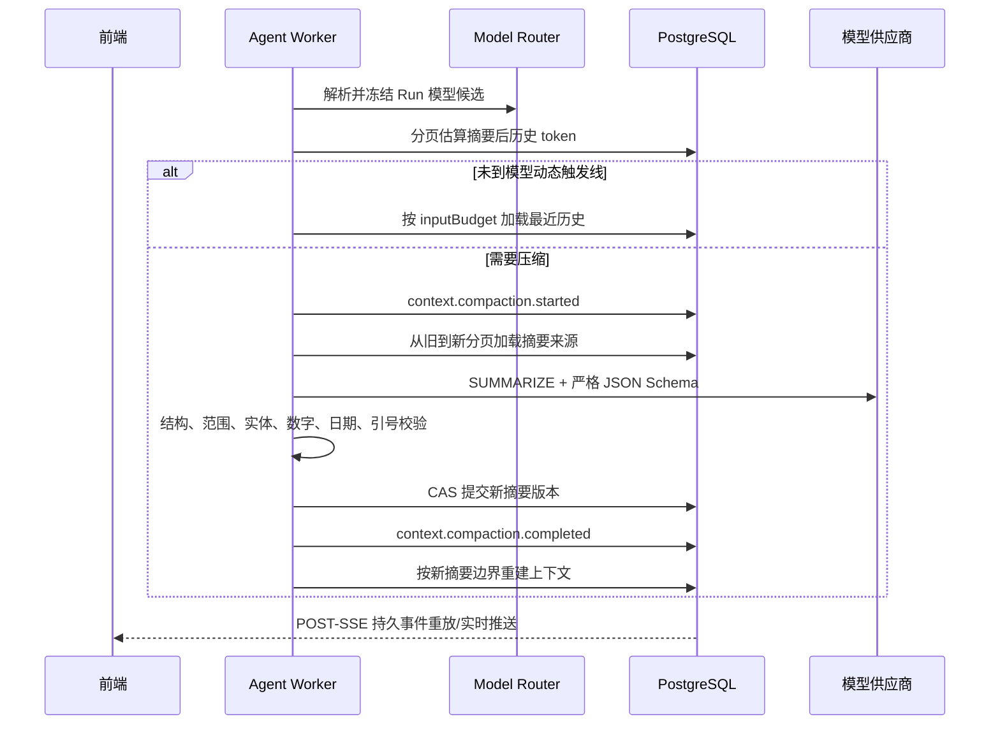

# 模型感知会话上下文压缩运行手册

> 状态：已实现。适用于 Agent API、Agent Worker 与同级 React 前端。

## 1. 结论

会话上下文不再按固定消息条数或固定 token 阈值裁剪。每个 Run 在 `load_context` 阶段根据实际路由模型的 `contextWindow`、`maxOutputTokens`、Run 剩余输入预算与比例配置计算上下文预算；AUTO 模式按全部冻结候选中的最小窗口计算，保证后续 fallback 仍可承载相同上下文。

长会话会调用模型生成结构化滚动摘要。摘要不是思维链：它只压缩用户可见消息、Tool 结果摘要和已验证引用，不读取、不保存、不返回供应商隐藏推理。原始消息保持不变，摘要通过版本与消息范围引用原文。

切换到更小上下文模型时，保存接口会先评估当前会话并返回 `READY`、`COMPACTION_REQUIRED` 或 `INCOMPATIBLE`。下一次 Run 需要压缩时，前端通过 SSE 显示“正在整理历史会话”；失败会显示稳定错误码和重试建议。

## 2. 预算算法

实现入口：

- `src/apps/agent/workflow/model-context-budget.service.ts`
- `src/apps/agent/workflow/workflow-model.service.ts`
- `src/apps/agent/memory/context-builder.service.ts`
- `src/apps/agent/memory/conversation-summary-generator.service.ts`

设：

- `W`：Run 冻结模型候选中最小 `contextWindow`；MANUAL 只有一个候选。
- `O`：候选中最小 `maxOutputTokens`。
- `L`：Run 可选的累计输入成本护栏；默认关闭时为正无穷。
- `U`：Run 已消耗的输入 token。
- `s/o/t/c`：安全、输出预留、压缩触发、压缩目标比例。

计算公式：

```text
safeWindow       = floor(W * (1 - s))
reserveBase      = safeWindow
outputReserve    = min(O, floor(reserveBase * o))
remainingInput   = L == null ? +Infinity : L - U
inputBudget      = min(remainingInput, safeWindow - outputReserve)
compactionTrigger= floor(inputBudget * t)
compactionTarget = floor(inputBudget * c)
```

摘要模型的输入、输出也由当前模型与 Run 剩余预算推导：

```text
summaryOutput = min(O, floor(reserveBase * summaryOutputReserveRatio))
summaryInput  = min(
  safeWindow - summaryOutput,
  floor(remainingInput * summaryRunInputRatio)
)
```

任何计算结果小于 1 token 都立即返回 `6048 AI_MODEL_CONTEXT_INCOMPATIBLE`，不会把超限请求发给供应商后再猜测错误。

`AGENT_CONTEXT_QUERY_PAGE_SIZE` 仅是数据库分页批量大小，不参与语义阈值计算。修改它只影响查询次数和单次内存占用，不改变保留多少历史。

## 3. Run 内模型一致性

每个 Run 在创建事务内从活动部署目录冻结模型能力，不等到 Worker 的 `load_context` 才取实时配置。AUTO 只纳入满足工作流结构化协议与 `USER_PRIVATE` 数据等级的候选；结果同时写入 Run budget 和 Workflow State/Checkpoint：

```ts
type WorkflowModelProfile = {
  selectedProvider: string
  selectedModel: string
  candidates: ModelDescriptor[]
}
```

后续 PLAN、SUMMARIZE、SYNTHESIZE、VERIFY 使用同一份冻结候选，不重新选择路由。这样可以避免以下竞态：上下文按大模型构建后，调用前健康状态变化又切到小模型导致供应商拒绝。

旧 Checkpoint 没有 `modelProfile` 时会在恢复后惰性解析并写回，不要求一次性迁移历史记录。

## 4. 压缩流程



关键约束：

1. 消息以游标分页扫描，不依赖固定消息条数。
2. 当前用户问题属于必需上下文，不允许被摘要；它单独超预算时返回 `6049`。
3. 摘要来源从旧到新加载，完整 Prompt 估算不能超过 `summaryInput`。
4. 摘要使用专用发布态 Prompt、`purpose=SUMMARIZE` 和严格结构化输出。
5. 校验通过后使用 expected version CAS 提交；并发冲突重读后最多重算一次。
6. 原始消息不删除，旧摘要不覆盖；会话只推进 `currentSummaryId/summaryVersion`。
7. 必须压缩却无法安全生成摘要时不静默丢历史，Run 以 `6047` 失败并允许重试。

这与 Codex 的核心思路一致：在接近模型上下文边界时使用模型生成可继续工作的压缩状态，而不是截断固定 N 条消息。当前系统仍使用供应商无关的结构化摘要，因为现有模型网关同时支持 OpenAI-compatible/DeepSeek 等模型；未来若迁移到 Responses API，可在 Adapter 内评估原生 compaction，但不得让供应商 opaque state 成为数据库会话的唯一事实源。参考：[OpenAI Compaction 指南](https://developers.openai.com/api/docs/guides/compaction)。

## 5. 模型切换

`POST /api/agent/conversations/model/update` 在更新前调用 `ConversationContextCompatibilityService.assess()`，响应固定包含：

```json
{
  "contextPreparation": {
    "status": "COMPACTION_REQUIRED",
    "targetModel": "example-model",
    "contextWindow": 32768,
    "estimatedRecentTokens": 26000,
    "triggerTokens": 18432,
    "targetTokens": 12288,
    "willAutoCompactOnNextRun": true,
    "message": "下一轮发送前会自动整理历史会话，原始消息不会删除"
  }
}
```

状态语义：

| 状态 | 行为 |
| ---- | ---- |
| `READY` | 下一轮可直接构建上下文。 |
| `COMPACTION_REQUIRED` | 模型设置保存；下一轮在调用模型前自动压缩，前端显示警告提示。 |
| `INCOMPATIBLE` | 模型设置保存但前端显示强错误提示；下一轮若仍无法建立安全预算，会返回 `6048/6049`，不会静默换回大模型。 |

MANUAL 模型必须同时具备 `USER_PRIVATE` 数据资格、`STREAMING` 和 `STRUCTURED_OUTPUT`。AUTO 只从满足相同条件且健康的模型中选择。模型目录向前端公开 `contextWindow/maxOutputTokens`，但不公开密钥、base URL 或原始健康错误。

AUTO 的切换预检与实际 Run 一样，按全部健康 fallback 候选中的最小窗口计算；`targetModel` 表示首选模型，`contextPreparation.contextWindow` 表示本次策略可安全依赖的有效最小窗口。

## 6. 前端事件和错误

新增持久 SSE 事件：

| 事件 | 用途 |
| ---- | ---- |
| `context.compaction.started` | 显示目标模型、估算 token 与目标 token。 |
| `context.compaction.completed` | 显示摘要版本、来源消息数与来源 token。 |
| `context.compaction.failed` | 显示安全错误文案和是否可重试。 |

前端 reducer 只把事件投影为运行阶段与错误提示，不把摘要正文写入 assistant 消息。事件 payload 不允许包含原始消息、Prompt、摘要正文或隐藏推理。

新增错误码：

| code | 枚举 | 用户动作 |
| ---: | ---- | -------- |
| 6047 | `AI_CONTEXT_COMPACTION_FAILED` | 重试；反复失败时选择上下文更大的模型。 |
| 6048 | `AI_MODEL_CONTEXT_INCOMPATIBLE` | 选择更大上下文模型，或降低本次 Run 预算占用。 |
| 6049 | `AI_CURRENT_INPUT_TOO_LARGE` | 缩短当前输入/附件，或切换更大模型。 |

OpenAI-compatible Adapter 只对 400/409/422 且包含稳定 context-length 错误码/短语的响应映射为内部 `CONTEXT_LENGTH`；最多读取 8192 字符用于分类，供应商原始 body 不返回前端。

## 7. 配置与迁移

```dotenv
AGENT_SUMMARY_ENABLED=true
AGENT_CONTEXT_SAFETY_RATIO=0.08
AGENT_CONTEXT_COMPACTION_TRIGGER_RATIO=0.75
AGENT_CONTEXT_COMPACTION_TARGET_RATIO=0.5
AGENT_CONTEXT_OUTPUT_RESERVE_RATIO=0.15
AGENT_SUMMARY_OUTPUT_RESERVE_RATIO=0.05
AGENT_SUMMARY_RUN_INPUT_RATIO=0.25
AGENT_CONTEXT_QUERY_PAGE_SIZE=100
```

约束：`COMPACTION_TARGET_RATIO < COMPACTION_TRIGGER_RATIO`。所有比例均有配置启动校验；非法值会阻止服务启动。

旧配置已废弃，部署配置中心和 Secret 模板中应删除：

```text
AGENT_CONTEXT_MAX_TOKENS
AGENT_RECENT_MESSAGE_COUNT
AGENT_SUMMARY_MIN_MESSAGE_COUNT
AGENT_SUMMARY_TRIGGER_TOKENS
AGENT_SUMMARY_MAX_SOURCE_TOKENS
AGENT_SUMMARY_MAX_MESSAGE_COUNT
AGENT_SUMMARY_MAX_OUTPUT_TOKENS
```

`AGENT_MAX_INPUT_TOKENS` 已废弃，仅兼容恢复旧 Run。部署模板必须删除它。若业务确需跨多次模型调用限制累计输入成本，显式配置：

```dotenv
AGENT_RUN_MAX_CUMULATIVE_INPUT_TOKENS=128000
```

新护栏默认关闭，并在 Run 创建时记录策略来源和快照时间。它不是模型 `contextWindow`；两者分别在事件、审计和 UI 中显示。旧变量与新变量同时配置会阻止启动。

## 8. 发布与验证

不需要 Prisma migration。发布时必须同时更新 API、Agent Worker 和前端，避免新事件只在后端产生而前端没有阶段文案。

```bash
pnpm run agent:contracts:check
pnpm run swagger:generate
pnpm run build
pnpm exec jest src/apps/agent --runInBand

cd ../client-code
yarn api:agent:check
yarn test src/sections/agent/__tests__/agent-reducer.test.ts \
  src/sections/agent/__tests__/conversation-model-control.test.tsx \
  src/types/agent/__tests__/agent-contracts.test.ts
yarn lint
yarn build
```

上线后至少验证：

1. 大窗口模型的长会话未到动态阈值时不触发压缩。
2. 同一会话切换小窗口模型后返回 `COMPACTION_REQUIRED`，下一轮出现 started/completed 事件并继续回答。
3. 模型摘要超时或返回非法结构时出现 failed 事件和 `6047`，原始消息不丢失。
4. 当前单条输入超过预算时返回 `6049`，前端显示明确错误。
5. AUTO fallback 到最小窗口候选时不出现供应商 context-length 错误。
6. 日志、SSE、REST 与数据库审计中均不存在隐藏推理或摘要来源原文泄漏。

## 9. 监控建议

当前事件和 ModelCall 审计已经能定位单次故障；后续补充 Prometheus 指标时使用低基数标签：

- `agent_context_compaction_total{status,provider,model_group}`
- `agent_context_compaction_duration_seconds{provider,model_group}`
- `agent_context_estimated_tokens{model_group}`（直方图）
- `agent_context_error_total{code}`

禁止把 `conversationId`、`runId`、完整模型名或用户输入作为指标标签。告警建议关注 `6047` 比率、P95 压缩耗时与供应商原生 context-length 映射数量，而不是单次失败。
