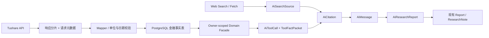

# 数据血缘设计

## 1. 目标

Agent 输出的每个金融事实都必须能回答五个问题：来自哪个数据集/网页、原始业务时点是什么、何时对市场可得、何时入库、经过什么单位/复权/算法转换。`syncedAt`、报告期和交易日不能互相替代。

血缘最小链路：



当前仓库没有长期原始 Tushare 响应层；首期至少保存 request/task/分片/response hash/row count/validation summary。只有争议数据集和审计抽样保存脱敏原始对象，避免把全部 41 GB 再复制一份。

## 2. 数据目录契约

每个 Agent 可访问数据集在代码内注册不可变 `DatasetCatalogEntry`：

| 维度 | 含义 | 示例 |
| --- | --- | --- |
| `datasetKey` | 稳定逻辑名 | `tushare.daily.v1` |
| `model/table` | Prisma/真实表映射 | `Daily` / `stock_daily_prices` |
| `sourceApi/sourceTask` | 上游与同步 plan | `daily` / `DAILY` |
| `grain` | 一行代表什么 | 一证券一交易日 |
| `businessKey` | 自然键 | `(tsCode,tradeDate)` |
| `businessTime` | 经济归属时间 | `tradeDate` |
| `publishedTime` | 来源发布/公告时间 | 财报 `annDate/fAnnDate` |
| `availableTimeRule` | 历史查询可见规则 | `annDate` 收盘后或明确时间 |
| `ingestedTime` | 实际入库时间 | `syncedAt`/SyncLog 时间 |
| `timezone` | 业务时间解释 | `Asia/Shanghai` |
| `unit/currency/scale` | 字段单位 | amount=千元、totalMv=万元 |
| `adjustment` | 价格复权口径 | NONE/FORWARD/BACKWARD |
| `versionRule` | dataVersion 计算 | schema+task watermark+校验版本 |
| `qualityRules` | 完整性/及时性/一致性 | 活跃证券覆盖、OHLC、单位 |
| `retention/license` | 保存与使用边界 | Tushare 授权、网页许可 |

目录由 Tool Registry 引用；未知 datasetKey、单位、时区或可得日规则时，Tool 状态只能是 `DEGRADED/UNKNOWN`，不能默认推断。

## 3. 核心数据集血缘

### 3.1 行情与复权

```text
Tushare daily
  -> TushareSyncRegistry DAILY plan
  -> mapOhlcvRecord
  -> Daily / stock_daily_prices
  -> StockToolFacade.getPriceHistory
  -> get_stock_price_history
  -> AiToolCall(dataAsOf,dataVersion,qualityFlags)
  -> AiCitation(toolCallId, locator={tsCode,tradeDate,field})
```

Daily 的 grain 为 `(tsCode,tradeDate)`，交易日是 `date`，市场时区为 `Asia/Shanghai`。`vol` 为手、`amount` 为千元，响应必须转换为 Tool Schema 的显式单位。Weekly/Monthly 当前 `pctChg` 与 Daily 相差 100 倍，修复和回填完成前血缘标记 `BLOCKED:PCT_SCALE_MISMATCH`。

复权链增加 `AdjFactor / stock_adjustment_factors`。前复权基准因子、截止日、公式版本必须进入 dataVersion；当前个股图表 `latestAdj/factor` 方向错误，回测虽用正确方向但因子查询无稳定排序，均不可省略 warning。

### 3.2 估值、市场快照与因子

`DailyBasic / stock_daily_valuation_metrics` 来自 `daily_basic`，服务 `get_stock_overview`、`compute_valuation_percentile`、`get_market_snapshot`，不作为 `get_financial_indicators` 的 canonical 来源。估值百分位还依赖 universe、行业分类有效期、窗口和 null 规则，这四项进入算法版本。

`FinaIndicator / financial_indicator_snapshots` 才是 `get_financial_indicators` 来源。其公告版本键不完整时返回 `DEGRADED:FINANCIAL_VERSION_GAP`，不能用 DailyBasic 替换后仍称为财务指标。

### 3.3 财务报表

```text
Tushare income/balancesheet/cashflow/fina_indicator
  -> FinancialSyncService 按证券/报告分片
  -> Income / BalanceSheet / Cashflow / FinaIndicator
  -> FinancialPointInTimeResolver(asOf)
  -> get_financial_statements / get_financial_indicators
```

时间字段必须拆分：

- `reportPeriod=endDate`：报表经济归属期。
- `announcementDate=annDate/fAnnDate`：公告/实际公告日期。
- `availableAt`：历史市场能使用该版本的最早时点；仅有日期时按明确市场规则解析，不假装有分钟精度。
- `ingestedAt`：本系统收到该版本的时间。

查询先做 `availableAt <= requestedAsOf`，再按报告期、修订状态、公告时间和稳定 id 选择 canonical 版本。当前按 `endDate` 直接选版会产生 91%–98% 的实测未来公告选择，必须标 `BLOCKED:LOOKAHEAD_BIAS`。

多版本不是重复：Income/Balance/Cash 同期多版本组分别 69,386/102,026/80,963。Dividend 的 16,260 条冗余则是确认重复，修复后要在 lineage 记录 dedupe migration、保留 row 映射和新自然键版本。

### 3.4 资金流、行业和指数成分

`Moneyflow / stock_capital_flows` 当前只有约 60 个交易日，金额单位为万元；Tool 必须返回真实 `coverageStart`，不能描述为全历史。行业/市场资金流、HSGT/GGT 各有独立交易日历和截止日，组合快照时不能只给一个“最新”。

指数/申万成分使用不晚于 asOf 的最近有效快照，并应用 inDate/outDate。THS 成员缺完整有效期时返回 `DEGRADED:MEMBERSHIP_EFFECTIVE_DATE_UNKNOWN`。回测 universe 版本至少包含成分 snapshot date、成分 hash、上市/退市有效规则。

### 3.5 用户私有数据

Watchlist、Portfolio、Backtest 由现有表和 Service 负责。ToolCall 血缘只保存 owner-scoped resource ref、读取版本/updatedAt、查询摘要与 hash；不复制全部持仓到公共缓存。Citation locator 可含资源 id，但前端和日志按 userId 重新鉴权。

`get_portfolio_risk` 当前主要是最新持仓快照；收到历史 asOf 时若没有历史持仓/价格版本，应拒绝或标 `BLOCKED`，不能把当前持仓与历史价格拼接。

### 3.6 Web 来源

`search_web` 先保存结果元数据；`fetch_web_page` 保存 canonical URL、标题、站点、作者、publishedAt、fetchedAt、contentHash、许可/robots 状态和对象引用。重定向链和 canonicalization 版本进入 source metadata。

网页更新产生新的 `(canonicalUrlHash,contentHash)` 版本，不覆盖旧快照。Citation 保存段落/页码/表格单元格定位和 quote hash；报告重放时能说明引用的是哪个抓取版本。模型生成的总结不是新事实来源。

## 4. `ToolFactPacket` 标准

所有 canonical Tool 先输出程序验证的事实包，再由 Model Gateway 预算化进入上下文：

```ts
type ToolFactPacket<T> = {
  toolCallId: string
  tool: { key: string; version: string; outputSchemaVersion: string }
  data: T
  provenance: Array<{
    datasetKey: string
    sourceTask?: string
    sourceType: 'DATABASE' | 'PROGRAM_CALCULATION' | 'OFFICIAL' | 'MEDIA' | 'INSTITUTION'
    businessAsOf?: string
    availableAt?: string
    retrievedAt: string
    dataVersion: string
    locator: Record<string, unknown>
  }>
  semantics: {
    timezone?: string
    currency?: string
    unit?: string
    adjustment?: 'NONE' | 'FORWARD' | 'BACKWARD'
    nullPolicy: 'PRESERVE'
  }
  coverage: { start?: string; through?: string; expected?: number; actual?: number }
  quality: { status: 'READY' | 'DEGRADED' | 'BLOCKED' | 'UNKNOWN'; flags: string[] }
  truncated: boolean
}
```

程序计算还必须列出输入 dataVersion 集合、算法 key/version、参数、universe hash 和输出 hash。模型推断在 Message block 标记 `MODEL_INFERENCE`，不能伪造 ToolFactPacket。

## 5. DataVersion 规则

禁止只用 `MAX(tradeDate)` 作为版本：空响应、部分股票缺失和 retry 假成功会得到相同最大日期。建议稳定串：

```text
sha256(
  datasetKey
  + schemaVersion
  + mapperVersion
  + unitVersion
  + qualityRuleVersion
  + sourceTask
  + partitionKeys
  + verifiedRowCount
  + primaryKeyChecksum
  + maxVerifiedBusinessTime
  + maxSuccessfulIngestedAt
)
```

行情区间可组合逐日分片版本；财报版本集合由选中 row 的业务键、availableAt、updateFlag、content hash 组成；复权增加 factor basis；网页使用 canonicalUrlHash+contentHash。大表 checksum 可用确定性分桶/抽样，但算法和误差范围必须登记。

TushareSyncLog 当前 10,686 条全 SUCCESS 不能单独进入“verified”版本，因为现有路径会吞掉分片失败、空响应可先删除旧数据、旧 retry 会被最新水位短路。只有实际表覆盖、分片行数/checksum、validation 和 quality gate 同时通过才推进 verified watermark。

## 6. As-of 解析

统一 `SnapshotResolver`：

1. 把请求日期解释为市场时区，并用 TradeCal 解析最近有效交易日。
2. 对每个 dataset 单独求 `businessAsOf/availableAt/dataThrough`。
3. 财报只选择当时已公告版本；指数/行业选择当时有效成员；证券池应用 list/delist 日期。
4. 对缺少历史版本的数据返回明确 warning 或失败，不静默使用当前值。
5. 返回多数据集各自截止日；Presenter 可计算最弱截止日，但不得覆盖明细。

事件/审计用 `timestamptz`；交易日/报告期用 `date`；来源只有日期时保存 date + `availabilityRuleVersion`，禁止编造 UTC 时间。现有 PostgreSQL `Asia/Shanghai` 与 Node UTC 的无时区字段需要逐字段采样确认后再迁移。

## 7. 质量门禁

每个分片状态：`RECEIVED -> MAPPED -> VALIDATED -> COMMITTED -> VERIFIED`；失败保留阶段和安全错误。门禁至少包括：

- schema/类型/日期真实日历校验；禁止无效日期自动归一。
- 主键唯一、自然键碰撞、null 比例和字段取值域。
- OHLC 一致性、收益/单位、金额/成交量 scale、复权公式。
- 目标交易日活跃证券覆盖；停牌按逐证券判断。
- 财务 distinct 证券覆盖与公告版本，不用总行数虚增。
- 与前一分片的行数/总额/摘要变化阈值。
- 空响应区分“真实无数据”和“上游/权限/频控异常”；未验证前不 delete-replace。

当前 DataQualityService 只覆盖 29/65 数据集、状态页只覆盖 52/65；其余 13 个遗漏任务在补齐前标 `UNKNOWN`。ShareFloat 未来日期到 2035，MAX 日期不能作为新鲜度。

## 8. 已知血缘断点与修复记录

| 断点 | 影响 | 修复后必须记录 |
| --- | --- | --- |
| 10 张表无 migration CREATE | 新库无法重建来源表 | migration id、schema hash、回填范围 |
| 周/月 pctChg 100 倍 | 收益计算错误 | 旧/新 unit version、回填主键范围、校验和 |
| QFQ 公式反向/排序不稳 | 历史价格错误 | formula version、basis date/factor |
| 财报无 availableAt | 回测/历史回答前视 | resolver version、选版规则、公告源 |
| Dividend 重复 | 事件/收益重复 | old row id→canonical id 映射、dedupe reason |
| retry 假成功/部分成功 | 水位不可信 | 原分片、重跑 attempt、实际覆盖/checksum |
| 空响应先删 | 会造成历史数据丢失 | 删除前备份/恢复批次、上游 response hash |
| current listStatus 回测 | 幸存者偏差 | universe resolver version、成员 hash |

修复不得原地改变语义而不升级 dataVersion。历史报告继续引用旧版本并显示 warning；重新生成产生新 Run/Report，不改写旧结论。

## 9. 引用完整性与展示

- 数据库事实 Citation 指向 ToolCall，并用 locator 精确到 dataset、证券、日期/报告期、字段或聚合公式。
- Web Citation 指向 SearchSource 版本；抓取失败、许可不明或正文未验证时不可引用为强事实。
- 一个 claim 可有多个 Citation；一个 Citation 不能同时指 ToolCall 和 SearchSource。
- Message/Report 删除前按保留策略处理引用，禁止留下用户可见的断链。
- 前端显示来源、asOf、单位、adjustment、quality warning 和 retrievedAt；引用序号不是事实 id。

## 10. 隐私与合规

血缘日志不保存密码、token、cookie、Webhook secret、完整 Prompt 私有片段或 hidden chain-of-thought。URL query、网页正文、Tool 参数和错误在持久化前脱敏；用户 Watchlist/Portfolio locator 只对 owner 可见。

用户删除流程先撤销访问和记忆，再清除消息正文/附件/私有来源对象/渠道凭据，最后匿名化必要审计。共享公共数据和来源按 content hash 去重时，引用关系与用户 ACL 分开保存，不能因一个用户删除而破坏其他用户合法引用。

参见[拟议 Schema 变更](./proposed-schema-changes.md)、[索引与性能](./indexes-and-performance.md)、[金融数据服务边界](../backend/financial-data-service.md)和[Tool 方案](../tools/README.md)。
