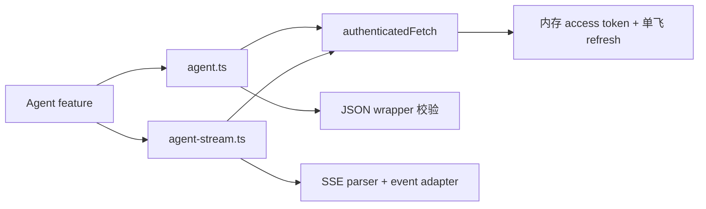

# Agent 前端 API 集成

> 契约入口：[REST API](../api/rest-api.md)、[SSE 事件](../api/sse-events.md)、[WebSocket 事件](../api/websocket-events.md)、[错误码](../api/error-codes.md)。本文不复制接口路径或载荷定义。

## 1. 当前基线与结论

现有 `../client-code/src/api/client.ts` 提供基于 `fetch` 的 JSON wrapper，识别后端 `{ code, data, message }`，访问令牌只存内存，刷新令牌使用 HttpOnly Cookie，并已实现 401 单飞刷新。现有业务调用实际主要使用 POST。

Agent 应保留这些安全基础，但把“请求执行”和“响应消费”拆开：普通命令/查询消费 JSON，运行消费 POST Fetch SSE。不能为了流式回答绕过统一鉴权，也不能让 JSON helper 预先读取流 body。

## 2. 文件变更

建议修改/新增（路径相对 `../client-code`）：

- 修改 `src/api/client.ts`：抽取 `authenticatedFetch` 或等价底层函数；保持现有 API 兼容。
- 新增 `src/api/agent.ts`：会话、消息、运行、工具确认、定时任务、报告与通知的语义方法。
- 新增 `src/api/agent-stream.ts`：POST 流建立、恢复、取消 reader 与响应头校验。
- 新增 `src/api/sse-parser.ts`：无业务依赖的纯解析器。
- 生成 `src/api/generated/agent-api.ts`：公共 DTO、消息块与事件类型。
- 新增 `src/mocks/handlers/agent.ts`：MSW 普通响应与可控分块场景。

`agent.ts` 方法名表达业务意图，不把 URL 散落进组件。组件禁止直接调用 `fetch`。

## 3. 契约生成与运行时校验

后端 CI 输出 OpenAPI/契约制品，前端锁定版本并生成 TypeScript 类型。生成文件禁止手工修改；契约变更在 PR 中展示 diff。无法完全由静态类型保护的边界——SSE JSON、未知消息块、缓存数据——增加轻量运行时守卫。

构建门禁：

1. 服务端契约与文档一致；
2. 前端生成文件无未提交漂移；
3. 类型检查与 reducer fixture 编译通过；
4. 契约破坏性变化必须升级版本或提供兼容窗口。

## 4. 普通 JSON 请求

分页列表、详情、状态查询与命令统一通过 `agent.ts`。规则：

- 遵循服务端 POST JSON 约定；方法与载荷以 [REST API](../api/rest-api.md) 为准。
- 每个请求接收 `AbortSignal`，会话切换或组件卸载时可取消。
- 会改变状态或可能重复执行的命令传递稳定幂等标识。
- 统一把 HTTP、业务错误与响应校验错误转换为前端错误分类，同时保留安全 traceId。
- 不在 feature 内再次实现 401 刷新；刷新最多自动重放一次。

页面上下文是结构化、可见且可删除的输入。前端只发送当前页面允许的最小字段，不上传整个 DOM、浏览器历史、隐藏表格或本地存储。

## 5. 流式请求

流式调用使用同一 `authenticatedFetch`，但要求响应是可读流和正确媒体类型。成功后把 body 交给解析器；错误响应按普通错误 wrapper 安全读取。解析、顺序、心跳、背压和恢复见 [流式协议](./streaming-protocol.md)。

流请求的 AbortSignal 由运行 hook 持有。刷新令牌后必须建立新请求并按服务端规范恢复，不能尝试续用旧 response。一次运行只能有一个当前连接代次；旧连接迟到事件由 adapter 拒绝。

## 6. WebSocket 接入

现有 `src/lib/socket.ts` 与 `src/contexts/sync-notification-context.tsx` 可继续作为全局通知入口，但上线前必须：在握手传递访问令牌、鉴权失败即断开、实现规范化的错过通知恢复、修复异常扫描事件名不一致，并在服务端多实例启用 Redis adapter。

Socket 通知只使相关会话/报告/通知缓存失效或更新摘要；完整数据随后经普通 API 拉取。即使 Socket 断开，当前 SSE 运行仍可独立完成。

## 7. Cookie、同域与 CSRF

当前刷新 Cookie 为 HttpOnly 且 `SameSite=Strict`。生产建议让浏览器只访问同一站点：前端静态站点与 `/api`、`/socket.io` 由同一反向代理域名提供，避免跨站 Cookie、CORS 和浏览器隐私策略的不确定性。

若未来必须跨站部署，需要显式重新设计 `SameSite=None; Secure`、允许来源、credentials、CSRF token、Origin/Referer 校验与预检缓存，不能只放宽 CORS 为通配符。部署细节见 [后端部署](../backend/deployment.md)。

## 8. 缓存与请求协调

第一阶段不引入 TanStack Query。会话侧栏与详情使用 Provider 内存缓存、请求代次和显式失效：

- 列表按搜索/分页参数缓存短生命周期结果；
- 会话快照按身份缓存，进入时可先显示后校验；
- 运行终态、Socket 通知和写命令使相关条目失效；
- 同一资源并发读取可做 promise single-flight；
- 敏感响应不写 Service Worker 或长期浏览器缓存。

如果后续多页面共享同一服务器缓存，再评估查询库，并先定义与 SSE 增量合并的单一所有权。

## 9. 测试替身

MSW handler 提供确定性场景：空会话、分页、慢流、工具成功/失败、未知块、401 刷新、限流、流中断、恢复位置失效和取消竞态。fixture 从生成类型创建，禁止复制一份手写 DTO。

单元测试断言请求方法、鉴权重放次数、幂等标识稳定性、Abort 和错误转换；集成测试断言 JSON 快照与 SSE 增量不会产生重复消息。Playwright 的后端镜像与契约版本必须固定，不能隐式使用浮动 `latest` 作为唯一可重复环境。

首批实现归入 [batch-015](../tasks/batches/batch-015-frontend-stream-client-and-contracts.md)。
