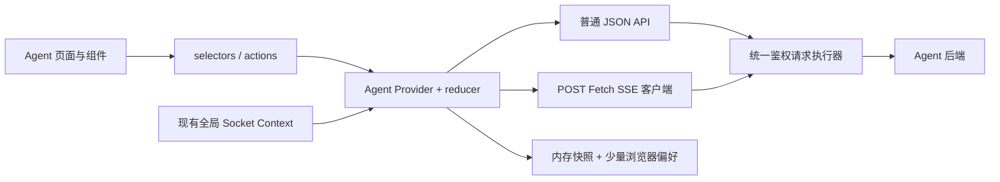
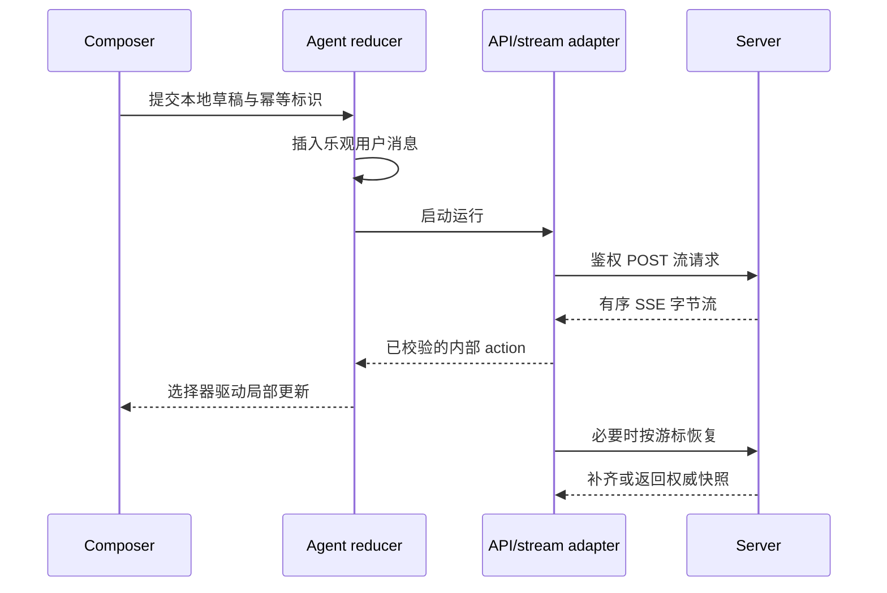

# Agent 前端架构

> 公开接口以 [Agent API 总览](../api/README.md) 为准；本文只定义前端模块与依赖方向。

## 1. 架构结论

在现有 `../client-code` 中新增 feature-scoped Agent 模块，不引入新的全局状态库。页面层只负责路由；`sections/agent` 负责工作台组合；`api` 层区分普通 JSON 与 POST Fetch SSE；会话运行状态由局部 Provider + reducer 管理；稳定的登录态、主题与全局后台通知继续使用现有 Context。



依赖只能从 UI 指向状态与 API；解析器、reducer、格式化器不得反向依赖页面组件。这样可以独立测试流处理，也避免把网络生命周期散落到消息组件中。

## 2. 建议目录

以下路径均相对 `../client-code/src`：

```text
api/
  agent.ts                         # 普通 JSON 查询/命令
  agent-stream.ts                  # POST Fetch SSE 与解析器入口
  generated/agent-api.ts           # 由服务端契约生成的公共类型
pages/
  agent.tsx                         # 薄路由页面
sections/agent/
  view/agent-view.tsx               # 页面组合与加载边界
  components/
    agent-shell.tsx
    conversation-sidebar.tsx
    message-viewport.tsx
    message-item.tsx
    composer.tsx
    run-status-bar.tsx
    tool-call-card.tsx
    citation-list.tsx
    blocks/
      block-renderer.tsx
      markdown-block.tsx
      data-table-block.tsx
      chart-block.tsx
      stock-kline-block.tsx
      block-error-boundary.tsx
  state/
    agent-provider.tsx
    agent-reducer.ts
    agent-selectors.ts
    agent-actions.ts
    agent-state.types.ts
  hooks/
    use-agent-run.ts
    use-conversation-list.ts
    use-composer-draft.ts
  lib/
    stream-event-adapter.ts
    message-block-guards.ts
    format-finance-value.ts
    run-recovery.ts
  tests/
```

共享抽取建议：

- 将 `src/sections/research-note/research-note-preview.tsx` 的 Markdown/GFM 能力下沉到 `src/components/markdown/`，研究笔记和 Agent 共用。
- 保留 `src/components/chart/` 作为唯一 ApexCharts 壳；Agent 只增加领域数据到图表配置的转换器。
- 从 `src/sections/stock-detail/stock-detail-market-tab.tsx` 抽取 `src/components/stock-kline/`，只接收已归一化序列，不负责请求和业务标签页。
- 不急于抽取通用表格。先让 Agent 数据表在 feature 内稳定，再依据股票列表、回测结果等共同需求决定是否提升到 `src/components/data-table/`。

## 3. 路由与导航

新增 `src/pages/agent.tsx`，在 `src/routes/sections.tsx` 注册受保护的懒加载路由，并在 `src/layouts/nav-config-dashboard.tsx` 增加“AI 研究”入口。建议使用：

- `/agent`：进入最近会话或新建态；
- `/agent/:conversationId`：可收藏、可刷新、可分享受权限保护的会话地址。

路由参数只是选择器，不是状态真相。参数变化触发服务端加载会话快照；无权限或已删除时进入明确错误态，不静默创建新会话。

## 4. 模块边界

### 4.1 页面与布局

`agent-view.tsx` 负责加载边界、Provider 挂载和三栏/双栏布局；不直接解析网络事件。`agent-shell.tsx` 组合会话侧栏、消息视口、上下文栏和输入区。

### 4.2 状态域

Agent Provider 只覆盖 Agent 路由树。它保存规范化实体索引、当前选择、流连接元数据与 UI 临时态。详细模型见 [状态管理](./state-management.md)。认证、主题、全局同步通知仍由现有 Provider 负责，避免 Provider 嵌套出重复真相源。

### 4.3 网络域

- `agent.ts`：分页列表、详情、命令与状态查询，遵循 [REST API](../api/rest-api.md)。
- `agent-stream.ts`：发起带 JSON body 的流式 POST、读取响应字节并产出内部事件，遵循 [SSE 事件](../api/sse-events.md)。
- `src/lib/socket.ts`：只接收后台/跨设备通知，遵循 [WebSocket 事件](../api/websocket-events.md)。

普通请求与流请求共享“添加访问令牌—401 单飞刷新—重放一次”的底层执行器，但不能共享一次性读取 JSON 的响应处理。

### 4.4 展示域

服务端消息先通过生成类型和运行时守卫，再交给 `block-renderer.tsx` 的白名单分发。未知块、版本过新或单块渲染失败时，只替换该块，不让整条消息或整个工作台崩溃。详情见 [组件设计](./component-design.md) 与 [图表设计](./chart-and-data-visualization.md)。

## 5. 数据流



关键规则：

1. 网络层不直接 setState；所有运行增量都变成 reducer action。
2. reducer 按运行与事件身份去重，并拒绝序号倒退。
3. 流结束只是“停止接收”；最终状态以服务端持久化快照为准。
4. Socket 通知只触发失效标记或轻量状态合并，不能把通知当完整消息正文。

## 6. 现状缺口与迁移顺序

当前主要风险是 `src/api/client.ts` 把响应按 JSON 处理、`src/lib/socket.ts` 未在握手携带访问令牌，以及现有后端允许无效 Socket 连接继续存在。前端还监听了服务端并未按同名事件发送的异常扫描事件，且重放请求没有对应处理器。Agent 上线前应按 [WebSocket 事件](../api/websocket-events.md) 一次性收敛这些旧缺口。

建议顺序：先完成流客户端与契约生成，再完成聊天壳，最后接入富响应块；分别对应 [batch-015](../tasks/batches/batch-015-frontend-stream-client-and-contracts.md)、[batch-016](../tasks/batches/batch-016-frontend-chat-shell.md) 和 [batch-017](../tasks/batches/batch-017-frontend-rich-response-blocks.md)。
