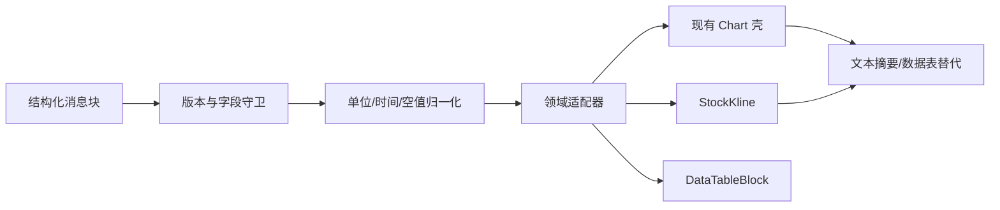

# Agent 图表与数据可视化

> 目标：让回答中的数值可验证、可比较、可追溯；服务端提供结构化数据，前端决定安全且一致的展示。

## 1. 总体方案

所有富数据先经过生成类型与运行时守卫，再由白名单 renderer 转换为本地组件。服务端不得直接下发任意 ApexCharts 配置、HTML formatter、颜色、回调函数或脚本。

公开消息块的字段与版本只在 [REST API](../api/rest-api.md) 定义，本文不创建第二份 schema。

## 2. 现有能力复用

`../client-code/src/components/chart/chart.tsx`、`use-chart.ts` 与 `types.ts` 已封装 ApexCharts、主题和常见配置，应继续作为折线、柱状、面积、混合等图表的唯一基础。Agent 新增的是纯转换器，而不是复制 Chart 组件。

K 线方面：

- `../client-code/src/api/stock.ts` 已有 `StockChartItem`、`StockChartData` 与股票详情图表接口，可复用领域命名和数值处理经验。
- `../client-code/src/sections/stock-detail/stock-detail-market-tab.tsx` 超过千行并混合请求、标签页、懒加载、分时、资金流与图表，不应被 Agent 直接导入。
- 抽取 `../client-code/src/components/stock-kline/stock-kline.tsx` 与纯适配器，输入为已排序、已归一化的 OHLCV 序列；股票详情和 Agent 分别负责取数。

## 3. 支持的展示形态

第一阶段应覆盖以下产品能力，但具体块类型名称仍以生成契约为准：

- 时间序列：价格、指数、净值、指标随时间变化；
- 横向比较：多股票、多行业或多财务指标；
- K 线：OHLC、成交量、可选均线与复权说明；
- 数据表：财务明细、筛选结果、回测交易、因子暴露；
- 关键指标：少量 KPI 与同比/环比；
- 文本 + 来源：不能可靠画图时优先给出表格和解释。

不支持饼图展示过多类别，不支持 3D 图，不根据服务端任意字符串动态加载图表插件。

## 4. 数据语义与格式

每个可视化必须明确：标题、指标含义、单位、时间范围、时区、数据时间、来源与调整口径。缺少这些元数据时进入“数据说明不完整”警告态，而不是自行猜测。

格式规则：

- 价格保留精度依据市场/证券元数据，不统一强制两位小数；
- 百分比内部采用一种明确口径，适配层统一转换并测试，避免 `0.05` 与 `5` 混用；
- 金额使用本地化和万/亿缩写时，tooltip 同时给出完整值；
- `null` 表示缺失，不转成 0；NaN、Infinity 拒绝渲染；
- 时间戳统一解析为明确时区，交易日序列不人为补周末；
- 涨跌颜色遵循现有中国市场主题，同时保留正负号和方向图标。

## 5. K 线设计

K 线块默认展示价格主图和成交量副图，共享十字线与时间轴。均线作为本地允许列表选择，不接受任意公式字符串。复权方式、交易所、证券代码、币种、频率与最新数据时间必须在块头可见。

大数据处理：

- 服务端/接口先按视窗给出合理窗口，前端不一次加载全历史；
- 用户平移到边界时请求更多数据，按时间主键去重并稳定合并；
- 需要降采样时保留 OHLC 极值语义，不用普通平均破坏蜡烛；
- 数据量过大或移动端性能不足时，降级为摘要 + 可下载表格。

Agent K 线只展示分析结果，不复刻完整股票详情页。需要分时、盘口、资金流等深度交互时提供“在股票详情打开”链接。

## 6. 通用图表适配器

适配器完成：字段白名单、序列长度上限、时间排序、单位统一、主题 token 映射、tooltip 格式器选择和可访问摘要生成。formatter 只能从客户端允许列表选择，不能执行服务端代码。

图表交互包括 tooltip、图例开关、时间范围缩放、还原和“查看数据”。小屏默认减少刻度与图例；系列过多时先展示重要系列，其余放入选择器。

## 7. 数据表

当前项目没有 MUI DataGrid，现有表格多为 feature-local `Table` + `TablePagination`。Agent 第一阶段使用 MUI Table 实现受控数据块，功能边界为：

- 客户端小数据排序与列显隐；大数据排序/分页交回服务端；
- 表头固定、数值右对齐、单位进入列头；
- 横向滚动时冻结主标识列；
- 移动端提供关键字段卡片摘要；
- CSV 导出重新序列化已验证数据，防止公式注入，并标注来源与导出时间。

若后续需要列虚拟化、分组或十万级行数，再统一评估 DataGrid；不要为一个消息块提前引入重量依赖。

## 8. 来源与可审计性

每个块底部显示紧凑来源行：数据源、截至时间、口径和引用入口。tooltip 中的数据点可关联到来源或工具调用，但不得暴露服务端敏感内部路径。用户复制或导出时附上数据时间与来源说明，避免截图脱离上下文。

若数据陈旧、部分缺失或工具降级，图表头显示可见警告；不能只在隐藏日志里记录。

## 9. 安全与故障隔离

- 限制系列、点数、列数、字符串长度和嵌套深度。
- URL 仅允许安全协议；图片通过受控代理或允许域，避免追踪像素。
- 单个图表用 `BlockErrorBoundary` 包裹；失败显示文本摘要与重试，不影响回答其余部分。
- 不把原始工具输出直接传给 ApexCharts。
- 对未知版本显示升级提示，并上报块类型、版本、traceId，不上报完整敏感数据。

## 10. 性能与测试

图表仅在进入视口后初始化；隐藏 Drawer/折叠工具里的图表延迟渲染。配置用 memo，ResizeObserver 事件节流，组件卸载时销毁实例。流式阶段先展示骨架或小摘要，完整数据块确认后一次渲染。

测试覆盖单位/百分比转换、空值、乱序时间、重复 K 线、时区、超限降级、暗色主题、窄屏、键盘与文本替代。视觉回归使用确定数据，不依赖实时行情。实施归入 [batch-017](../tasks/batches/batch-017-frontend-rich-response-blocks.md)。
