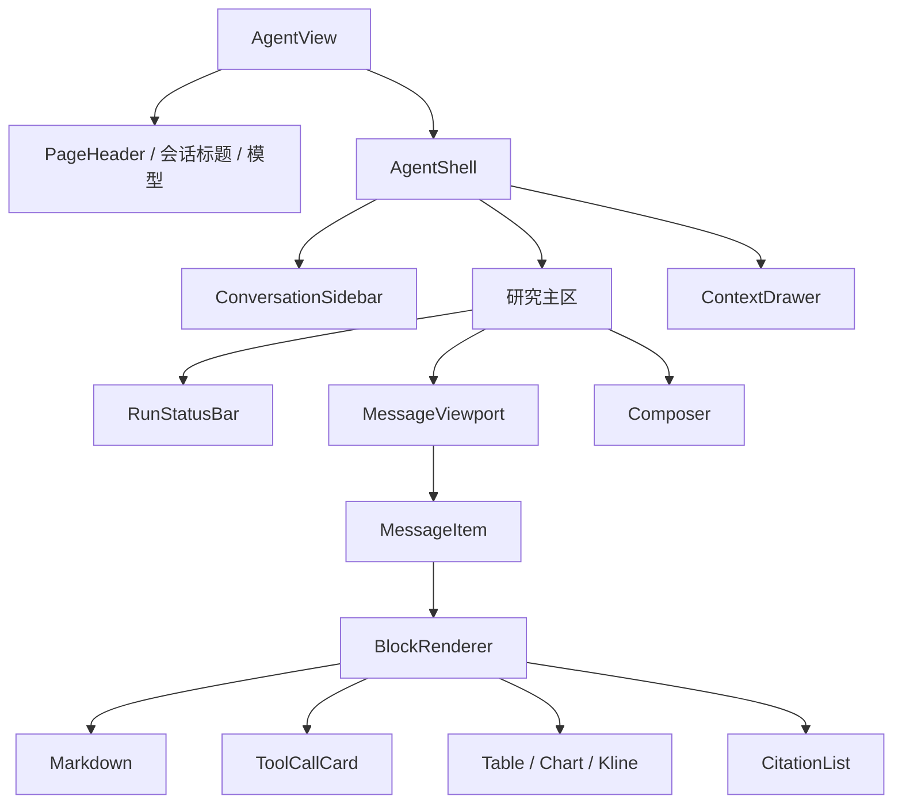

# Agent 组件设计

> 视觉目标：量化研究终端 + 可审计工作流。复用现有 MUI 主题和组件语汇，不另造一套“霓虹渐变 AI”设计系统。

## 1. 页面骨架

主内容沿用 `../client-code/src/layouts/dashboard/content.tsx` 的页面宽度、间距和断点。消息区采用可读行宽，数据表与 K 线可在消息卡内突破正文行宽，但不能撑破视口。

视觉层级建议：

- 背景保持现有 dashboard 中性底色；消息不使用两个巨大彩色气泡。
- 用户消息用轻量实色面板，助手消息更接近研究文档排版。
- 运行中状态用主题信息色，工具警告用 warning，真正失败才使用 error。
- 数值涨跌颜色必须沿用项目已有市场语义，并同时提供符号/文字，不能只靠红绿。

## 2. 复用、适配与新增

| 类型 | 组件/路径 | 处理方式 |
| --- | --- | --- |
| 复用 | `src/components/page-header/` | 会话标题、返回与操作区 |
| 复用 | `src/components/empty-content/` | 无会话、无搜索结果 |
| 复用 | `src/components/scrollbar/` | 侧栏等固定容器；消息主区优先原生滚动 |
| 复用 | `src/components/label/` | 状态、模型、数据时间标签 |
| 复用 | `src/components/iconify/` | 图标入口，补齐可访问名称 |
| 复用 | `src/components/confirm-dialog/` | 删除会话等普通确认；高风险工具另用上下文确认卡 |
| 适配 | `src/sections/research-note/research-note-preview.tsx` | 抽取共享 Markdown/GFM 渲染器 |
| 适配 | `src/components/chart/` | 作为唯一通用图表壳 |
| 适配 | `src/api/stock.ts` 与股票详情行情页 | 抽取 K 线纯展示组件和数据转换器 |
| 新增 | `src/sections/agent/components/` | Agent 工作台与领域块 |

表中 `src/...` 均位于 `../client-code`。

## 3. 核心组件职责

### 3.1 ConversationSidebar

支持新建、分页加载、搜索、日期分组、置顶/归档状态与后台运行提示。侧栏列表项只订阅会话摘要，不订阅消息全文。删除、归档等菜单使用键盘可操作的 MUI Menu；当前项使用 `aria-current`。

### 3.2 MessageViewport

使用已安装但尚未使用的 `react-virtuoso` 处理长会话。列表底部预留输入区高度；只有用户处在底部阈值时自动跟随流式内容。用户向上阅读后显示“回到最新”，新 token 不抢焦点、不强制滚动。

### 3.3 MessageItem

负责角色、时间、状态和操作，但不理解每种富内容细节。完成消息提供复制、引用展开、反馈和重新生成；运行中消息只显示与当前状态相符的操作。复制默认输出可读纯文本，图表/表格另提供数据导出入口。

### 3.4 Composer

包含多行输入、上下文 Chip、模型选择、发送/停止按钮和草稿恢复提示。支持粘贴长文本的长度反馈、输入法 composition、Enter/Shift+Enter 与移动端安全区。第一阶段不接收任意本地文件；若后续支持，必须先有服务端对象存储、扫描和权限方案。

### 3.5 ToolCallCard

按“待确认、排队、执行、成功、警告、失败、取消”映射视觉状态，但具体状态值以生成契约为准。摘要区始终可读；调试参数与原始结果默认折叠并脱敏。高风险操作在卡片内显示结构化影响范围和一次性确认按钮，不能用普通 Yes/No 弹窗掩盖上下文。

### 3.6 BlockRenderer

只对受支持且通过运行时校验的块选择组件。未知块显示“此内容需要更新客户端”，并提供复制诊断标识；单块使用 `BlockErrorBoundary` 隔离。任何服务端字段都不能选择任意 React 组件、注入 JSX 或传入可执行函数。

公开消息块契约见 [REST API](../api/rest-api.md)，前端组件只消费生成类型。

## 4. Markdown、引用与链接

从研究笔记预览抽取共享渲染器时保留 `react-markdown` 与 GFM，并增加：

- 禁止原始 HTML，或使用严格、明确的 sanitize 白名单；
- 外部链接显示域名，使用安全的 `rel`，在新窗口打开前可预览；
- 标题从消息正文层级开始，避免破坏页面唯一主标题；
- 代码块支持复制与横向滚动，不在浏览器执行；
- 表格在窄屏进入横向容器；
- 流式阶段减少全量语法高亮，终态后再做完整渲染。

引用在正文中使用稳定编号，点击后高亮右侧引用详情；移动端用 Bottom Sheet。引用至少展示来源标题、机构/域名、数据时点和可访问链接。缺失链接时仍显示来源元数据，不伪造 URL。

## 5. 响应式与密度

| 断点 | 布局 |
| --- | --- |
| 大屏 | 可收起侧栏 + 主区 + 右侧上下文抽屉 |
| 中屏 | 侧栏 + 主区；上下文为覆盖式 Drawer |
| 小屏 | 单列主区；会话与上下文均为 Drawer/Bottom Sheet |

图表最小高度、工具卡与表格操作区采用容器宽度判断，而不是只看 viewport。触摸目标不小于常见可访问尺寸；密集数据表可提供“紧凑/舒适”偏好，但移动端默认卡片摘要而非硬塞全列。

## 6. 加载、空态与骨架

会话列表、消息快照和富数据块各自有局部骨架。已经存在的内容在后台刷新时保持可见，只显示细小刷新提示；不能把整个页面重新遮罩。图表或表格加载失败只影响对应块，回答文字仍保留。

空态示例应与真实能力对应；如果某工具或数据源未启用，不展示会触发它的示例。

## 7. 无障碍

- 工作台使用清晰 landmark：nav、main、complementary、form。
- 流式文本不逐 token 宣读；节流后通过 `aria-live="polite"` 播报阶段与完成状态。
- 工具进度使用可读文本，不伪造 `progressbar` 百分比。
- Drawer 打开后管理焦点，关闭时返回触发按钮。
- 所有图表都有文本摘要/数据表替代；颜色不是唯一编码。
- 尊重 `prefers-reduced-motion`，关闭光标闪烁、骨架波纹和大幅滚动动画。

## 8. 测试与 Story 场景

组件测试至少覆盖空态、运行中、部分工具失败、长 Markdown、未知块、窄屏、键盘操作与错误边界。视觉回归场景使用固定数据验证暗色/亮色、涨跌颜色、长中文、超长股票名称和大数值。聊天壳归入 [batch-016](../tasks/batches/batch-016-frontend-chat-shell.md)，富响应块归入 [batch-017](../tasks/batches/batch-017-frontend-rich-response-blocks.md)。
