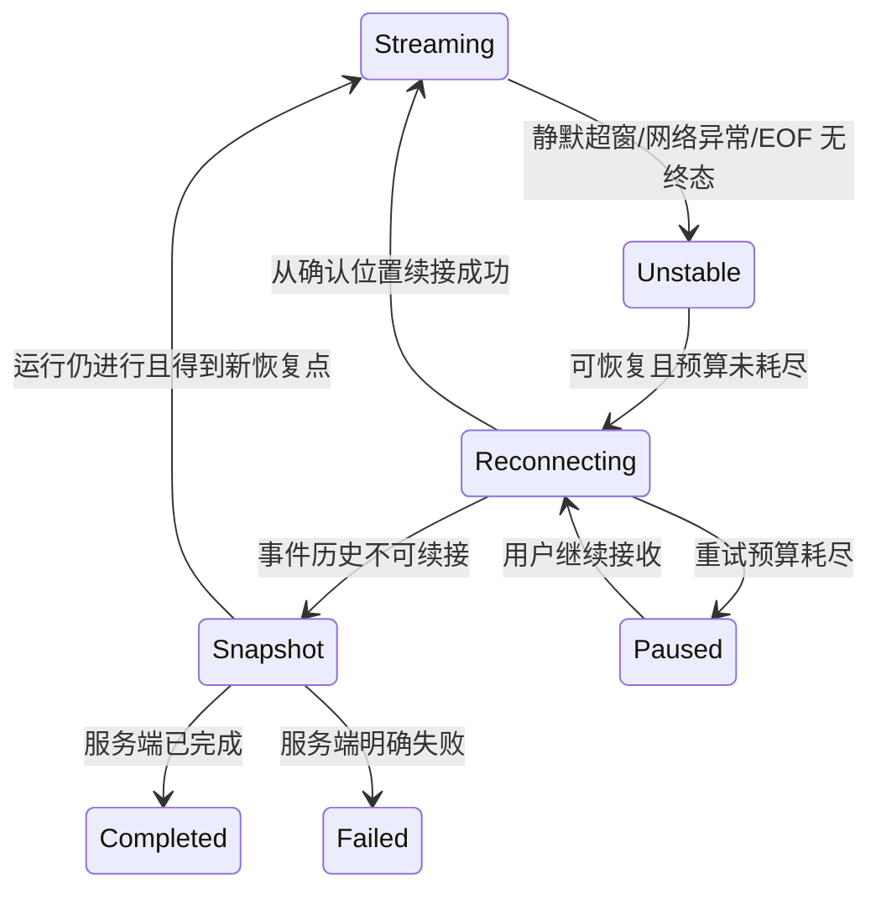

# Agent 前端错误与恢复

> 错误码与可重试语义以 [错误码规范](../api/error-codes.md) 为准；流终态与恢复规则以 [SSE 事件](../api/sse-events.md) 为准。

## 1. 错误分层

| 层级 | 典型问题 | UI 范围 | 主要动作 |
| --- | --- | --- | --- |
| 输入 | 空问题、长度或上下文不合法 | Composer | 原地说明并保留草稿 |
| 鉴权/权限 | 登录过期、会话无权访问 | 页面或操作 | 单飞刷新、重新登录或返回 |
| 网络 | 离线、代理重置、超时 | 运行状态条 | 自动恢复或手动继续 |
| 协议 | 响应类型错误、事件缺口、未知版本 | 运行/单块 | 拉权威快照、提示升级 |
| 运行 | 模型、预算、取消或服务端失败 | 助手消息 | 保留部分输出，重试/重新生成 |
| 工具 | 某数据源或计算失败 | ToolCallCard | 局部警告，允许主运行继续 |
| 渲染 | Markdown/图表组件异常 | 单个消息块 | ErrorBoundary 降级 |

不要把所有问题都显示成红色 Snackbar。Snackbar 只适合短暂、非关键反馈；可恢复运行问题留在消息时间线，页面级权限问题使用完整状态页，字段问题靠近输入。

## 2. 标准错误视图

对用户展示：简短原因、影响范围、系统当前是否仍在工作、可执行下一步。可展开诊断区展示时间、traceId、运行标识和错误码；不展示堆栈、SQL、令牌、内部文件路径或完整工具参数。

每个错误动作必须精确：

- “继续接收”用于流连接中断；
- “重新加载”用于快照过期或协议缺口；
- “重试问题”用于新建一次运行；
- “重新登录”用于刷新失败；
- “更新客户端”用于不支持的契约版本。

避免只有含糊的“再试一次”。

## 3. 自动重试矩阵

| 情况 | 自动处理 | 上限后的行为 |
| --- | --- | --- |
| 流短暂断线/浏览器恢复在线 | 按最后确认位置指数退避重连 | 保留部分回答，显示继续按钮 |
| 普通幂等读取网络失败 | 带抖动短重试 | 局部错误与手动重试 |
| 访问令牌过期 | 共享单飞刷新一次 | 清理敏感状态并引导登录 |
| 服务端限流/过载 | 尊重服务端重试提示 | 展示等待时间，不忙循环 |
| 参数、权限、预算、确定性业务错误 | 不自动重试 | 给出具体修正动作 |
| 创建/取消/确认等命令结果未知 | 使用相同幂等标识查询或重放 | 查询权威状态，禁止生成重复操作 |

重试预算按操作隔离，不能让侧栏、流和 Socket 各自无限重连形成重试风暴。

## 4. 流断线恢复

连接中断期间保留已确认文本，并在末尾显示非侵入状态；不得清空或把部分内容标成最终答案。恢复返回重复增量时由事件身份去重。若权威快照与本地投影冲突，以服务端为准，并记录诊断信息。

## 5. 取消竞态

用户点击停止后进入“正在停止”，禁用重复点击。以下结果都应被正确表达：

- 服务端接受取消：显示已取消，保留允许展示的部分结果。
- 服务端早已完成：显示最终答案，并提示完成发生在取消前。
- 取消请求结果未知：查询运行状态，不能直接假定成功。
- 浏览器 reader 已中止但取消命令失败：提示任务可能仍在后台运行，提供重新连接或查看状态。

## 6. 工具与富块降级

单工具失败不抹掉其他工具和回答。工具卡显示数据源、失败阶段、是否影响结论；若模型继续使用缺失数据，回答头部显示“结果不完整”。

图表失败时优先显示服务端提供的安全文本摘要或已验证数据表；未知块显示版本提示；Markdown 失败则回退为转义纯文本。每个块都由错误边界隔离，错误边界 reset key 包含消息与块版本，重新加载快照后可恢复。

## 7. 鉴权与隐私

`../client-code/src/api/client.ts` 已有 401 单飞刷新，但流客户端必须复用同一机制。刷新失败时：中止所有流与 Socket、清除内存访问令牌、保留不敏感的本地偏好；草稿是否保留由产品隐私策略决定，并按用户隔离。

权限拒绝不可自动改用另一个会话或隐藏失败；深链显示“无权访问或内容不存在”，避免泄露资源存在性。

## 8. 离线与浏览器休眠

监听 `online/offline` 只做提示与触发恢复，不能把 `navigator.onLine` 当真实服务可达性。页面从长时间隐藏恢复时先检查运行权威状态，再决定续流。离线期间允许编辑草稿，但第一阶段不做离线发送队列，避免恢复时重复执行高影响操作。

## 9. 可观测性

前端记录结构化阶段：请求开始/完成、流连接代次、恢复次数、首事件耗时、首可见内容耗时、终态、解析错误和块渲染错误。上报需采样并脱敏，不发送问题全文、模型回答、令牌或完整工具参数。

所有服务端错误尽量携带 traceId，用户复制诊断信息时只包含安全字段。生产观测与告警见 [后端部署](../backend/deployment.md)。

## 10. 测试

Vitest 覆盖错误分类、重试预算、取消竞态、旧响应拒绝、快照覆盖与错误边界。Playwright 使用可控故障注入覆盖：首次 401 后刷新成功、刷新失败、SSE 半途中断、恢复历史过期、工具局部失败、未知块、服务器完成与取消并发、离线再上线。
