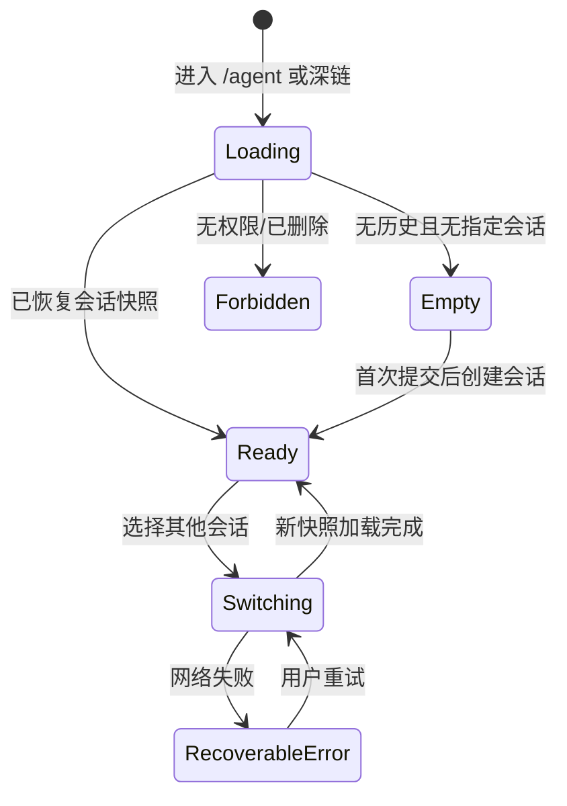
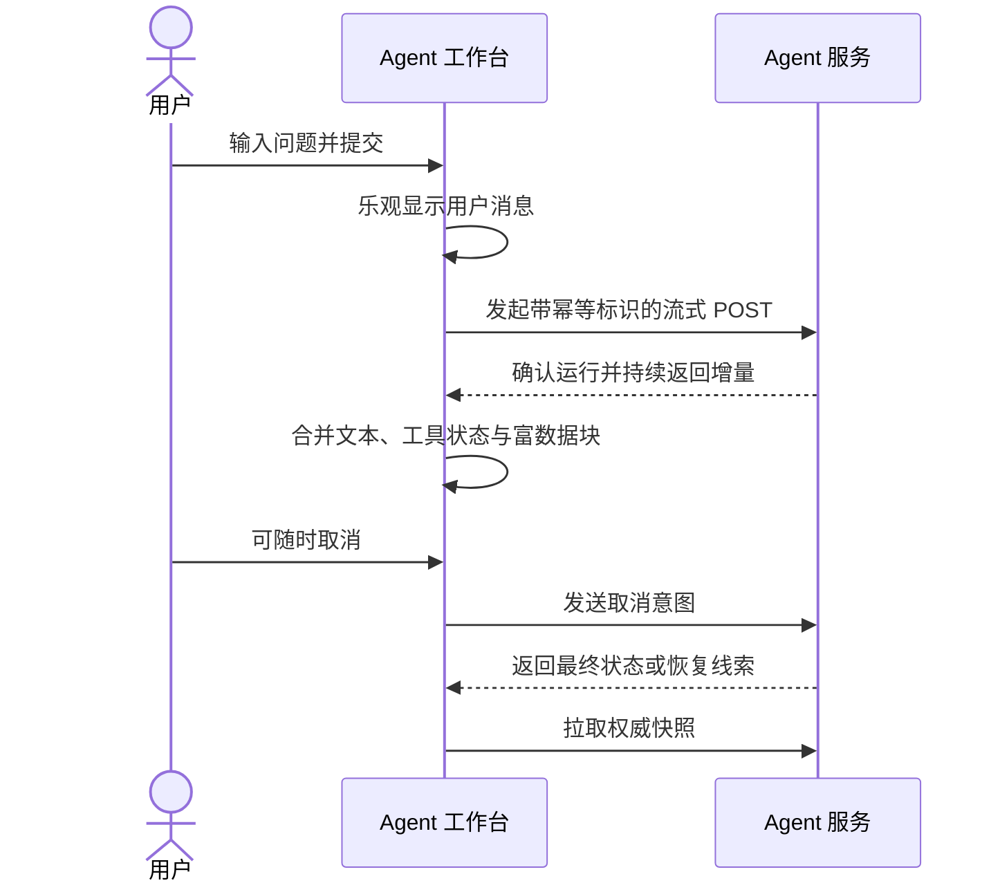

# Agent 前端交互流程

> 本文描述用户体验与页面状态，不复制 REST 或事件载荷。网络契约见 [REST API](../api/rest-api.md) 与 [SSE 事件](../api/sse-events.md)。

## 1. 工作台信息架构

桌面端采用“会话侧栏 + 研究主区 + 可选上下文抽屉”：

- 左侧：新建、搜索、分页会话、置顶/归档入口；宽度可收起。
- 中间：会话标题、模型与运行状态、消息时间线、固定底部输入区。
- 右侧抽屉：当前股票、时间范围、引用、工具详情或运行诊断；默认不挤压移动端主区。

移动端只保留消息主区，会话列表与上下文改为 Drawer。输入区考虑安全区、软键盘和多行文本，不使用占满屏幕的模态聊天框。

## 2. 首次进入与会话选择

进入 `/agent` 时先显示布局骨架，再加载最近会话。不要用全屏 Spinner 阻止用户看到导航。深链 `/agent/:conversationId` 必须优先加载指定会话；失败时保留侧栏和明确原因，不自动跳入其他会话造成误解。

新建按钮进入本地空白态，直到第一次提交才创建服务端会话，避免生成大量空记录。用户从股票详情发起“用 AI 分析”时，把股票代码、市场、页面来源和可见时间范围作为待确认上下文显示在输入框上方，而非偷偷拼进用户文本。

## 3. 发送与流式回答

一次正常发送：

1. 校验非空内容、附件/上下文限制与当前权限。
2. 立刻把用户消息加入时间线，清空编辑框但把草稿保存在内存恢复区。
3. 创建或复用会话并启动本次运行；同一会话默认只允许一个前台运行。
4. 收到增量后更新同一条助手占位消息，显示光标和“正在分析”。
5. 工具执行以折叠卡片插入回答时间线；用户可以展开查看参数摘要、进度、耗时、来源和错误。
6. 终态到达后停止动画，刷新权威消息快照，显示引用、反馈、复制、重新生成等操作。

输入区在运行中仍可编辑下一条草稿，但提交按钮变成“排队不可用”提示或“停止后发送”，第一阶段不做客户端隐式消息队列。Enter 发送、Shift+Enter 换行；中文输入法 composition 期间不得误发送。

## 4. 长任务、工具与阶段反馈

长分析不能只有旋转图标。运行状态条按服务端提供的阶段显示“规划、取数、计算、生成”等人类可读描述，并展示已用时间；不要伪造百分比。工具卡默认展示：

- 工具的人类可读名称与状态；
- 输入参数的脱敏摘要；
- 数据时间范围、来源与更新时间；
- 成功结果摘要或失败原因；
- 调试详情入口，仅向有权限用户显示。

多个工具并行时按开始时间稳定排序，完成后不跳动。单个工具失败但运行仍继续时，卡片进入警告态，回答可以解释降级结果；只有运行整体失败才把主消息标为失败。

## 5. 取消、重试与重新生成

“停止”首先中止浏览器读取，并向服务端发送取消意图；UI 显示“正在停止”，不能马上把运行伪装成已取消。若服务端已完成，则接受权威终态并提示“回答已在停止前完成”。

失败后的操作按语义区分：

- **继续接收**：连接中断但服务端运行可能仍在进行，从最后确认游标恢复。
- **重新加载状态**：事件缺口、浏览器休眠或游标失效，拉取服务端快照。
- **重试本次问题**：运行明确失败，新建运行并沿用原用户消息引用。
- **重新生成**：对已完成回答产生新分支/版本，不覆盖旧答案。

所有会改变服务端状态的按钮点击后禁用并显示进行态，使用相同幂等标识抵御双击。详细策略见 [错误与恢复](./error-and-recovery.md)。

## 6. 刷新、离开与恢复

刷新页面后，前端按会话地址加载快照。如果存在进行中运行，则读取其当前状态并按服务端给出的恢复位置重连；不从 `localStorage` 还原助手正文。

用户切换会话时：

- 当前流可以在 Provider 内继续，或按产品策略提示后取消；第一阶段建议继续后台运行并断开逐 token 展示。
- 目标会话优先展示已有内存快照，再后台校验。
- Socket 后台通知只把完成/失败状态同步到侧栏；重新进入时再拉完整消息。

浏览器关闭提示仅在存在未提交长草稿或不可恢复的本地附件时出现。正在运行的服务端任务可恢复，不应滥用 `beforeunload`。

## 7. 模型、上下文与风险确认

模型切换显示能力、速度和成本等级；运行开始后锁定本次模型，切换只影响下一次提交。页面上下文以可删除 Chip 呈现，用户可在发送前检查。

对于下单、修改策略、创建定时任务等高影响工具，使用两阶段确认卡：展示操作对象、范围、有效期和风险，再由用户显式确认。普通只读行情查询不弹确认框。确认超时或会话权限变化后，旧确认按钮失效。

## 8. 空态与可发现性

空态提供 4–6 个与现有产品相关的例子，如个股异动解释、财务对比、回测复盘和研究报告摘要；示例点击后只填入编辑框，让用户先检查上下文。避免自动发送，也避免泛化的“有什么可以帮你”。

键盘、读屏和触摸必须完成同一流程：流式更新使用节流后的礼貌 live region；焦点不随 token 跳动；错误提示可被读屏读取；取消、重试、引用与工具详情都有可见焦点样式。
