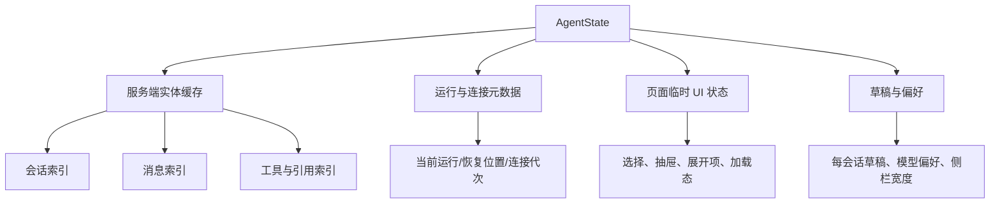

# Agent 前端状态管理

> 目标：在不新增全局状态库的前提下，使长连接、会话切换、恢复和富消息更新可预测、可测试。

## 1. 选择

采用 Agent 路由级 Context + `useReducer`，配合规范化实体、细粒度 selector 和外置流缓冲。理由：现有 `../client-code` 已使用 Auth reducer/Context 与同步通知 Context；Agent 第一阶段状态域明确，无需把整个应用迁到 Redux 或 Zustand。

若后续出现多个非 Agent 页面同时读写会话、离线缓存复杂化或 reducer 订阅粒度成为性能瓶颈，再评估外部 store。不要在首批同时引入新网络缓存库和新全局状态库。

## 2. 状态分层

服务端实体使用 `byId + orderedIds`，避免一段增量导致整条消息数组重建。运行状态与消息实体分开：一条助手消息可以展示当前运行投影，但终态后以服务端消息快照替换。

不要把 `ReadableStream`、`AbortController`、计时器或 Promise 放进 reducer；它们由 hook 的 ref 管理。reducer 只保存可序列化的生命周期元数据。

## 3. 真相源与持久化

| 数据 | 真相源 | 浏览器策略 |
| --- | --- | --- |
| 会话、消息、运行、工具、引用 | 服务端 | 内存缓存；刷新后重新获取 |
| 流恢复位置与去重窗口 | 服务端事件流 + 当前连接 | 仅内存；必要时用服务端状态恢复 |
| 未提交文字草稿 | 浏览器 | `sessionStorage` 或受控 `localStorage`，按用户与会话隔离 |
| 模型、侧栏、密度偏好 | 浏览器 | `localStorage`，带 schema 版本 |
| 访问令牌 | 现有 Auth Provider | 只在内存；不得持久化 |

草稿键必须包含当前用户稳定标识和会话/新建态标识；退出登录时清理。消息正文、工具结果和敏感页面上下文不得写入长期浏览器存储。

## 4. Action 设计

Action 按事实命名，而不是按组件操作命名，例如“会话快照加载成功”“运行事件已接受”“连接中断”“取消已请求”。禁止 `SET_STATE` 或任意路径更新，以保持状态转换可审计。

处理一条流事件时遵循：

1. 校验运行身份与连接代次，拒绝旧连接迟到数据。
2. 根据事件身份与顺序去重。
3. 更新相关实体与最后确认位置。
4. 终态时清理 streaming 标记，但保留诊断和最终快照等待标志。
5. 权威快照到达后按版本/更新时间合并，不让旧响应覆盖新流状态。

公开事件形态以 [SSE 事件](../api/sse-events.md) 为准，reducer 测试应由生成类型构造 fixture。

## 5. 乐观状态

用户提交后立即插入带本地身份的消息，并保留服务端幂等标识。服务端确认后原位替换身份，不能追加出第二条消息。失败分为：

- 请求尚未被服务端接受：保留内容，标记“未发送”，允许原幂等标识重试。
- 服务端已创建运行但连接丢失：显示“正在恢复”，禁止再次提交相同问题。
- 运行明确失败：保留用户消息与部分回答，提供新运行重试。

会话标题可以乐观显示用户首句摘要，但侧栏最终标题由服务端回填。

## 6. 并发与陈旧响应

每次会话加载、分页搜索和流连接都分配请求代次。响应合并前检查代次和目标会话；用户快速切换会话时，旧请求不得覆盖当前选择。

同一会话第一阶段只允许一个前台运行。其他设备触发的新运行通过 Socket 通知把会话标为 stale，前端随后拉取快照；不尝试在两个不同来源的 token 流之间客户端排序。

## 7. Selector 与渲染性能

建议 selector：当前会话摘要、当前有序消息、单条消息块、当前运行投影、侧栏分页结果、未读/后台状态。Provider 可以拆成 state 与 dispatch 两个 Context；高频消息视口可进一步用 `useSyncExternalStore` 封装运行缓冲，但不暴露给全应用。

性能规则：

- reducer 更新只复制被修改实体；
- `MessageItem`、完成的 Markdown 块和工具卡使用稳定 props 与 memo；
- 文本增量批量提交，历史长列表使用已安装的 `react-virtuoso`；
- 自动滚动仅在用户处于底部阈值内生效，用户向上阅读时显示“回到最新”。

## 8. 跨标签页

不直接同步 token。可用 `BroadcastChannel` 传播轻量失效通知、登出和“某会话运行已改变”，接收方再从服务端读取。若多标签同时打开同一会话，各自连接必须靠服务端事件身份去重；第一阶段可提示“另一标签正在查看”，但不能依赖浏览器锁保证服务端唯一性。

## 9. 测试

reducer 使用纯 fixture 覆盖：快照合并、乐观身份替换、重复/乱序事件、旧连接迟到、取消竞态、失败保留、会话快速切换和终态刷新。Provider 集成测试覆盖草稿隔离、退出清理和深链恢复。流解析测试另见 [流式协议](./streaming-protocol.md)。
