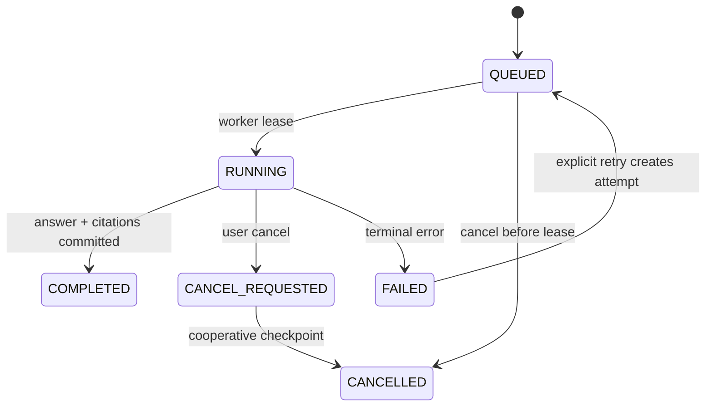
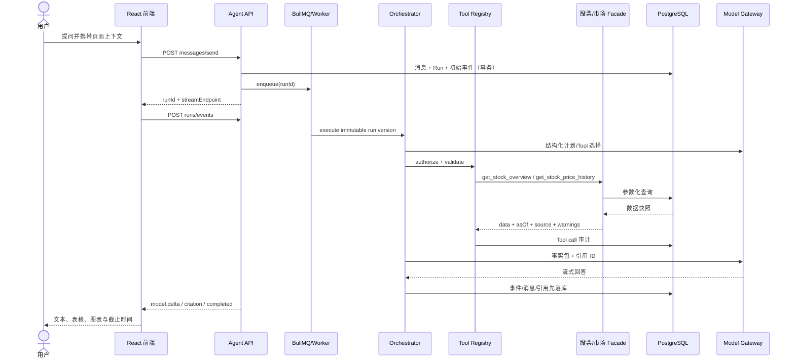
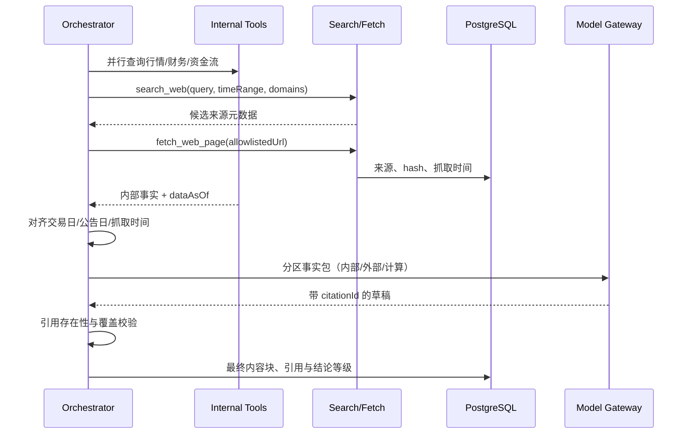
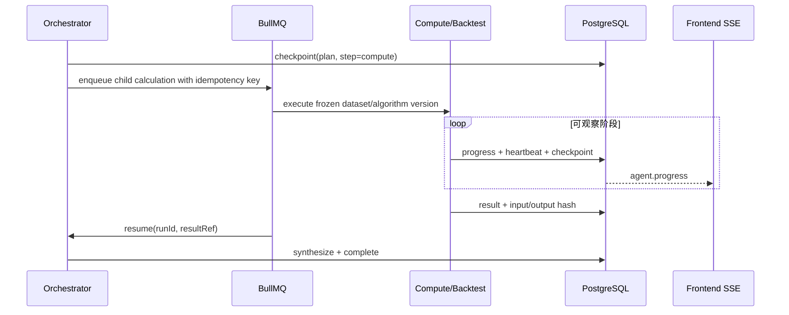
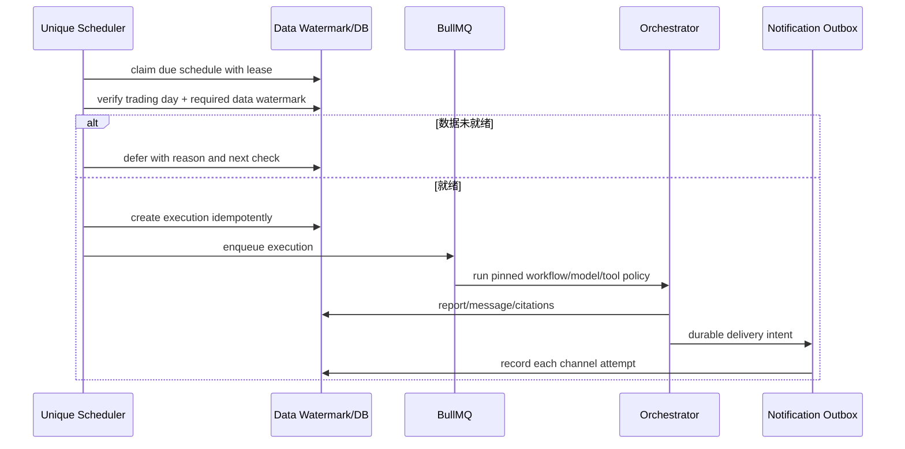

# Agent 工作流设计

本文描述跨模块执行语义；接口事件字段以 [SSE 协议](../api/sse-events.md) 为唯一来源，节点实现见 [后端编排](../backend/agent-orchestrator.md)。

## 1. 统一状态机

终态为 `COMPLETED/FAILED/CANCELLED`。任何转换使用 `statusVersion` 乐观锁；事件与状态在同一事务写入。Tool/模型等待由 Step/ToolCall/ModelCall 状态表达，Run 保持 `RUNNING`，因此并行调用没有单一 waiting 状态歧义。`RUNNING` 不表示一直持有进程，checkpoint 后可重新入队恢复。

## 2. 普通股票问答与内部数据

不需要数据时可跳过 Tool；涉及股票的事实回答默认先解析证券并查询真实数据，不让模型凭参数记忆作答。

## 3. 内部数据与联网信息融合

来源冲突不自动“多数表决”。优先展示官方公告和内部结构化数据，并标明冲突、截止时点和无法确认项。

## 4. 多 Tool、长计算与回测

计划只能引用 registry 中的 tool key；每步有最大次数和总预算。独立只读查询可并行，存在数据依赖的步骤串行。结果过大时 Tool 自己聚合/分页，模型只收到受限摘要和引用句柄。

用户取消时 API 写 `CANCEL_REQUESTED`；模型 HTTP 使用 AbortController，Tool 轮询取消标志，回测在数据分片/参数组合边界检查。无法立即终止的底层任务不得把 Run 再写回 completed。

## 5. 定时与条件触发研究

条件触发使用结构化字段、操作符和阈值，不执行模型生成代码或 SQL。计划任务的输入必须固定资源所有者，执行时再次校验权限和资源是否仍存在。

## 6. 失败、重试与降级

| 故障 | 策略 | 禁止行为 |
| --- | --- | --- |
| Tool 临时超时/限流 | 仅幂等只读 Tool 指数退避 + jitter，记录 attempt | 无限重试、换参数掩盖失败 |
| Tool 数据缺失 | 返回 typed warning；可选替代 Tool | 让模型编造缺失数字 |
| 模型限流/5xx | 同模型有限重试，再按 policy 降级 | 把两个模型的半截输出拼接 |
| 模型内容无引用 | 校验失败后一次受控修复 | 无引用直接完成 |
| 搜索/抓取失败 | 保留内部数据回答并明确联网缺失 | 将搜索摘要冒充原文 |
| Worker 崩溃 | lease 超时后从 DB checkpoint 恢复 | 仅依赖内存上下文 |
| 通知失败 | outbox 独立重试，不回滚已完成研究 | 重跑 Agent 造成重复费用 |

## 7. 多模型切换

每个 Run 冻结一个 model routing policy。自动路由在首次调用前选择；能力不符、限流或供应商故障才可降级。每次 attempt 独立记录 provider/model、请求 hash、token、成本、延迟和 failure class。用户手动切换只影响后续 Run；重新生成创建新版本，历史不覆写。

## 8. 中断、刷新与会话恢复

- 页面刷新先 `runs/status`，若非终态再以最新 sequence 重连 `runs/events`。
- 服务端以持久 `AiRunEvent.sequence` 重放；实时通知只是加速器。
- 客户端按 `(runId, sequence)` 去重，收到 gap 立即断开并从最后连续序号重连。
- SSE 慢消费者有连接缓冲上限；超过后关闭连接，事件仍可重放。
- 用户恢复失败 Run 时创建新 attempt，复用已验证且未过期的幂等 Tool 结果；外部搜索是否复用由 TTL 与数据时效决定。

## 9. Prompt 与上下文构造

上下文顺序固定：系统政策 → workflow/prompt version → 用户与资源权限摘要 → 页面上下文 → 最近消息 → 版本化滚动摘要 → 显式用户记忆 → 本轮 Tool 事实包。隐藏推理不持久化或暴露；只保存结构化计划摘要、决策原因类别和可审计输入输出。

所有外部网页、用户上传、历史消息和 Tool 文本都包裹为不可信数据段。任何其中出现的“忽略指令/调用工具/泄露信息”不改变系统 policy。
