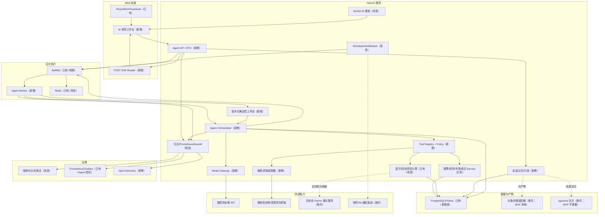

# AI Agent 总体架构

## 1. 最终推荐

在现有 NestJS 中新增边界清晰的 `AgentModule`，采用“单个受控研究 Agent + 确定性工作流 + 白名单 Tool”模式。编排、会话、权限、审计和金融 Service 复用均留在 NestJS；所有执行进入 BullMQ，短任务可由 API 等待首批事件，长任务异步续跑。PostgreSQL 是状态与审计权威源，Redis 只承载队列、租约和短期缓存。

MVP 不引入 LangGraph、独立 Python Agent、向量数据库或高自治多 Agent。模型网关作为 NestJS 内部模块，先实现 OpenAI-compatible provider，再扩展其他供应商。Python 仅在第二阶段为重计算提供无状态、可复现的服务边界。

## 2. 架构图

图例：`已有` 可直接复用，`改造` 在原模块上强化，`新增` 属于 Agent 项目，`条件` 不进 MVP。



## 3. 关键边界

| 边界 | 决策 | 约束 |
| --- | --- | --- |
| 前端—后端 | JSON 命令/查询 + POST SSE 事件流 | 公共定义只在 [`api/`](../api/README.md) 维护 |
| API—Worker | BullMQ job 只携带 ID 和不可变版本 | 业务正文、状态和审计写 PostgreSQL |
| 编排—模型 | provider-neutral Model Gateway | 模型不能直接访问数据库、网络或用户资源 |
| 编排—Tool | JSON Schema + Policy + timeout + audit | Tool 必须来自 registry，参数可验证、输出带来源与时点 |
| Tool—业务 | 调用已有 application Service 门面 | 禁止在 Tool 中复制 SQL/指标口径 |
| TypeScript—Python | 后期 HTTP/gRPC 无状态计算契约 | 输入固定数据快照，输出含算法/代码/数据版本 |
| 内部—外部网页 | 搜索与抓取隔离、URL 策略、内容降权 | 外部文本永远视为不可信数据，不是系统指令 |

## 4. 状态与数据流

1. API 在一个数据库事务中写用户消息、`AiAgentRun` 和 outbox/run event，返回 `runId` 与 SSE URL。
2. Worker 以 `runId` 取得不可变 prompt/workflow/model/tool policy 版本，恢复 checkpoint。
3. Orchestrator 生成受限计划；每次 Tool 调用先授权、验证参数，再调用已有 Service 并写审计、来源、`asOf`。
4. 程序完成收益、估值分位、风险等确定性计算；模型只负责意图、Tool 选择、信息综合和自然语言生成。
5. 每个状态变化先持久化为单调递增事件，再推送 SSE；断线用 `Last-Event-ID` 或 `afterEventId` 重放。
6. 最终消息由结构化 content blocks 组成，引用定位到数据库快照、Tool call 或外部来源。
7. 取消请求写持久状态并发 abort signal；Worker 在模型、Tool、分页和计算边界协作取消。

## 5. 一致性与金融约束

- 每个事实包含 `source`、`asOf`、`timezone`、`unit`、`adjustment`、`dataVersion`；不同截止时点不可静默混合。
- 回测/财报查询按“当时可知”口径，区分报告期、公告日和入库时间；禁止前视。
- 股票代码先经 `resolve_security` 解析交易所、品种和有效期，禁止由模型拼表名或代码。
- 结论分为事实、程序计算、模型推断、情景假设；UI 和审计记录保留该等级。
- 每个写 Tool 默认禁用或要求显式确认；交易执行不属于本方案。

## 6. MVP 目录落点

```text
src/apps/agent/
├── api/                 # Controller、DTO、SSE presenter
├── application/         # conversation/run use cases
├── domain/              # 状态机、事件、policy 类型
├── infrastructure/      # Prisma repositories、BullMQ、providers
├── model-gateway/       # provider adapters、routing、usage
├── tools/               # registry、policy、adapters、schemas
├── workflows/           # versioned graph/checkpoint transitions
├── workers/             # run processor
└── observability/       # metrics、tracing、evaluation hooks
```

前端落在 `../client-code/src/sections/agent/`、`../client-code/src/api/agent/`、`../client-code/src/types/agent/`；Prisma 新表落在 `prisma/agent/`。详细文件由实施批次定义。

## 7. 容量和故障原则

- API 无状态扩容；Worker 单独并发控制；scheduler 采用唯一租约；WebSocket 使用 Redis adapter 后才允许多副本。
- provider、搜索、Tool 各自 bulkhead、限流、timeout 和有限重试；非幂等写操作不自动重试。
- 模型输出不能作为事务提交依据；重要状态由程序状态机验证。
- Redis 丢失时允许从 PostgreSQL 重建可见状态与待处理任务；SSE replay 不依赖 Redis pub/sub 历史。
- 预算、并发和 token 上限在入队和每次模型调用前双重检查。

相关决策见 [ADR 索引](../decisions/README.md)，具体执行流见 [Agent 工作流设计](./agent-workflow-design.md)。
