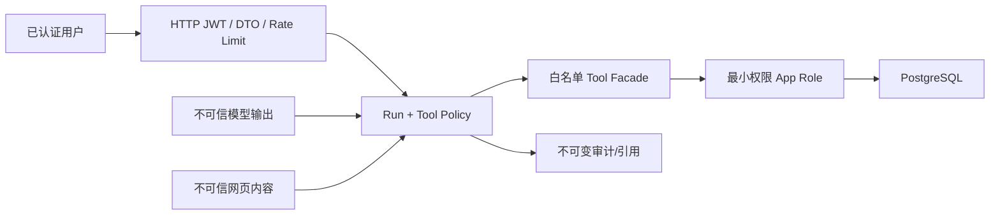

# 安全与风险控制

## 1. 安全目标与信任边界

Agent 是现有用户权限的受限调用方，不是数据库管理员、Tushare 管理员或交易执行器。模型、外部网页、用户输入、历史会话均视为不可信；只有服务端 policy、固定 workflow、验证后的 Tool schema 和认证上下文具有授权意义。

## 2. 当前必须先修复的风险

| 等级 | 现状 | MVP gate |
| --- | --- | --- |
| P0 | WebSocket 配置存在空 JWT secret 回退路径，匿名连接被保留，回测订阅无所有权检查 | Agent WS 功能禁用，直至强制鉴权、token 黑名单/用户状态校验、资源 ACL 完成 |
| P0 | `FactorDefinition` 无 userId，自定义因子写接口全局；归因查询缺所有权 | 不向 Agent 开放因子写和该归因 Tool，先补领域权限 |
| P0 | 当前部署配置未固定非超级用户 PostgreSQL app role；Redis ACL `+@all ~*`；存在 `$queryRawUnsafe` | 生产建立 migration/app/read-only roles；Agent 永不接触 SQL/Prisma/Redis 原语 |
| P0 | fresh migration 缺十张表，开发启动允许 `db push --accept-data-loss` | 新空库 `migrate deploy` 验证通过前禁止生产发布 |
| P0 | 周/月涨跌幅单位错配 | 修复 mapper、回填并建立单位回归测试后才开放跨周期收益 Tool |
| P1 | 当前 HTTP 日志脱敏规则未证明完整覆盖 refreshToken；Agent prompt/持仓更敏感 | 扩大字段/结构脱敏，默认不记录 body、prompt 或 Tool 原始结果 |

## 3. 身份、多租户与资源所有权

- HTTP 复用全局 `JwtAuthGuard`，`userId/role/status` 只从服务器认证上下文取得。
- 每个 Agent repository 查询都包含 `userId`；会话、Run、报告、schedule、channel 使用组合索引支持该约束。
- Tool 接受不可序列化给模型的 `ToolAccessContext`，其中含 userId、role、runId、allowedScopes、budget；模型参数中不存在 userId。
- 组合、自选股、回测、报告等资源先检查归属再查询；管理员读取也写独立审计原因。
- 后台任务在执行时重新读取用户状态/权限，不信任入队时快照；用户被禁用则取消。

## 4. Tool 最小权限

每个 Tool 元数据定义 `requiredRole`、`sideEffect`、`requiresConfirmation`、`allowedDataScopes`、`timeoutMs`、`maxRows`、`costClass`、`idempotent` 和 retry policy。默认 deny；未注册、schema 不匹配、超过次数/行数/日期跨度/预算都失败。

首期默认只读。`save_research_report` 是受控写操作：只写当前用户、展示预览、带 `clientRequestId` 幂等；通知或 schedule 写操作经显式 UI 表单/确认，不由自然语言隐式执行。删除、用户管理、Tushare 同步、因子定义写、任意 SQL/URL、交易下单永久不作为 MVP Tool。

## 5. Prompt Injection 与数据外泄

- 系统政策与 Tool policy 不进入可被网页覆盖的文本拼接；使用结构化 role/content 边界。
- 搜索摘要只用于选择候选，正文抓取后按来源域、MIME、大小和内容 hash 记录。
- 外部内容中的命令、编码 payload、隐藏文本、工具调用要求全部作为引用资料，不能升级权限。
- 发送模型前按字段策略移除 refresh token、API key、手机号、邮箱、完整持仓明细等；必要数据最小化并支持 provider-specific data residency。
- 模型响应做内容块 schema、引用 ID、URL、数值单位和风险提示校验；Markdown 禁止原始 HTML，链接加安全属性。

## 6. SSRF、SQL 与代码执行

`fetch_web_page` 仅接受搜索工具签发的 URL token；生产只允许 HTTPS 默认端口，解析 DNS 前后拒绝 loopback、link-local、RFC1918、metadata endpoint 和重定向越界。HTTP 仅用于注入式、隔离测试 fixture，不能由普通环境变量放开。限制响应大小、时间、MIME、压缩比和重定向次数，隔离 cookie/认证头，不执行 JavaScript。

不存在 Text-to-SQL MVP。Tool adapter 只调用固定 Facade/parameterized query；标识符来自枚举映射。未来 controlled SQL explorer 也必须用只读副本、AST allowlist、statement timeout、row limit 和审计，见条件批次 028。

Python 计算服务不得执行用户/模型代码，不挂载 Docker socket，不连主库；容器只读文件系统、无特权、有限 CPU/内存/超时和受限网络。

## 7. 密钥与供应商隔离

- 模型、搜索、对象存储、通知密钥只来自环境/secret manager，不存 prompt、数据库普通列或前端。
- 配置启动时只校验存在性，不把值输出日志；轮换支持双 key 窗口。
- 生产模型 provider 配置明确区域、保留、训练使用和数据处理条款；敏感用户数据可禁止路由到不合规 provider。
- 每个 provider 以独立 key、预算和速率限制；错误信息脱敏后再展示。

## 8. 配额、限流与成本

在创建 Run、模型 attempt、搜索和重计算前分别检查用户/角色日配额、并发数、最大输入、最大 Tool 次数、最大 token 和金额预算。超限使用明确错误码，不静默降级为低质量回答。API rate limit 与 worker concurrency 分开；管理员也不能绕过供应商硬限制。

## 9. 金融风险控制

- UI 固定展示数据截止时间、来源、币种/单位、复权口径和“非投资建议”。
- 事实、程序计算、模型推断、情景假设使用不同 provenance；模型不能把推断写成数据库事实。
- 涉及未来收益只给情景和风险，不给保证性措辞。
- 回测记录数据版本、幸存者偏差、交易成本、停牌/涨跌停、复权和可交易性假设；结果不可复现则不能生成强结论。
- 不做自动交易、不保管券商凭据、不把 Agent 输出连接到订单执行。

## 10. 审计、保留与事件响应

会话消息、Run、步骤、Tool/模型调用、搜索来源、引用、写操作确认、schedule 与 delivery attempt 形成可关联审计链。日志只记录 ID、时延、状态、计数和 hash；原始内容按数据保留政策存数据库/对象存储，并支持按用户删除或法律保留。

安全告警包括跨租户查询拒绝、异常 Tool 次数、SSRF 拒绝、prompt injection 评测失败、provider key 错误、预算突增、审计写失败。审计/引用写失败时，Agent Run 不得标记完成。

## 11. 发布安全清单

- [ ] 空库 migrations 全链通过，应用使用非超级用户。
- [ ] 周/月收益单位修复、回填和口径测试通过。
- [ ] 所有 Agent DTO 启用 whitelist + forbidUnknown，POST 显式状态码。
- [ ] Tool 默认 deny、租户过滤、确认和审计测试通过。
- [ ] POST SSE 资源归属、重放和取消测试通过。
- [ ] WebSocket 强制认证与订阅 ACL 完成，或 Agent 不使用 WS。
- [ ] SSRF、prompt injection、Markdown/XSS、日志脱敏测试通过。
- [ ] 密钥、预算、限流、超时、重试和熔断已配置。
- [ ] 备份恢复、队列 Redis noeviction、scheduler 单例已演练。
