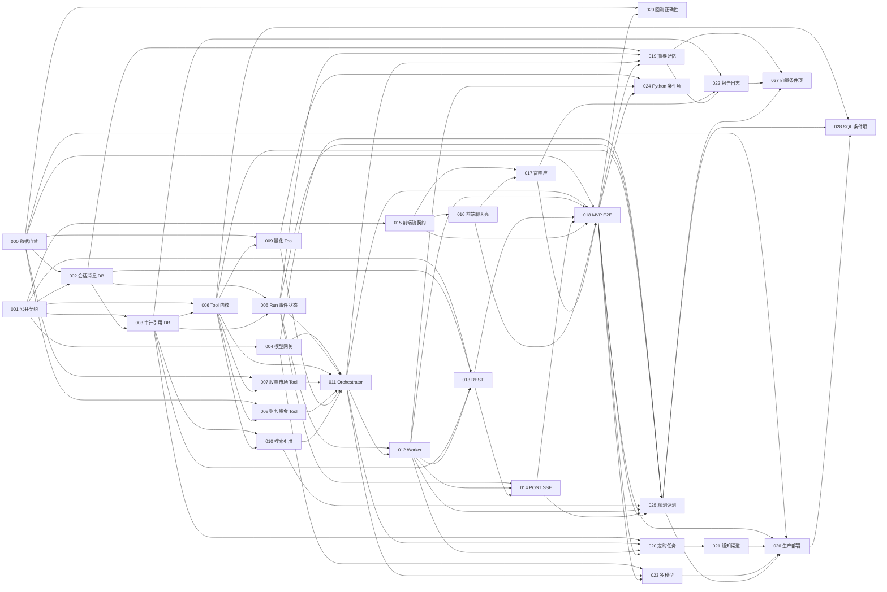

# 批次依赖图

## 1. 硬依赖

`A --> B` 表示 B 只有在 A 验收完成后才能开始。图由各批次 `depends_on` 汇总；Batch 024/027/028 即使依赖满足，也要通过其条件门禁。

## 2. 推荐并行波次

| 波次 | 可并行批次 | 汇合点 |
| --- | --- | --- |
| A | 000、001 | 002/数据 Tool 前各自验收 |
| B | 002、004、015 | 003 与 016；彼此不共享实现文件 |
| C | 005、006、前端 016 | Tool 实现与前端 UI |
| D | 007、008、009、010、前端 017 | 011 与 018 |
| E | 011、前端联调准备 | 012 |
| F | 019、020、023、025、029 | 021/022/026 |
| 条件 | 024、027、028（各自门禁后） | 各自 ADR go/no-go |

同一文件冲突优先级：公共契约/Prisma/AgentModule 的 owner 批次先提交，其他批次 rebase 后只注册自己的 provider；不要多个 agent 同时重写同一 Module。

## 3. 必须串行

- 002→003→005：外键和 migration 顺序。
- 006→007/008/009/010→011：Tool 执行器先于 adapters，全部 Tool 先于 v1 workflow。
- 011→012→013→014：编排、后台运行、命令面、事件流。
- 015→016→017：流解析、状态壳、富内容渲染。
- 020→021：execution 先于 delivery。
- 025→026：SLO/告警先于生产放量。

## 4. Migration 与基础设施阻塞

- Batch 000 未 green：002/003/005 和所有金融 Tool 不得在生产 migration/注册。
- 002/003/005 各自显式 migration；后一个必须在空库完整链中验证前一个。
- 020/021/022/025/029 的 migration 按编号阶段执行，并在 Batch 026 做 `migrate deploy` 发布作业。
- 024 需要独立容器；027 需要 pgvector extension 审批；028 需要只读副本/role。缺条件时标 no-go/deferred，不绕过。

## 5. 协作节点

- 契约：001 后前端可并行；任何公共 DTO/SSE 变化都回到 001/API 文档评审。
- 数据：000 和数据库文档给 007–010/029 口径；Tool 不自行解释表字段。
- 联调：013+014 与 015–017 通过相同 fixtures；018 才允许 MVP complete。
- 生产：021/023/025 交付由 026 集成；WS、Redis、scheduler、存储安全不分散定义。

## 6. 循环依赖检查

当前图是有向无环图。所有依赖只从较早基础能力指向后续能力；Batch 027/028/029 不反向阻塞 MVP。验证脚本应解析 frontmatter：

1. 每个 `depends_on/blocks/parallel_with` 文件存在。
2. `blocks` 与其他文件的 `depends_on` 完全互为反向集合。
3. topological sort 覆盖全部 30 个节点。
4. `parallel_with` 不与直接/传递依赖冲突。
