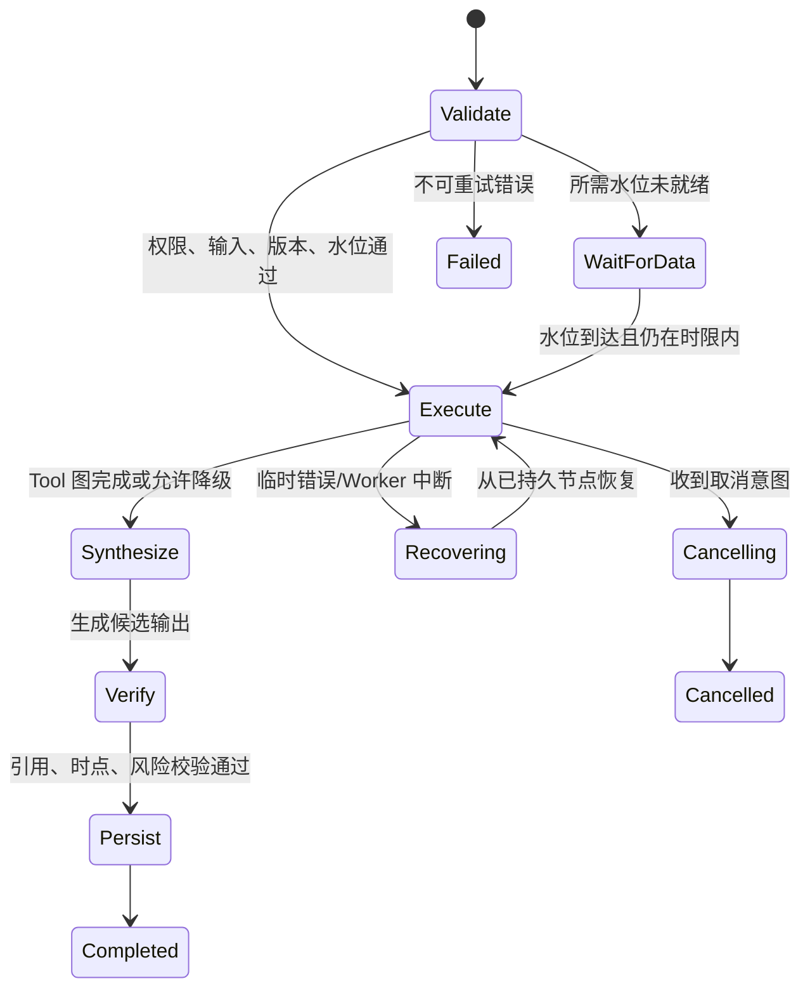

# Agent 工作流设计索引

> 状态：规划中
> 基线：当前 `server-code` 真实服务与已冻结的 Agent API、Tool 契约
> 文件名使用用户指定英文命名；正文使用中文。

## 1. 工作流职责

Workflow 负责固定节点、权限、版本、超时、分支、恢复与输出；Tool 负责一次有界、可审计的真实能力调用；模型只做意图识别、计划建议与基于事实包的解释。模型不得绕过 Tool 访问 Prisma、SQL、Redis、Tushare 管理接口、文件系统或任意 URL。

公开接口、运行状态和流事件不在本目录重新定义。唯一规范源：

- [Agent 公共协议](../api/README.md)
- [REST API](../api/rest-api.md)
- [SSE 事件](../api/sse-events.md)
- [WebSocket 事件](../api/websocket-events.md)
- [错误码](../api/error-codes.md)
- [Tool 方案](../tools/README.md)
- [15 个 Tool 与真实复用来源](../tools/tool-inventory.md)
- [Tool 开发标准](../tools/tool-development-standard.md)

## 2. 工作流导航

| 文档 | 单一职责 | 默认执行形态 |
| --- | --- | --- |
| [交互式会话](./interactive-chat.md) | 多轮意图路由、澄清、Tool 编排与流式回答 | 前台、可取消 |
| [个股研究](./stock-research.md) | 单股/多股基本面、行情、估值、资金与来源研究 | 前台或报告子流程 |
| [市场与新闻分析](./market-news-analysis.md) | 市场截面与外部来源的时间对齐、核验和综合 | 前台或定时子流程 |
| [定时研究](./scheduled-research.md) | 数据水位驱动的唯一调度、执行与可靠通知 | 后台、可恢复 |
| [预警监控](./alert-monitoring.md) | 确定性规则触发、去重、解释与投递 | 后台、条件触发 |
| [回测复盘](./backtest-workflow.md) | 只读分析已有回测及强制偏差披露 | 前台；MVP 不提交回测 |

## 3. Canonical Tool 边界

MVP 只能注册下列 15 个 key。本文只标注覆盖关系，不复制输入输出 Schema。

| Tool key | 主要工作流 |
| --- | --- |
| `resolve_security` | 交互、个股、新闻 |
| `get_stock_price_history` | 交互、个股、预警解释 |
| `get_stock_overview` | 交互、个股、新闻、预警解释 |
| `get_financial_statements` | 个股、定时研究 |
| `get_financial_indicators` | 个股、定时研究 |
| `get_stock_moneyflow` | 个股、市场新闻、预警解释 |
| `get_market_snapshot` | 交互、市场新闻、定时研究、预警解释 |
| `get_sector_membership` | 个股、市场新闻、预警解释 |
| `get_user_watchlist` | 交互、定时研究、预警个性化 |
| `get_portfolio_risk` | 交互、定时研究 |
| `get_backtest_result` | 回测复盘 |
| `compute_performance_metrics` | 个股区间表现、回测复核 |
| `compute_valuation_percentile` | 个股估值 |
| `search_web` | 个股、市场新闻、定时研究、预警解释 |
| `fetch_web_page` | 个股、市场新闻、定时研究、预警解释 |

精确 Schema 分别见 [内部数据 Tool](../tools/schemas/internal-data-tools.md)、[确定性量化 Tool](../tools/schemas/quantitative-tools.md) 与 [联网研究 Tool](../tools/schemas/web-research-tools.md)。禁止用近义 key、临时后缀或“更方便”的新 Tool 替代。

## 4. 统一执行骨架

以下是内部节点语义，不是新的公共 DTO 或 SSE 事件名：

每个 Run 固定 `workflowKey + workflowVersion + promptVersion + toolKey/toolVersion`。重跑旧任务必须使用原版本；版本缺失按 [错误码](../api/error-codes.md) 失败，不能悄悄升级。

## 5. 输入、权限与预算

- `userId`、角色和数据 scope 由认证上下文注入，不接受模型或客户端伪造。
- 用户私有资源在 Workflow Policy 和真实 Facade 两层校验所有权。
- 页面上下文、调度输入和条件规则均使用 [REST API](../api/rest-api.md) 的受控结构；不传 DOM、SQL、任意代码或隐藏数据。
- 每次运行在开始前冻结允许能力、Tool 次数、Token、时间、联网和成本预算。
- 写操作不属于 15 个 MVP Tool。保存报告、创建 schedule、通知投递由受控 command/workflow 节点执行；高风险操作需显式确认。

## 6. 数据水位、时点与引用

所有事实必须携带 [Tool 公共 Schema](../tools/schemas/common-types.md) 规定的 provenance、`asOf`、warnings 与引用来源。行情、资金、财务、行业、网页各自保留独立数据时点；不能用一个“最新”掩盖某部分未更新。

财务历史研究以公告可用时间过滤，不能只看报告期。网页搜索摘要只能选源，关键事实需抓取并验证；模型推断必须与数据库、程序计算和官方事实分开标注。

定时/条件工作流额外要求：

1. 触发先读取所需数据集 watermark；
2. 未达到目标交易日/公告批次时延迟，不在旧数据上静默运行；
3. 执行唯一键包含 schedule/rule、逻辑触发时点、目标 watermark 与 workflow version；
4. 结果持久化与 outbox 同事务，通知消费者幂等投递；
5. 只有 outbox 可触发外发，不允许模型直接调用通知通道。

## 7. 失败、取消与恢复

Tool 错误分类、自动重试边界见 [Tool 错误](../tools/schemas/tool-errors.md)。只对已分类、幂等、临时错误有限重试；权限、参数、数据质量和版本缺失不重试。重试保留同一业务 Tool 调用身份，只增加 attempt。

取消是持久化意图；运行只有达到公共终态才算取消。Worker 崩溃后从最后完成的持久节点恢复，不能重新发送已提交的通知或重复创建报告。前端断线不代表运行失败，恢复遵循 [SSE 事件](../api/sse-events.md)。

## 8. 全局验收

- 任一工作流只调用 15 个 canonical Tool key，Schema 与 Policy 校验不可绕过。
- 每个输出能追溯 workflow/prompt/tool/algorithm/data 版本、时点、引用与 warning。
- 用户 A 无法读取用户 B 的自选、组合、回测、报告或运行。
- Tool 临时失败会有限重试；确定性错误不忙循环；取消与 Worker 重启不产生重复副作用。
- 定时和条件触发在多实例下只执行一次，数据未就绪会等待或明确失败，outbox 可重放且不重复投递。
- 回测复盘强制显示已知可复现性与偏差风险，不把未验证历史结果包装成投资结论。
