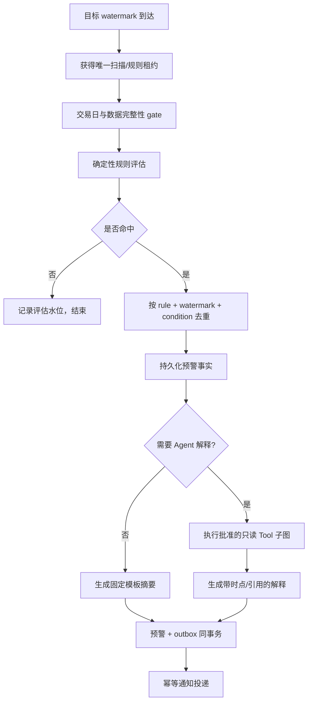

# 预警监控工作流

## 1. 元数据与职责

- `workflowKey`：`alert_monitoring`
- 初始版本：`1`
- 触发：价格规则、盘后异动扫描或其他批准的结构化条件在目标 data watermark 到达后评估为真。
- 职责：确定性评估、执行去重、可选 Agent 解释、持久化预警和 outbox 通知。
- 非职责：让模型决定是否触发、接受自然语言任意代码/SQL、直接广播全体用户、下单或修改持仓。

预警规则与 schedule 由结构化 UI/API command 管理，不注册为模型 Tool。MVP 15 个 Tool 只用于命中后的事实解释。

## 2. 输入与权限

内部输入：rule 身份与版本、owner、结构化条件、目标证券/自选范围、比较窗口、冷却期、严重级别、目标交易日/watermark、通知 channel 和解释预算。公共端点与错误以 [REST API](../api/rest-api.md) 和 [错误码](../api/error-codes.md) 为准，本文不定义新 DTO。

- 创建/修改时校验用户拥有规则范围、相关自选和 channel。
- 执行时重新校验用户/规则仍启用，资源仍归属，通知偏好有效。
- 全市场异动扫描可为共享计算；匹配用户自选、生成解释和投递时按用户隔离。
- 模型永远看不到 channel 密钥、其他用户规则或完整持仓。

## 3. 版本与确定性

每次评估固定 rule version、`alert_monitoring@1`、阈值算法、数据 watermark 和可选解释 workflow/prompt/tool 版本。规则判断必须由程序完成；模型只能解释已持久化命中事实。

条件输入需要有限枚举、数值范围和窗口，不允许表达式字符串、任意字段名或 SQL。规则更新创建新版本；历史预警仍能复现旧条件。

## 4. 节点

## 5. 真实服务复用与改造

现有能力：

- `src/apps/alert/price-alert.service.ts`：价格规则与盘后检查；
- `src/apps/alert/market-anomaly.service.ts`：量能、连板、大单流入等盘后异动；
- `src/apps/alert/alert-limit.service.ts`：用户规则数量限制；
- `src/apps/alert/alert-calendar.service.ts`：预警日历聚合；
- `src/apps/notification/notification.service.ts`：站内通知；
- `src/websocket/events.gateway.ts`：实时通知通道。

当前 `PriceAlertService` 与 `MarketAnomalyService` 都用工作日 19:00 进程内 Cron；需要改成唯一 scheduler + 交易日历 + watermark gate。`MarketAnomalyService` 当前调用 `broadcastNotification('market-anomaly-scan-completed', ...)`，但 gateway 实际发固定 `notification` 事件，且会广播全体连接；应由用户匹配、持久化通知和 outbox 取代，公开行为服从 [WebSocket 事件](../api/websocket-events.md)。

命中后允许的解释 Tool 仅为：`get_stock_overview`、`get_stock_price_history`、`get_stock_moneyflow`、`get_market_snapshot`、`get_sector_membership`、`get_user_watchlist`；用户启用联网且预算允许时，追加 `search_web`、`fetch_web_page`。Schema 和真实 Facade 见 [Tool 清单](../tools/tool-inventory.md)。MVP 不存在预警查询 Tool，不得临时新增近义 key。

## 6. 水位、去重与冷却

价格/异动评估必须绑定目标交易日与具体数据集 watermark。只检查“表中最新日期”不足以证明所有依赖已完成；行情、涨跌停价、停牌、资金流等分别验证。

预警唯一键建议包含 `ruleId + ruleVersion + targetWatermark + conditionFingerprint`。同一水位重复扫描只更新审计，不重复创建通知。冷却期抑制后续水位的重复提醒，但严重级别升级可按明确规则重新触发；模型不得决定绕过冷却。

共享异动先按市场水位计算一次，再按用户自选/规则匹配。个性化匹配使用 `get_user_watchlist` 或同源 Facade，所有权由服务端注入。

## 7. 数据时点、引用与解释

预警事实至少记录触发值、阈值、比较窗口、交易日、扫描完成时间、依赖 watermark 与算法版本。解释所用行情、资金、市场、行业各自显示 `asOf`；外部新闻遵守 [联网研究 Tool](../tools/schemas/web-research-tools.md) 的来源链。

Agent 解释必须明确“规则已命中”是程序事实，“可能原因”是基于数据/来源的推断。解释失败不撤销真实预警；改用固定模板并标记解释不可用。

## 8. 失败、重试、取消与恢复

- 数据未就绪：延迟评估；超时后记录未评估/数据未就绪，不按旧水位触发。
- 确定性扫描失败：有限重试同一扫描身份；部分 universe 未处理时不得标记水位完成。
- 解释 Tool 失败：按 [Tool 错误](../tools/schemas/tool-errors.md) 降级为固定预警，不重复触发规则。
- 通知失败：只重试 outbox delivery，不重跑规则或 Agent 解释。
- 用户禁用/删除规则：阻止未来评估；在途解释可取消，已提交 outbox 按事务时点与产品策略处理。
- Worker 崩溃：从扫描分片、命中事实和 outbox 恢复；唯一键防重复预警。
- 前端/Socket 断线：通知留在数据库，重连后按 [WebSocket 事件](../api/websocket-events.md) 失效/回放规则获取。

## 9. 输出

输出包括预警事实、规则版本、目标 watermark、触发/比较值、严重级别、冷却状态、可选解释、引用、warning 和 delivery 状态。通知只给最小摘要与详情链接；不放完整模型输入、持仓或内部错误。

## 10. 验收场景

1. 两个实例同时执行 19:00 扫描：共享扫描一次，每个匹配用户/规则至多一条预警。
2. 工作日但休市：交易日 gate 跳过；不产生空预警或旧数据预警。
3. 行情已到、资金流未到：依赖资金流的规则等待；纯价格规则可独立放行。
4. 相同水位重复运行：唯一键命中，无第二条通知。
5. 解释搜索失败：固定预警正常投递，详情显示解释失败 warning。
6. 用户 A 的自选异动不广播给用户 B；Socket payload 不暴露他人资源。
7. 通知 worker 崩溃后恢复：outbox 续投一次，不重跑扫描。
