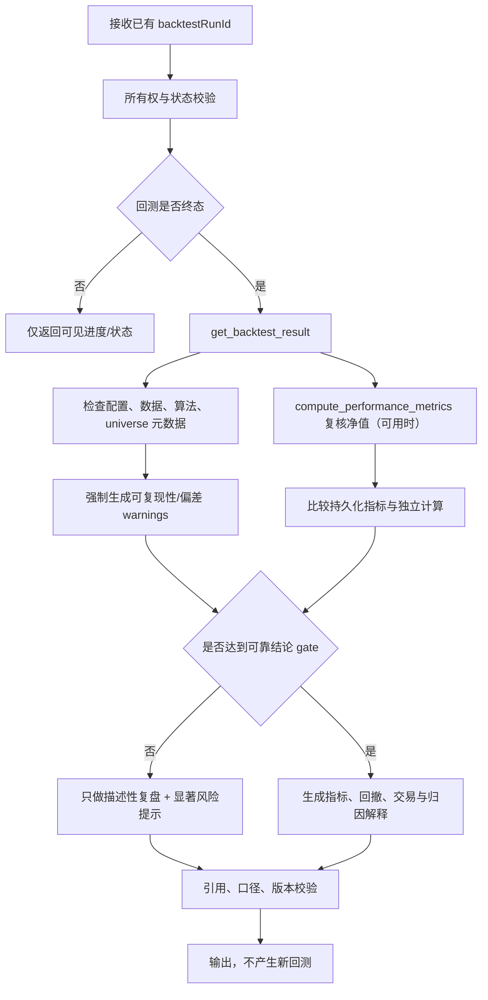

# 回测复盘工作流

## 1. MVP 边界

- `workflowKey`：`backtest_analysis`
- 初始版本：`1`
- 唯一触发：用户选择自己已有的回测 Run，请求解释、比较指标或复盘风险。
- 唯一核心读取 Tool：`get_backtest_result`；可用 `compute_performance_metrics` 对返回净值序列做独立确定性复核。
- **MVP 不注册回测提交 Tool，不允许模型自由创建、改参、重跑或取消现有回测。**

回测提交能力只有在本文第 10 节 gate 全部完成后，才能作为专用结构化确认 command 另行设计；不能把现有 Controller 包一层就交给模型。

## 2. 输入、权限与版本

输入只引用 [内部数据 Tool](../tools/schemas/internal-data-tools.md) 的 `get_backtest_result` Schema：已有 run 身份、用户选择的分析 sections 和图表点数上限。用户可补充关注问题，如回撤、换手、基准或策略稳定性；不接受策略代码、任意 SQL、模型生成参数或新运行请求。

`userId` 由 ToolAccessContext 注入。复用 `src/apps/backtest/services/backtest-run.service.ts` 的 ownership 查询，并在 Agent Facade 再校验 run 未删除且对当前用户可见。无权限与不存在使用相同安全语义。

Run 固定 `backtest_analysis@1`、prompt、`get_backtest_result`、`compute_performance_metrics`、指标算法与数据口径版本。分析记录原回测的 strategy/config/data/algorithm version；缺失时不能声称可复现。

## 3. 节点

进行中 Run 只能展示服务端可见进度，不对不完整曲线计算最终 Sharpe、回撤或投资结论。失败/取消 Run 可解释失败阶段，但不把部分结果当完整回测。

## 4. 真实服务复用

`get_backtest_result` 通过只读 Agent Facade 复用：

- `src/apps/backtest/services/backtest-run.service.ts`：归属、详情、净值、交易和持仓读取；
- `src/apps/backtest/services/backtest-metrics.service.ts`：现有指标及口径元数据；
- `src/apps/backtest/services/backtest-report.service.ts`：现有报告数据组织经验；
- `src/apps/backtest/services/backtest-data.service.ts` 与 `strategies/`：只读取版本/偏差元数据，不由 Agent 直接执行回测。

`compute_performance_metrics` 使用独立、版本化纯函数，从 Tool 返回的有界净值序列重新计算；模型不得自行算收益、Sharpe 或回撤。精确能力见 [Tool 清单](../tools/tool-inventory.md) 与 [量化 Tool Schema](../tools/schemas/quantitative-tools.md)。

## 5. 当前已实证的强制风险披露

在以下问题修复并通过 golden test 前，`get_backtest_result` 必须返回 `BACKTEST_BIAS_UNVERIFIED`，并在回答摘要附近展示具体 warning。不得把当前结果直接当可靠投资结论。

| 已实证问题 | 真实位置 | 对结果的影响 |
| --- | --- | --- |
| `ALL_A` 使用当前 `listStatus='L'` 构造历史股票池 | `src/apps/backtest/services/backtest-data.service.ts#getAllListedStocks` | 已退市历史股票被排除，产生幸存者偏差；初始一次性 universe 也不会纳入区间内后续 IPO |
| 指数池按最近快照取成分，但退出成分未被可靠剔除 | `BacktestDataService#getIndexConstituents` 与 engine 的动态 universe 合并路径 | 历史成分集合残留退出成员，收益归属和可交易集合失真 |
| 部分 rotation strategy 不按配置 universe 过滤 | `screening-rotation.strategy.ts`、`factor-screening-rotation.strategy.ts` | 排名/筛选会越过声明的指数或自定义股票池，从全市场选股 |
| `FactorRankingStrategy` 财务因子按 `end_date` 选择，而非按 `ann_date/availableAt` | `src/apps/backtest/strategies/factor-ranking.strategy.ts` | 回测读取当时尚未公告的财务信息，形成前视偏差 |
| 股票详情 QFQ 使用 `latestAdj / factor` | `src/apps/stock/stock-detail.service.ts#getDetailChart` | 与标准前复权方向相反，造成 Agent 行情对照和回测数据口径冲突 |
| 回测 `adjRows` 查询无 `orderBy`，却用 `reduceRight` 推断最新因子 | `src/apps/backtest/services/backtest-data.service.ts#loadDailyBars` | “最新复权因子”依赖数据库返回顺序，结果不可确定、不可稳定复现 |

Tool 输出至少包含：是否有完整 universe 快照、是否按公告可用时点、复权口径与排序是否验证、策略是否实际应用 universe、数据/算法版本、input/output hash。缺任何关键项都保持 warning。

## 6. 数据时点、指标复核与引用

复盘必须展示回测起止交易日、数据截止日、基准、复权、universe、成本/滑点、策略版本、算法版本和生成时间。交易、净值与指标引用同一 run 与数据版本；不能拿当前行情解释历史成交而不标明是事后观察。

独立指标复核步骤：校验日期升序、无重复、数值有限、净值为正、年化因子和无风险利率明确；再调用 `compute_performance_metrics`。持久化值与复核值超容差时显示口径差异/数据质量错误，不让模型选“更好看”的数字。

所有 provenance 与 warning 遵循 [Tool 公共 Schema](../tools/schemas/common-types.md)。回测数据来自程序计算，不需要网页引用；若用户另问市场背景，应新开受控 [市场与新闻分析](./market-news-analysis.md) 子流程，并明确事后信息边界。

## 7. 失败、重试、取消与恢复

- Run 不存在/无权：不重试，不透露资源属于谁。
- Run 仍在进行：返回状态和可见进度；不自动等待无限时间，也不替用户取消。
- Tool 临时 DB/超时错误：按 [Tool 错误](../tools/schemas/tool-errors.md) 有限重试；数据质量/版本缺失不重试。
- 净值点过多：由 `get_backtest_result` 确定性降采样并标注；模型不自行删点。
- 复核失败或偏差 gate 未过：保留描述性配置/状态信息，禁止可靠性结论。
- 用户取消 Agent 分析：只取消本次 Agent Run，不取消原回测 Run。
- 前端断线：按 [SSE 事件](../api/sse-events.md) 恢复 Agent 分析；不重新读取出第二套消息。
- Worker 重启：复用已持久 Tool result hash 和复核结果；不提交、修改或重跑回测。

## 8. 输出

建议输出顺序：

1. **醒目可靠性结论**：可复现、部分可复现或未验证；列出强制 warnings。
2. 配置与数据口径：时间、universe、成本、基准、复权、版本。
3. 指标与独立复核差异。
4. 净值、回撤和交易摘要。
5. 风险、偏差、缺失与不能得出的结论。

消息块结构以 [REST API](../api/rest-api.md) 为准。输出只能说“该历史运行记录显示”，不能在 gate 未过时说“策略有效”“具有超额收益能力”或给交易建议。

## 9. 验收场景

1. 用户读取自己的完成 Run：返回配置、净值、指标、复核差异和版本；不创建新回测。
2. 用户 A 请求用户 B 的 run：Facade 拒绝，响应不泄露存在性。
3. `ALL_A` 历史 Run：明确显示当前上市状态造成的幸存者偏差与后续 IPO 缺失。
4. 指数/rotation/factor 财务 Run：逐项命中适用 warning，不被通用免责声明替代。
5. `adjRows` 顺序/复权版本未验证：结果标为不可稳定复现，不输出可靠投资结论。
6. 持久化 Sharpe 与纯函数复核不一致：并列口径与差异，返回数据质量 warning。
7. 进行中、失败或取消 Run：只展示对应状态/部分数据，不计算终态结论。
8. 取消 Agent 分析：原回测状态完全不变。

## 10. 回测提交能力解锁 gate

全部满足前，提交能力保持延期：

- point-in-time `ALL_A` 与指数成分历史，正确处理上市、退市、加入和退出；
- 所有 strategy 在 engine 与 SQL 查询两层严格应用 universe；
- 财务因子以 `ann_date/availableAt` 过滤，覆盖修订公告；
- 股票详情与回测统一正确 QFQ 公式，`adjRows` 显式稳定排序；
- 手算/golden fixtures 覆盖复权、成分变化、IPO/退市、财报公告时点、成本、停牌和涨跌停；
- 提交/取消幂等、成本预算、队列隔离、显式确认与审计完成；
- `get_backtest_result` 能证明数据、策略、算法和输出 hash 可复现。

解锁后也只能使用专用结构化确认 command，不把回测提交加入模型可自由选择的 15 个 MVP Tool。
