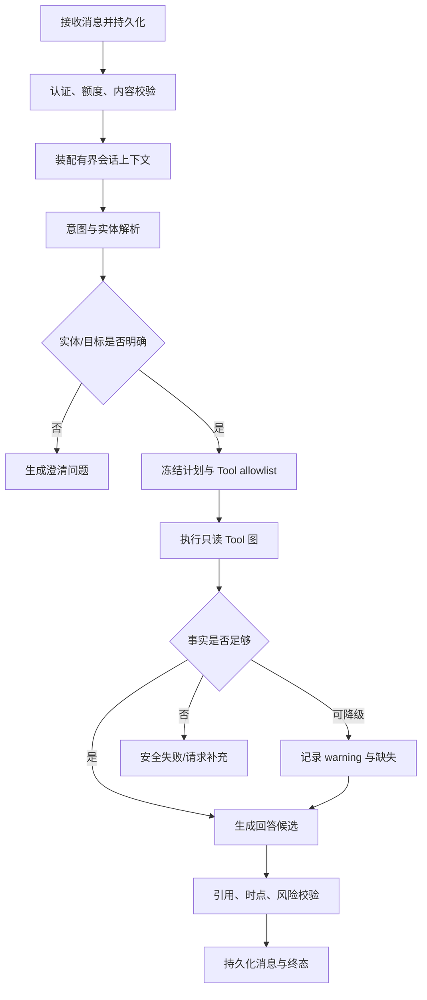

# 交互式会话工作流

## 1. 元数据与职责

- `workflowKey`：`interactive_chat`
- 初始版本：`1`
- 触发：用户发送消息、继续追问或对已有回答重新生成。
- 职责：维护多轮上下文、识别意图、必要时澄清、选择允许的子流程/Tool 图并生成可引用回答。
- 非职责：执行任意代码、自由联网、创建回测、修改持仓、直接发通知或暴露隐藏推理。

消息、Run、重生成和模型偏好的输入输出以 [REST API](../api/rest-api.md) 为准；流式过程以 [SSE 事件](../api/sse-events.md) 为准。本文不新增公开状态或事件。

## 2. 触发与输入

触发前提：用户已登录，提交内容通过长度与内容策略校验。Workflow 接收公共协议中的会话、消息、页面上下文、允许能力和模型策略；服务端补充 `userId`、角色、额度、时区和当前数据权限。

页面上下文只作为待验证线索。例如股票详情传来的 `entityId` 仍需 `resolve_security` 或受控实体校验，不能因为页面提供代码就跳过权限和存在性检查。

追问复用会话，但只加载有界历史摘要、最近相关消息、已验证事实引用和用户明确固定的上下文。模型隐藏推理、过期 Tool 原始结果和其他会话内容不得进入上下文。

## 3. 权限、预算与版本

- 默认只允许只读能力；联网、用户私有数据、量化计算分别做 capability policy。
- `get_user_watchlist`、`get_portfolio_risk`、`get_backtest_result` 必须在真实 Facade 再校验资源所有权。
- 每次 Run 冻结 workflow、prompt、model policy 及所用 Tool 版本；继续追问是新 Run，可使用新版本，但历史回答保留旧版本信息。
- 运行前冻结 Tool 次数、搜索页数、模型 Token、时间和成本预算；达到预算时生成明确的部分结果或失败，不隐式超支。

Tool 权限与版本规则见 [Tool 开发标准](../tools/tool-development-standard.md)。

## 4. 节点与状态

意图路由只能选择注册表中的版本化 workflow 和以下 canonical Tool，不接受模型自造 key。常见组合：

- 股票问题：`resolve_security` 后进入 [个股研究](./stock-research.md)。
- 市场与新闻：进入 [市场与新闻分析](./market-news-analysis.md)。
- 自选/组合：`get_user_watchlist`、`get_portfolio_risk`，必要时结合 `get_market_snapshot`。
- 已有回测复盘：`get_backtest_result`、`compute_performance_metrics`，进入 [回测复盘](./backtest-workflow.md)。
- 联网事实：只允许 `search_web` 选源、`fetch_web_page` 取受控页面。

## 5. 真实服务复用

所有服务经 [Tool 清单](../tools/tool-inventory.md) 的 Facade 复用，不做内部 HTTP 回环：股票使用 `src/apps/stock/stock.service.ts`；市场使用 `src/apps/market/market.service.ts`；自选使用 `src/apps/watchlist/watchlist.service.ts`；组合使用 `src/apps/portfolio/portfolio.service.ts` 与 `portfolio-risk.service.ts`；回测读取 `src/apps/backtest/services/`。

会话与 Run 是新增 Agent 领域持久化；现有 `src/websocket/events.gateway.ts` 只做后台/多端失效通知，当前前台回答使用 POST Fetch SSE。WebSocket 的鉴权、归属和重放必须先满足 [WebSocket 事件](../api/websocket-events.md)。

## 6. 数据时点与引用

每次回答建立事实账本：事实 ID、Tool 调用、来源、数据时点、单位、warning、引用 ID。模型只能引用账本内事实；程序计算结果标注算法版本，外部事实必须绑定经过验证的抓取来源。

多数据源时分别展示截止日期。用户问“今天”时先按 `Asia/Shanghai` 解析意图，再检查交易日与数据 watermark；数据库尚未同步到目标日时说明当前可用日，不用旧数据冒充当日。

输出内容块与 provenance 采用 [公共协议](../api/README.md)，不在 Workflow 内拼自定义 DTO。

## 7. 失败、重试、取消与恢复

- 实体有多个候选：停止 Tool 图并澄清，不擅自选最高分。
- 单个可选 Tool 失败：按 [Tool 错误](../tools/schemas/tool-errors.md) 有限重试；仍失败则保留已验证事实并明确缺口。
- 核心事实缺失、陈旧或引用无效：不生成确定性结论。
- 用户取消：持久化取消意图，向当前 Tool/模型传 AbortSignal；只有公共取消终态到达才完成。
- 浏览器断线：Run 继续；客户端按 [SSE 事件](../api/sse-events.md) 的序号恢复。
- Worker 重启：从已持久化节点、Tool attempt 与事实账本恢复；已成功的幂等 Tool 不重复执行，模型回答可从最近安全检查点重建。

## 8. 输出

输出为公共协议支持的消息块、引用、Tool 摘要、数据截止日、warning、模型/工作流版本和成本摘要。回答区分数据库事实、程序计算、外部来源与模型推断；禁止显示模型隐藏推理。

若信息不足，输出澄清问题或带缺失说明的部分回答；不以空数组、零值或模型猜测补齐。

## 9. 验收场景

1. 用户输入“分析平安”：返回多个证券候选并请求澄清，未调用下游股票 Tool。
2. 从 `600519.SH` 详情页追问：验证实体后复用页面上下文，回答带各数据集时点与引用。
3. 用户 A 请求用户 B 的组合或回测：Policy/Facade 拒绝，响应不泄露资源是否存在。
4. 可选新闻抓取超时：有限重试后给内部数据回答和联网缺失 warning，不造新闻。
5. 流中断、刷新再连接：不重复消息或 Tool 卡片，最终内容与服务端快照一致。
6. 用户取消与 Tool 完成竞态：以服务端状态版本和终态为准，不把已完成 Run 假标取消。
7. 重新生成：产生新消息版本，旧回答、引用和 workflow/tool 版本仍可审计。
