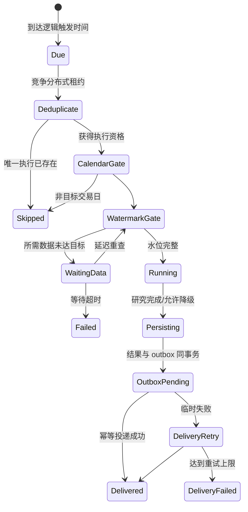
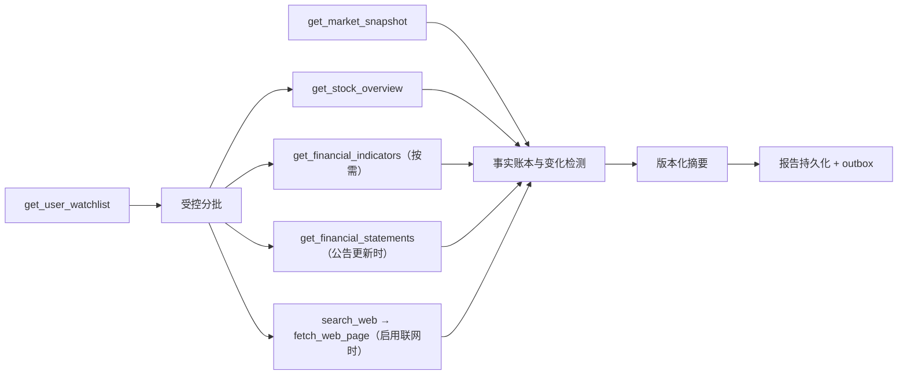

# 定时研究工作流

## 1. 元数据与职责

- 首个批准模板：`watchlist_daily_research@1`。
- 执行形态：后台、可恢复、按数据 watermark 放行。
- 触发：用户通过 [REST API](../api/rest-api.md) 创建的结构化 Cron 或条件 schedule；模型不能直接创建/修改 schedule。
- 职责：在唯一逻辑触发点读取用户资源、等待所需数据就绪、运行固定版本研究、持久化报告并经 outbox 可靠通知。
- 非职责：接受任意代码/SQL 条件、使用普通微信个人号、让模型自由选择通知对象或在数据未就绪时静默产出旧报告。

后续模板可新增不同 workflow key；每个模板独立版本和 Tool allowlist，不用一个巨型 Prompt 接收任意输入。

## 2. 调度输入与权限

Schedule 输入、操作与返回以 [REST API](../api/rest-api.md) 为准。执行内部需要：schedule 身份、owner、固定 workflow/version、结构化资源引用、时区、交易日规则、逻辑触发时间、通知 channel 引用、成本上限和所需数据集 watermark 规则。

权限在两个时点检查：

1. 创建/更新时：用户拥有自选、组合、报告目标和通知 channel；workflow/version 已发布；额度合法。
2. 每次执行时：用户仍有效、资源仍归属、channel 未撤销、配额仍足够。失败不泄露其他用户资源。

`get_user_watchlist`、`get_portfolio_risk` 的 `userId` 由 ToolAccessContext 注入。通知收件人与 channel 只来自 schedule 持久配置，模型不能改写。

## 3. 版本与变更

Schedule 固定 workflow、prompt 和默认 Tool 版本。发布新版本不自动改变现有 schedule；用户更新 schedule 后，从下一个逻辑触发点生效并记录新旧版本。

执行创建后再次冻结完整版本集合与 input hash。旧版本缺失按 [错误码](../api/error-codes.md) 失败并通知用户修复，不降级到“最新”。

## 4. 唯一调度、水位与 outbox

多实例只允许 scheduler 角色扫描到期任务；分布式租约防并发扫描，数据库唯一约束才是最终去重。建议执行唯一键由 `scheduleId + logicalFireAt + targetWatermark + workflowVersion` 决定。进程重启、夏令时/时区换算和重复 tick 都必须命中同一执行。

data watermark 按依赖分别记录，例如交易日行情、估值、资金流、财务公告批次、市场截面。`tradingDayOnly` 需真实交易日历，不只判断周一到周五。未就绪时进入 `WaitingData`，不能用上一次报告冒充新报告。

报告/执行状态与 outbox 在同一数据库事务提交。通知 worker 以 outbox 身份幂等投递；成功后记录 delivery，重启可续投但不会重复发送。

## 5. Tool 图与真实复用

`watchlist_daily_research@1` 的批准 Tool 图：

组合日/周报模板可使用 `get_portfolio_risk`；不得自动加入未批准 Tool。精确 Schema 和服务复用见 [Tool 清单](../tools/tool-inventory.md)。自选复用 `src/apps/watchlist/watchlist.service.ts`，组合复用 `src/apps/portfolio/`，市场复用 `src/apps/market/market.service.ts`，报告适配现有 `src/apps/report/`，站内通知复用 `src/apps/notification/notification.service.ts`。

当前报告本地文件存储和通知直接推送需要先改为生产对象存储/outbox；Workflow 设计不把现状的 fire-and-forget 当可靠交付。

## 6. 数据时点、引用与变化检测

每份报告记录目标 watermark、实际各数据集 `asOf`、上次成功执行身份和差异基线。只有数据变化才可生成“新增/变化”；不能拿两次抓取时间差冒充业务变化。

财务变化按公告可用时间；网页按发布/抓取时间；行情按交易日。联网关键事实遵守 [联网研究 Tool](../tools/schemas/web-research-tools.md) 的 search→fetch→引用链。报告中的每个事实块遵循 [Tool 公共 Schema](../tools/schemas/common-types.md)。

## 7. 失败、重试、暂停、取消与恢复

- schedule 暂停：阻止未来执行，不自动取消已运行 execution。
- execution 取消：持久化取消意图并停止未开始节点；报告未提交前可取消，outbox 已提交后只能按渠道语义处理，不能伪装撤回。
- watermark 未就绪：按有界策略延迟；达到截止时间后明确 `DATA_NOT_READY` 类失败并通知一次。
- Tool 临时错误：按 [Tool 错误](../tools/schemas/tool-errors.md) 有限重试；单股可选数据失败可降级，核心自选/市场数据失败则整次失败。
- Worker 崩溃：从 execution 节点、Tool attempt、报告和 outbox 恢复；唯一键阻止第二份报告。
- 通知失败：只重试 delivery，不重新运行研究；用户可从通知投递列表手动重试。
- resume schedule：从下一逻辑触发点运行，不补跑所有历史，除非用户显式选择有上限的 backfill。

## 8. 输出

输出包含：版本化研究报告、各数据 watermark/截止日、变化摘要、引用、warning、执行成本与状态；通知只携带最小摘要和报告引用，不放完整持仓、Prompt 或敏感 Tool payload。后台完成/失败通知遵循 [WebSocket 事件](../api/websocket-events.md)，客户端再拉权威详情。

## 9. 验收场景

1. 两个 scheduler 实例同一秒触发：数据库只有一个 execution、一份报告、一组 outbox。
2. 18:30 到点但当日资金流未同步：进入等待；水位到达后只运行一次。
3. 法定节假日周一：交易日 gate 跳过，不因“工作日”误跑。
4. Worker 在报告事务后、通知前崩溃：恢复只续投 outbox，不重建报告。
5. 通知 provider 失败三次：研究仍成功，delivery 独立失败并可手动重试。
6. 用户暂停后有在途执行：在途按明确策略继续/可取消，未来触发被阻止。
7. workflow 版本被撤下：执行失败并提示升级，不静默切到新版。
