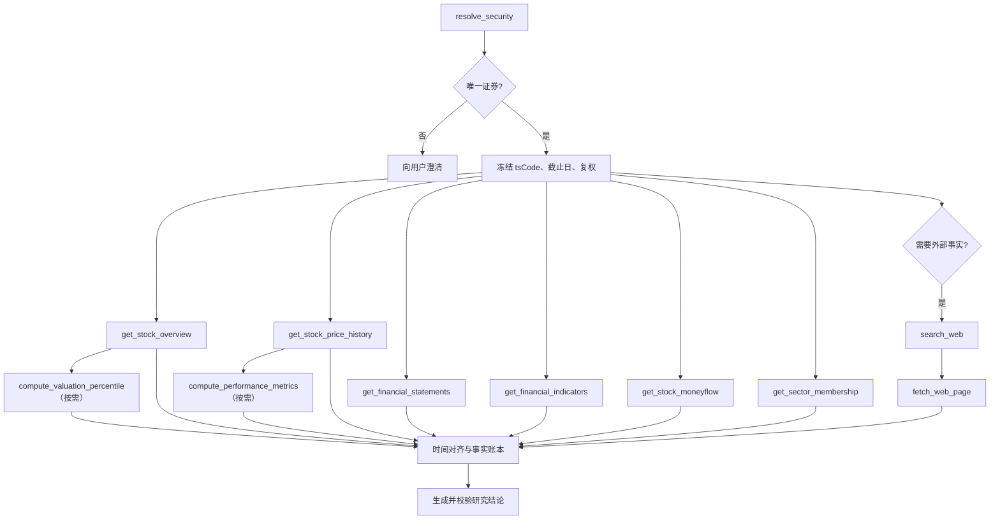

# 个股研究工作流

## 1. 元数据与职责

- `workflowKey`：`stock_research`
- 初始版本：`1`
- 触发：会话明确提出单股/多股研究，或从股票详情页发起“用 AI 分析”。
- 职责：把证券身份、行情、基本面、财务、估值、资金、行业和必要外部来源按同一研究截止时点组织成可引用结论。
- 非职责：预测必然涨跌、生成交易指令、修改自选/持仓、提交回测或自动保存报告。

## 2. 输入

内部输入只引用 [REST API](../api/rest-api.md) 的会话与页面上下文，不另建公共 DTO。Workflow 需要：

- 一个或多个证券查询/已验证 `tsCode`；
- 研究问题与维度；
- 研究截止日、行情区间和频率；
- 明确复权口径；
- 是否需要联网核对最新公告/新闻；
- 允许能力、成本与时间预算。

最多标的数、日期跨度、字段 allowlist 以 [内部数据 Tool Schema](../tools/schemas/internal-data-tools.md) 为准。多股超限时要求用户缩小范围，不自动截掉未研究标的。

## 3. 权限与版本

登录用户可查询公共证券数据；联网能力、供应商配额和来源策略单独授权。若研究引用自选或组合上下文，使用 `get_user_watchlist` 或 `get_portfolio_risk` 并在真实 Facade 校验所有权。

Run 固定 `stock_research@1`、prompt 版本、所有 Tool/算法版本、复权方式和研究截止时点。相同问题在不同日期重跑是新 Run；旧报告仍绑定原水位与版本。

## 4. Tool 图

只调用实际需要的分支。只问财务时不为“显得全面”强制抓资金流和网页；多标的同类 Tool 可在限额内并行，但必须保持标的级错误与时点隔离。

## 5. 真实服务复用

复用关系以 [Tool 清单](../tools/tool-inventory.md) 为准：

- `resolve_security`、`get_stock_overview`、`get_stock_price_history`、`get_financial_statements`、`get_stock_moneyflow` 通过 `src/apps/stock/stock.service.ts` 的只读 Facade；
- `get_financial_indicators` 通过股票财务 Facade 读取真实 Prisma Model `FinaIndicator`（物理表 `financial_indicator_snapshots`）；
- `get_sector_membership` 复用 stock/industry/index 关联 Facade；
- `compute_valuation_percentile` 复用估值序列 Facade，并由固定算法 adapter 计算；
- `compute_performance_metrics` 使用从回测指标实现抽取的版本化纯函数；
- `search_web`、`fetch_web_page` 使用新增的受控 provider/fetch adapter，不允许任意 URL。

不得从 Controller 回环调用，也不得让模型直接构造 Prisma 字段或 SQL。

## 6. 数据时点与研究口径

研究截止时点由各数据集共同决定：

- 行情、估值和资金流给交易日、频率、复权和单位；
- 三表与财务指标同时给报告期、公告日和当时可用时间；历史研究按公告可用时间过滤，禁止前视；
- 行业/指数成分给有效日期；
- 网页给发布日期、抓取时间、内容 hash 和来源等级；
- 不同数据未同步到同一天时逐项披露，不把最新行情日套给财务或网页。

当前周/月 `pct_chg` 单位、前复权公式/排序未通过 gate 时，`get_stock_price_history` 只能使用已验证 OHLC 路径重算并返回既有 `DATA_UNIT_UNVERIFIED` warning；不能把未验证字段直接交给模型。精确规则见 [Tool 清单的数据风险](../tools/tool-inventory.md)。

## 7. 引用与结论规则

每个关键结论至少关联一个事实包来源；跨来源结论保留多个引用。官方公告、交易所和监管来源优先。`search_web` 摘要不能作为关键事实引用，必须经 `fetch_web_page` 或明确标为“仅搜索摘要，未核验”。

模型可解释估值高低、盈利质量与风险，但数值由 Tool/程序计算。观点冲突时并列来源与日期，不用模型投票产生“唯一真相”。输出需区分事实、程序派生和推断。

## 8. 失败、重试、取消与恢复

- 证券歧义：立即澄清；不继续调用下游 Tool。
- 核心行情或财务数据缺失/陈旧：按 [Tool 错误](../tools/schemas/tool-errors.md) 失败或降级，明确缺失维度。
- 外部搜索/抓取临时失败：有限重试；内部研究仍可完成，但必须显示联网缺口。
- 单一比较标的失败：保留其他标的事实，但不能给不完整横向排名。
- 用户取消：终止未开始分支并向在途 Tool 传 AbortSignal；已持久化事实可用于显示部分结果。
- Worker 中断：按节点与 Tool attempt 恢复；相同事实结果可依据 input/output hash 复用，不重复抓取或计算。
- 前端断线：Run 不受影响，恢复遵循 [SSE 事件](../api/sse-events.md)。

## 9. 输出

输出采用 [公共协议](../api/README.md) 支持的 Markdown、表格、图表、K 线、财务指标与风险提示块，不重新定义字段。建议顺序：研究摘要 → 数据截止与口径 → 行情/估值 → 财务质量 → 资金与行业 → 外部事实 → 风险与缺失 → 引用。

输出不是投资建议；已知数据质量 warning 必须在摘要附近可见，不能只藏在 Tool 详情。

## 10. 验收场景

1. “茅台近五年估值贵吗”：唯一解析证券，固定复权/窗口，估值分位与行情数据时点清晰。
2. “比较茅台和五粮液盈利质量”：按公告可用时间对齐，不用后来公布的财报解释更早日期。
3. 股票简称有多个候选：只返回澄清选项，零下游 Tool 调用。
4. 周/月收益 gate 未通过：从 OHLC 重算并显示 `DATA_UNIT_UNVERIFIED`，或拒绝该指标。
5. 最新公告页面抓取失败：不引用搜索 snippet 充当公告事实；输出内部数据结果和缺口。
6. 某标的财务数据缺失：不把 `null` 转 0，不给错误排名。
7. 取消、恢复、重复事件：不重复 Tool 结果，最终事实账本、消息与引用一致。
