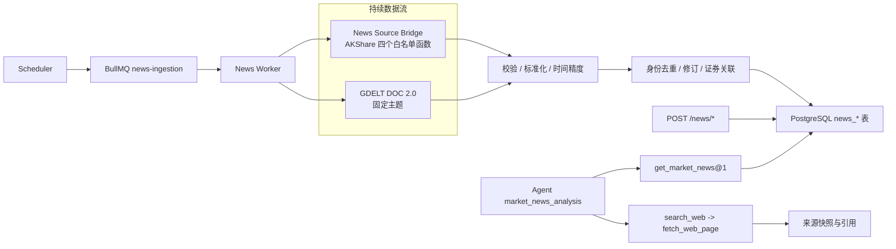

# 新闻时事模块后端设计

> 状态：🟡 Round 5 已实现（v1.2 契约、本地 AKShare 全链路、50 万数据/2 小时 SOAK 和四类故障恢复已通过；连续 5 个交易日、数据许可与 GDELT 外部恢复待验收）
> 设计日期：2026-08-05
> 适用范围：A 股公告、中文财经快讯、全球宏观事件、Agent 按需联网核验
> 实施原则：业务场景先行、测试用例文档先行、Outside-in TDD、先红后绿、不以现有实现或旧 spec 作为正确性依据。
> 执行结果：见 `docs/新闻时事模块测试执行报告-20260806.md`。

---

## 1. 结论摘要

首期不把“联网搜索”当作“持续新闻流”，而是分成两条独立链路：

1. **结构化新闻入库链**：免费或低成本数据源负责“发现”，经过字段标准化、时间精度保留、幂等去重后存入 PostgreSQL。
2. **Agent 联网核验链**：用户真正询问时，先读本地新闻，再通过现有 `search_web -> fetch_web_page -> citation` 安全链核验关键事实。

首期确定使用：

| 层级         | 数据源/技术                              | 用途                               | 首期决策             |
| ------------ | ---------------------------------------- | ---------------------------------- | -------------------- |
| A 股公告     | AKShare `stock_notice_report`            | 当日全市场公告发现                 | P0                   |
| 个股公告回补 | AKShare `stock_individual_notice_report` | 按股票和日期范围回补               | P0                   |
| 中文财经快讯 | AKShare `stock_info_global_em`           | 有 URL 的财经快讯                  | P0                   |
| 事件发现     | AKShare `stock_info_global_cls`          | 财联社电报，无 URL 时只做发现      | P0                   |
| 全球宏观     | GDELT DOC 2.0                            | 制裁、战争、关税、政策、供应链风险 | P0，可关闭副源       |
| 关键事实核验 | 现有 Brave Provider + 安全抓取           | Agent 按需查询和引用               | P0，不进持续采集链   |
| 模型联网回答 | 火山方舟 Web Search                      | Agent 分析层的可选联网能力         | P1，不作新闻库数据源 |

首期明确不使用：

- 不直接暴露原版 AKTools 通用 `/api/public/{item_id}`；改为只包含四个固定函数的内网 Python Bridge。
- 不把 `stock_news_em` 作为 P0；官方文档称最近 100 条，但 v1.18.81 源码实际固定返回第 1 页 10 条，需通过 5 个交易日的真实契约门禁后才能启用。
- Marketaux 只做契约 POC，不进首期正式链路；免费档 100 请求/日且每次最多 3 篇，同时自动化访问与持久化权利需书面确认。
- RSSHub 不做首期核心源；路由、上游网页和全文版权边界均不够稳定。
- 不引入向量库、LLM 自动聚类或 LLM 全量标签；首期所有去重、关联和优先级必须可确定性测试。
- 不持久化或对外重新发布新闻全文。

## 2. 目标、用户场景与非目标

### 2.1 业务目标

1. 用户可查询最新市场快讯、A 股公告、个股时间线和全球宏观事件。
2. Agent 可读取结构化本地新闻，并能识别时点、来源、数据新鲜度和未核验风险。
3. 同一上游快照重复轮询不重复建文；文章内容变化时保留不可变修订记录。
4. 任一上游不可用时，其他数据源和本地查询仍然可用，响应必须显式显示 `partial/warnings/dataThrough`。
5. 新数据源上线前必须通过版本化 fixture、契约测试、低频真实探针和版权/保留策略门禁。

### 2.2 核心场景

| 编号  | 场景                             | 正确行为                                                                |
| ----- | -------------------------------- | ----------------------------------------------------------------------- |
| S-001 | 用户查“今天市场有什么重要消息”   | 先返回本地已入库快讯与公告，带来源、发布精度、首次发现时间和水位        |
| S-002 | 查某股最新公告                   | 优先按明确股票代码关联；公告只有日期时不伪造 00:00 发布时间             |
| S-003 | 上游连续返回重叠快照             | 只更新 `lastSeenAt`，不重复建文、不重复建修订                           |
| S-004 | 同 URL 的标题/摘要更正           | 稳定 Article 不变，新建 Revision，保留旧 hash 和时点                    |
| S-005 | 财联社电报无原文 URL             | 使用稳定合成身份键入库，显式标识发现源，关键结论需 Agent 另行搜索核验   |
| S-006 | GDELT 返回 `seendate`            | 存为“GDELT 发现时间”，`publishedAt` 保持 `null`                         |
| S-007 | 一个数据源超时/429/500           | 有界重试，不推进该源水位；其他源继续工作                                |
| S-008 | 返回一条无法解析的坏数据         | 单条隔离并记录脱敏证据，不得把整批静默当作成功                          |
| S-009 | 用户问新闻对当日价格的影响       | 对齐事件/发布/发现/抓取/交易日时点；盘后新闻不得解释当日收盘波动        |
| S-010 | 管理员手动触发回补               | 使用 `clientRequestId`、参数上限和唯一任务键，重复提交返回原 Run        |
| S-011 | 两个 Worker 同时处理同一窗口     | 数据库唯一约束 + CAS 保证一篇 Article、一个 Revision、一个 ProviderItem |
| S-012 | 网页/快讯文本含 Prompt Injection | 文本始终是不可信数据，不影响队列、Provider、Tool 或权限决策             |

### 2.3 非目标

- 不承诺交易所行情级实时性或每条新闻的历史全覆盖。
- 不从新闻直接产生买卖指令、确定性价格预测或自动通知。
- 不把转载数量当作多源交叉验证。
- 不支持用户传入任意 URL、AKShare 函数名、GDELT 原始查询语法或 Provider 基础地址。
- 不在 P0 做跨来源模糊合并、事件聚类、情感分析或影响打分。

## 3. 关键架构决策

### 3.1 流与搜索分离



设计不变量：

- 新闻 Worker 不直接调用模型，不因 LLM 失败阻塞基础入库。
- Agent 不直接调 AKShare/GDELT，只读取本地标准化 Tool 或走受控 Web Search。
- Redis/BullMQ 不是数据真相源；水位、Run 和文章状态均以 PostgreSQL 为准。
- 单一 Provider 失败不应使应用整体 readiness 失败，但 `/news/coverage` 必须显示 `DEGRADED`。

### 3.2 火山产品的正确位置

- 火山方舟 Web Search 通过 Responses API 的 `tools: [{ type: "web_search" }]` 由模型决定是否搜索、搜索几次，主产物是回答与 annotations，官方没有承诺稳定的原始 `results[]` 列表。
- 因此它应位于 Agent/分析层，不实现 `NewsFeedProvider`，也不取代现有的原始 `WebSearchProvider` 契约。
- 官方当前为每月 20,000 次联网资源免费，超出后联网搜索资源约 4 元/千次，模型 Token 另计，默认账号约 5 QPS。计费单位是实际搜索资源/关键词调用，不是简单 HTTP 请求数；P1 必须根据响应 `usage.tool_usage_details` 记录真实用量。
- 豆包搜索 Custom 版虽可返回 `Result.WebResults[]`，但专用条款对复制、存储、归档搜索内容和建立内容库有明确限制。未取得书面授权前，只可做临时查询/核验，不可进入新闻持久化链。
- 豆包搜索 Custom/Global 的公开标准为共享每月 500 次免费，按量约 20 元/千次；它与“方舟联网内容插件每月 2 万资源免费”是两套产品和计费口径，不得混用。

### 3.3 不直接暴露 AKTools

原版 AKTools 存在以下契约和安全问题：

- `/api/public/{item_id}` 无认证、CORS 全开。
- `item_id` 来自 `dir(akshare)`，query 参数动态拼接后通过 `eval` 调用。
- 网络、JSON、pandas 等异常多为无结构 500，没有稳定重试标志或 partial 语义。
- AKShare 部分函数没有底层 HTTP timeout，单个请求可长时间占用 worker。

因此增加 `services/news-source-bridge/`：

- Python 3.12、FastAPI/Pydantic、Uvicorn/Gunicorn、固定版本 AKShare。
- 通过 `uv.lock` 锁定全部传递依赖；AKShare 初始候选版本为经过契约验证的 `1.18.81`，禁止自动浮动升级。
- 只提供四个固定 POST 端点；不接收函数名、参数名、URL 或任意代码。
- 仅位于 Compose 内网，不映射宿主机端口；NestJS 使用至少 32 字节的内部 token 访问。
- NestJS 超时先于 Bridge worker 强制超时；Gunicorn 必须配置 worker timeout 与定期回收，防止无 timeout 的上游请求永久占满进程。

## 4. 技术选型

| 关注点         | 选型                                              | 理由                                                            |
| -------------- | ------------------------------------------------- | --------------------------------------------------------------- |
| API/业务模块   | NestJS 11 + TypeScript 5.8                        | 与当前仓库一致                                                  |
| 数据库         | PostgreSQL 17 + Prisma 6                          | 关系约束、幂等、修订、水位和时间类型可靠                        |
| 队列           | Redis 7.4 + BullMQ 5                              | 复用当前 Worker/Scheduler 运行角色，支持延迟、重试和 jobId 防重 |
| A 股数据桥     | Python 3.12 + FastAPI/Pydantic + AKShare          | 保留 AKShare 适配能力，但把动态通用入口收窄成固定契约           |
| HTTP           | Node 22 原生 `fetch` + 可注入 `NewsHttpTransport` | 不新增 Axios；单测可完全 mock，支持 AbortSignal                 |
| 上游 JSON 校验 | Ajv 8                                             | 仓库已有依赖，可版本化 JSON Schema                              |
| 时间           | Day.js + timezone，市场时区 `Asia/Shanghai`       | 保留日期/秒/分钟/未知精度，避免伪造时间                         |
| 哈希           | Node `crypto` SHA-256                             | 身份、内容、原始载荷和配置版本可追溯                            |
| 关键字搜索     | PostgreSQL `pg_trgm` GIN                          | 中文标题/摘要子串查询，避免首期引入 Elasticsearch               |
| 单元/集成/E2E  | Jest 29 + Nest TestingModule + Supertest          | 与仓库现有测试栈一致                                            |
| Bridge 测试    | pytest + FastAPI TestClient/HTTPX                 | 先用人工 DataFrame fixture 验证 Python 稳定契约                 |
| 负载/压力      | 固定镜像的 k6，只压本地 API                       | 不对第三方 API 施压，不增加 npm 运行时依赖                      |

不引入 Kafka、Elasticsearch、pgvector、LangChain/LangGraph 或独立微服务注册中心。当前数量级和单仓运行方式不需要这些复杂度。

## 5. 目标目录与依赖方向

```text
src/apps/news/
├── api/
│   ├── news.controller.ts
│   ├── news-admin.controller.ts
│   └── dto/
├── application/
│   ├── news-query.service.ts
│   ├── news-ingestion-orchestrator.ts
│   └── news-coverage.service.ts
├── domain/
│   ├── news-feed-provider.ts
│   ├── news-normalizer.ts
│   ├── news-identity.ts
│   ├── news-time.ts
│   └── news.errors.ts
├── infrastructure/
│   ├── news.repository.ts
│   ├── news-http.transport.ts
│   ├── provider-registry.ts
│   └── providers/
│       ├── akshare-bridge.provider.ts
│       ├── gdelt.provider.ts
│       └── fake-news.provider.ts
├── tool/
│   └── market-news-tool.facade.ts
├── test/
│   ├── fixtures/
│   └── *.spec.ts
└── news.module.ts

src/queue/news/
├── news-queue.constants.ts
├── news-queue-producer.module.ts
├── news-queue.service.ts
├── news.processor.ts
├── news-scheduler.service.ts
└── test/

src/config/news.config.ts
prisma/news/news.prisma
services/news-source-bridge/
├── app/
├── tests/
├── pyproject.toml
├── uv.lock
└── Dockerfile
```

依赖规则：

```text
Controller / Agent Tool
        -> Application Service
        -> Domain Port
        -> Repository / Provider Adapter

Provider Adapter -> NewsHttpTransport
Domain            -X-> Prisma / fetch / BullMQ / ConfigService
NewsModule        -X-> Agent workflow implementation
Agent workflow     -> MarketNewsToolFacade + existing WebSearchModule
```

- Provider 、Repository、Clock、Hash 器均使用 Symbol token 或小型接口注入。
- `NewsQueryService` 不调外网；`NewsIngestionOrchestrator` 不承担 HTTP DTO 转换。
- Scheduler 只入队，Processor 只编排一个入库 Run，Provider 只负责上游契约。

## 6. Provider 契约

### 6.1 NestJS 领域端口

```ts
export const NEWS_FEED_PROVIDERS = Symbol('NEWS_FEED_PROVIDERS')
export const NEWS_HTTP_TRANSPORT = Symbol('NEWS_HTTP_TRANSPORT')
export const NEWS_CLOCK = Symbol('NEWS_CLOCK')

export interface NewsFeedProvider {
  readonly providerKey: string
  readonly supportedFeeds: readonly string[]
  fetch(request: NewsFetchRequest, signal: AbortSignal): Promise<NewsProviderBatch>
}

export interface NewsFetchRequest {
  feedKey: string
  partitionKey: string
  windowStart?: Date
  windowEnd?: Date
  securityCodes?: readonly string[]
  providerCursor?: Readonly<Record<string, unknown>>
}

export interface NewsProviderBatch {
  schemaVersion: 1
  providerKey: string
  feedKey: string
  partitionKey: string
  retrievedAt: Date
  items: readonly ProviderNewsItem[]
  nextCursor: Readonly<Record<string, unknown>> | null
  potentiallyTruncated: boolean
  warnings: readonly NewsProviderWarning[]
}

export interface ProviderNewsItem {
  upstreamId: string
  contentType: 'NOTICE' | 'NEWS' | 'FLASH'
  title: string
  excerpt: string | null
  publisher: string | null
  canonicalUrl: string | null
  alternateUrls: readonly string[]
  publishedAt: Date | null
  publishedDate: string | null
  publishedPrecision: 'SECOND' | 'MINUTE' | 'DATE' | 'UNKNOWN'
  sourceDiscoveredAt: Date | null
  language: string | null
  sourceCountry: string | null
  securityHints: readonly string[]
  category: string | null
  sourceMetadata: Readonly<Record<string, unknown>>
  rawPayloadHash: string
}
```

`ProviderNewsItem` 是 Provider 边界的标准产物，不是数据库 Entity。后续仍需经过标题/摘要限长、URL 规范化、时区校验、本地证券代码校验和身份键生成。

### 6.2 News Source Bridge

只开放：

| 端点                              | Body                                                                       | AKShare 函数                               |
| --------------------------------- | -------------------------------------------------------------------------- | ------------------------------------------ |
| `POST /v1/feeds/eastmoney/latest` | `{}`                                                                       | `stock_info_global_em`                     |
| `POST /v1/feeds/cls/latest`       | `{ "scope": "ALL" }`                                                       | `stock_info_global_cls(symbol="全部")`     |
| `POST /v1/notices/daily`          | `{ "date": "YYYYMMDD" }`                                                   | `stock_notice_report(symbol="全部", date)` |
| `POST /v1/notices/security/range` | `{ "security": "600519", "beginDate": "YYYYMMDD", "endDate": "YYYYMMDD" }` | `stock_individual_notice_report`           |

约束：

- `security` 必须是 6 位数字；日期范围最多 31 天。
- P0 公告分类固定为“全部”，不向调用者暴露 AKShare 原始 `symbol` 枚举。
- 成功响应必须是统一 `schemaVersion/requestId/retrievedAt/items/warnings`。
- 错误必须是 `code/retryable/message/requestId`，禁止返回 Python stack、上游 cookie 或原始响应全文。
- 空 DataFrame 是成功空批次，不是 404。
- Bridge 只做字段契约收窄和必要时间解析，不做数据库去重、证券名称模糊关联或业务优先级。

字段映射：

| AKShare 函数                     | 核心映射                                                                                                                  | 特殊规则                                                              |
| -------------------------------- | ------------------------------------------------------------------------------------------------------------------------- | --------------------------------------------------------------------- |
| `stock_notice_report`            | `公告标题 -> title`、`公告类型 -> category`、`公告日期 -> publishedDate`、`网址 -> canonicalUrl`、`代码 -> securityHints` | `publishedAt=null`、precision=`DATE`；代码必须经本地主数据验证        |
| `stock_individual_notice_report` | 与全市场公告相同                                                                                                          | 只允许有上限的明确证券/日期回补                                       |
| `stock_info_global_em`           | `标题 -> title`、`摘要 -> excerpt`、`发布时间 -> publishedAt`、`链接 -> canonicalUrl`                                     | 按 `Asia/Shanghai` 解析；不从摘要模糊猜证券代码                       |
| `stock_info_global_cls`          | `标题 -> title`、`内容 -> excerpt`、`发布日期+发布时间 -> publishedAt`                                                    | `canonicalUrl=null`；空标题可生成展示标题，但去重 hash 仍使用原始内容 |

AKShare 已知数据质量限制不能被 Bridge 伪装成“已解决”：

- 公告与多个证券关联时，当前源码可能只取第一个 A 类代码；此类记录必须允许 `POSSIBLE_SECURITY_OMISSION` quality flag。
- 公告页内关键列缺失时，上游实现可能跳过整页且不返回 partial；首期只能通过行数趋势、个股公告交叉 canary 和水位 warning 发现，不对外宣称公告绝对完整。
- 后一轮公告/快讯快照数量变少时，只记录趋势告警，不删除已入库文章。

错误映射：

| Bridge code               | retryable | NestJS 行为                     |
| ------------------------- | --------- | ------------------------------- |
| `INVALID_ARGUMENT`        | false     | 任务失败，不重试                |
| `UPSTREAM_TIMEOUT`        | true      | 有界延迟重试                    |
| `UPSTREAM_RATE_LIMITED`   | true      | 服从 `retryAfterMs`，不立即循环 |
| `UPSTREAM_UNAVAILABLE`    | true      | 指数退避                        |
| `UPSTREAM_SCHEMA_CHANGED` | false     | 打开契约告警，暂停该 feed       |
| `INTERNAL_ERROR`          | false     | 脱敏记录，等待人工处理          |

### 6.3 GDELT DOC 2.0

固定请求模板：

```text
GET https://api.gdeltproject.org/api/v2/doc/doc
  ?query=<服务端版本化英文主题>
  &mode=artlist
  &format=json
  &sort=datedesc
  &timespan=45min
  &maxrecords=250
```

- P0 只允许 5～8 个版本化服务端主题；用户和模型不能传原始 query。
- 每 15 分钟运行，查询最近 45 分钟，制造 30 分钟重叠窗口。
- 多词短语必须按 DOC 2.0 语法使用双引号；主题以 OR block 组合，禁止拼接用户输入。
- 查询严格串行，全局间隔至少 60 秒；429 按延迟任务处理。
- 429 有 `Retry-After` 时服从有界上游值；无该响应头时进入 15 分钟 Provider 全局冷却，已经排队的请求醒来后必须重新检查冷却时间。
- canary 遇到首个 429 或超时立即停止剩余主题，避免探针放大外部故障。
- `articles[].seendate` 映射为 `sourceDiscoveredAt`，不映射为 `publishedAt`。
- `url_mobile` 作为 alternate URL，不创建第二篇文章。
- 返回数恰好 250 时设 `potentiallyTruncated=true`。
- 相同标题、不同域名首期保留为两篇，不自作主张合并。

## 7. 标准化、时间和去重

### 7.1 文本规范化

`normalizerVersion = "news-normalizer-v1"`：

1. Unicode NFKC。
2. 移除零宽字符，将 CRLF 转为 LF。
3. 标题首尾 trim，内部连续空白折叠为一个空格。
4. title 最长 1,000 Unicode code points，excerpt 最长 1,000 code points；超出必须打 `TRUNCATED` quality flag。
5. 用于 hash 的正规化文本不解析/执行 HTML、Markdown、JavaScript 或文本中的指令。
6. Provider 原始全文在内存中用于计算 hash 和短摘要后即丢弃，不写入业务表、日志或 tracing。

### 7.2 URL 规范化

- 仅允许 `https` 和经 Provider 明确允许的 `http`。
- host 小写、移除 fragment、默认端口和已知跟踪参数（`utm_*`、`spm`、`from`等）。
- 不删除未知业务参数，不跟随重定向来猜 canonical URL。
- 入库前保留原 URL 的 host 与规范 URL/hash；日志只记 host 和 hash。
- URL 规范器从现有 Web Search 中抽取为可复用纯函数，抽取前必须为现有行为补充回归测试。

### 7.3 身份键

优先级：

```text
1. 有规范 URL:
   identityHash = SHA256("url:v1\n" + canonicalUrl)

2. 无 URL 但有稳定上游 ID:
   identityHash = SHA256("provider:v1\n" + providerKey + "\n" + feedKey + "\n" + upstreamId)

3. 无 URL/无稳定 ID:
   upstreamId = "synthetic:v1:" + SHA256(publisher + normalizedTitle + normalizedBody + sourceTime)
   identityHash = SHA256("provider:v1\n" + providerKey + "\n" + feedKey + "\n" + upstreamId)
```

内容修订 hash：

```text
contentHash = SHA256(
  "content:v1\n" +
  contentType + "\n" +
  sourceType + "\n" +
  canonicalUrl + "\n" +
  canonicalJson(alternateUrls) + "\n" +
  normalizedTitle + "\n" +
  normalizedExcerpt + "\n" +
  publisher + "\n" +
  publishedAt + "\n" +
  publishedDate + "\n" +
  publishedPrecision + "\n" +
  language + "\n" +
  sourceCountry + "\n" +
  canonicalJson(qualityFlags)
)
```

不可用“标题相似”在 P0 直接合并文章。相同事件的连续进展是独立事实，错误合并比保留重复更危险。

### 7.4 时间规则

| 上游时间             | 入库                                                                        |
| -------------------- | --------------------------------------------------------------------------- |
| 完整时间且可确认时区 | `publishedAt=timestamptz`，precision=`SECOND/MINUTE`                        |
| 只有公告日期         | `publishedDate=date`，`publishedAt=null`，precision=`DATE`                  |
| GDELT `seendate`     | `NewsProviderItem.sourceDiscoveredAt`，`publishedAt=null`                   |
| 无时间/无法解析      | 保留原始脱敏字段摘要，`publishedAt/publishedDate=null`，precision=`UNKNOWN` |

- 中文财经源默认按 `Asia/Shanghai` 解析，但必须由 Provider 契约明确声明。
- 日期精度不得伪造成当日 00:00:00。23:59:59 或抓取时间。
- 首次建文时计算不可变 `timelineSortAt`：`SECOND/MINUTE` 取真实 `publishedAt`；`DATE` 取上海日历日 00:00 的内部排序锚点；`UNKNOWN` 取 `firstSeenAt`。该字段只用于顺序和 cursor，绝不序列化成发布时间。
- 后续修订不得改变 `timelineSortAt`。历史回补因此落在原日期附近，不会因“今天首次发现”冲到时间线顶部；修订也不会让翻页 tuple 漂移。

### 7.5 证券关联

P0 只接受确定性关联：

1. 公告/个股源显式返回 6 位代码。
2. 代码经本地 `StockBasic` 校验，并解析为唯一 `tsCode`。
3. 无法唯一确定交易所或不在本地主数据的代码不写入链接表，添加 `UNRESOLVED_SECURITY` flag。
4. 不以公司名称模糊命中、简称子串或 LLM 推测建立 P0 证券关联。

P1 才增加版本化别名词典和 `EXACT_NAME`；同名/歧义时 fail closed。

## 8. 入库、调度与并发

### 8.1 调度默认值

| Feed                            | 默认频率            | 并发     | 备注                                     |
| ------------------------------- | ------------------- | -------- | ---------------------------------------- |
| `akshare.eastmoney.global`      | 2 分钟              | 1        | 最近约 200 条滑动窗口，无历史 cursor     |
| `akshare.cls.telegraph`         | 60 秒               | 1        | 最近约 20 条，窗口小，无 URL             |
| `akshare.notice.daily.today`    | 10 分钟             | 1        | 上海日期 T                               |
| `akshare.notice.daily.previous` | 60 分钟             | 1        | 低频复查 T-1，上游数量变少时不删本地历史 |
| `gdelt.<topic>`                 | 15 分钟             | 全局串行 | 45 分钟窗口，各主题间隔 >=60 秒          |
| 个股公告回补                    | 仅管理员/初始化任务 | 1        | 每股每次最多 31 天，可分片               |

上述是系统调度策略，不是上游 SLA。发布前用 5 个交易日真实 canary 确认调用频率不会被限流，否则自动放大间隔。

### 8.2 队列与幂等

```text
queue: news-ingestion
job names:
  poll-feed
  backfill-security-notices
  retry-quarantined-item
  cleanup-news-metadata
```

定时任务 jobId：

```text
news:<provider>:<feed>:<partition>:<windowStartYYYYMMDDHHmm>
```

幂等不仅依赖 Redis jobId：

- `NewsIngestionRun.idempotencyKey` 数据库唯一。
- `NewsProviderItem(providerKey, feedKey, upstreamId)` 唯一。
- `NewsArticle.identityHash` 唯一。
- `NewsArticleRevision(articleId, contentHash)` 唯一。
- 水位使用 `version` CAS，仅在当批数据与隔离记录都落库后推进。

### 8.3 原子入库伪代码

```text
fetch provider batch outside DB transaction
validate response envelope
for each raw item:
  validate and normalize
  if invalid -> build sanitized quarantine record
  else -> compute identityHash/contentHash/security links

transaction:
  read pre-created QUEUED ingestion run and lock it
  upsert article by identityHash
  if currentContentHash changed:
    CAS article currentContentHash/currentRevision
    insert immutable revision
  upsert provider item
  upsert direct security links
  insert quarantine records
  update run counters/status
  CAS update cursor/watermark
  upsert aggregated NewsFeedHealth + warningSince
commit
```

Scheduler 或管理 API 必须先事务创建 `NewsIngestionCommand`（仅管理请求）和一个或多个 `QUEUED` Run，再写 BullMQ；不得先 fetch 再创建 Run。入队失败时把对应 Run/Command 原子标记为 `FAILED`，保证 status API 永远能解释已接受请求。

同一上游记录由两个 Worker 竞态时，唯一冲突后重读并合并 `lastSeenAt`，不把 Prisma `P2002` 直接暴露为业务错误。

### 8.4 重试和熔断

| 错误               | 重试             | 水位   | 处理                             |
| ------------------ | ---------------- | ------ | -------------------------------- |
| 取消               | 否               | 不推进 | `CANCELLED`                      |
| 超时/连接/5xx      | 最多 3 次        | 不推进 | 5s/30s/120s 有界退避             |
| 429                | 服从 Retry-After | 不推进 | 若已跨过下一调度窗口，不立即重试 |
| 400/鉴权/未知 feed | 否               | 不推进 | 配置/程序错误，员工处理          |
| 响应 Schema 漂移   | 否               | 不推进 | feed 降级，契约告警              |
| 单条坏数据         | 不重试整批       | 可推进 | 脱敏隔离，Run=`PARTIAL`          |

熔断默认值：最少 10 个请求后，滚动 20 次窗口内可重试失败率 >=50% 则打开 5 分钟；鉴权/Schema 漂移直接打开，不反复消耗上游额度。熔断状态存 Redis，最后成功/失败证据存 PostgreSQL。

## 9. Prisma 数据模型

新增 `prisma/news/news.prisma`：

```prisma
enum NewsContentType {
  NOTICE
  NEWS
  FLASH

  @@map("news_content_type")
}

enum NewsSourceType {
  REGULATOR
  EXCHANGE
  COMPANY
  MEDIA
  INSTITUTION
  AGGREGATOR
  OTHER

  @@map("news_source_type")
}

enum NewsPublishedPrecision {
  SECOND
  MINUTE
  DATE
  UNKNOWN

  @@map("news_published_precision")
}

enum NewsIngestionRunStatus {
  QUEUED
  RUNNING
  SUCCEEDED
  PARTIAL
  FAILED
  CANCELLED

  @@map("news_ingestion_run_status")
}

enum NewsIngestionTrigger {
  SCHEDULED
  MANUAL
  BOOTSTRAP
  RETRY

  @@map("news_ingestion_trigger")
}

enum NewsIngestionOperation {
  POLL_FEED
  BACKFILL_SECURITY_NOTICES

  @@map("news_ingestion_operation")
}

enum NewsCircuitState {
  CLOSED
  OPEN
  HALF_OPEN

  @@map("news_circuit_state")
}

enum NewsEntityMatchMethod {
  PROVIDER_CODE
  DIRECT_CODE
  EXACT_NAME
  MANUAL

  @@map("news_entity_match_method")
}

model NewsArticle {
  id                 String                 @id @default(cuid()) @db.VarChar(32)
  identityHash       String                 @unique(map: "news_articles_identity_hash_key") @map("identity_hash") @db.Char(64)
  canonicalUrl       String?                @map("canonical_url") @db.VarChar(4096)
  canonicalUrlHash   String?                @map("canonical_url_hash") @db.Char(64)
  alternateUrls      Json                   @default("[]") @map("alternate_urls") @db.JsonB
  contentType        NewsContentType        @map("content_type")
  sourceType         NewsSourceType         @map("source_type")
  publisher          String?                @db.VarChar(256)
  title              String                 @db.VarChar(1000)
  excerpt            String?                @db.Text
  publishedAt        DateTime?              @map("published_at") @db.Timestamptz(3)
  publishedDate      DateTime?              @map("published_date") @db.Date
  publishedPrecision NewsPublishedPrecision @map("published_precision")
  language           String?                @db.VarChar(16)
  sourceCountry      String?                @map("source_country") @db.VarChar(64)
  currentRevision    Int                    @default(1) @map("current_revision")
  currentContentHash String                 @map("current_content_hash") @db.Char(64)
  qualityFlags       Json                   @default("[]") @map("quality_flags") @db.JsonB
  firstSeenAt        DateTime               @map("first_seen_at") @db.Timestamptz(3)
  lastSeenAt         DateTime               @map("last_seen_at") @db.Timestamptz(3)
  timelineSortAt     DateTime               @map("timeline_sort_at") @db.Timestamptz(3)
  createdAt          DateTime               @default(now()) @map("created_at") @db.Timestamptz(3)
  updatedAt          DateTime               @updatedAt @map("updated_at") @db.Timestamptz(3)

  revisions    NewsArticleRevision[]
  providerItems NewsProviderItem[]
  securityLinks NewsSecurityLink[]

  @@index([publishedAt(sort: Desc), id(sort: Desc)], map: "news_articles_published_id_idx")
  @@index([publishedDate(sort: Desc), id(sort: Desc)], map: "news_articles_date_id_idx")
  @@index([timelineSortAt(sort: Desc), firstSeenAt(sort: Desc), id(sort: Desc)], map: "news_articles_timeline_cursor_idx")
  @@index([contentType, firstSeenAt(sort: Desc)], map: "news_articles_type_seen_idx")
  @@index([sourceType, firstSeenAt(sort: Desc)], map: "news_articles_source_seen_idx")
  @@index([canonicalUrlHash], map: "news_articles_url_hash_idx")
  @@map("news_articles")
}

model NewsArticleRevision {
  id                 BigInt                 @id @default(autoincrement())
  articleId          String                 @map("article_id") @db.VarChar(32)
  revision           Int
  contentHash        String                 @map("content_hash") @db.Char(64)
  rawPayloadHash     String                 @map("raw_payload_hash") @db.Char(64)
  normalizerVersion  String                 @map("normalizer_version") @db.VarChar(40)
  contentType        NewsContentType        @map("content_type")
  sourceType         NewsSourceType         @map("source_type")
  canonicalUrl       String?                @map("canonical_url") @db.VarChar(4096)
  alternateUrls      Json                   @default("[]") @map("alternate_urls") @db.JsonB
  title              String                 @db.VarChar(1000)
  excerpt            String?                @db.Text
  publisher          String?                @db.VarChar(256)
  publishedAt        DateTime?              @map("published_at") @db.Timestamptz(3)
  publishedDate      DateTime?              @map("published_date") @db.Date
  publishedPrecision NewsPublishedPrecision @map("published_precision")
  language           String?                @db.VarChar(16)
  sourceCountry      String?                @map("source_country") @db.VarChar(64)
  qualityFlags       Json                   @default("[]") @map("quality_flags") @db.JsonB
  createdAt          DateTime               @default(now()) @map("created_at") @db.Timestamptz(3)

  article NewsArticle @relation(fields: [articleId], references: [id], onDelete: Restrict)

  @@unique([articleId, revision], map: "news_article_revisions_number_key")
  @@unique([articleId, contentHash], map: "news_article_revisions_content_key")
  @@index([articleId, createdAt(sort: Desc)], map: "news_article_revisions_created_idx")
  @@map("news_article_revisions")
}

model NewsProviderItem {
  id                   BigInt   @id @default(autoincrement())
  providerKey          String   @map("provider_key") @db.VarChar(32)
  feedKey              String   @map("feed_key") @db.VarChar(96)
  upstreamId           String   @map("upstream_id") @db.VarChar(256)
  articleId            String   @map("article_id") @db.VarChar(32)
  sourceDiscoveredAt   DateTime? @map("source_discovered_at") @db.Timestamptz(3)
  rawPayloadHash       String   @map("raw_payload_hash") @db.Char(64)
  sourceMetadata       Json     @default("{}") @map("source_metadata") @db.JsonB
  firstSeenAt          DateTime @map("first_seen_at") @db.Timestamptz(3)
  lastSeenAt           DateTime @map("last_seen_at") @db.Timestamptz(3)
  retrievedAt          DateTime @map("retrieved_at") @db.Timestamptz(3)

  article NewsArticle @relation(fields: [articleId], references: [id], onDelete: Restrict)

  @@unique([providerKey, feedKey, upstreamId], map: "news_provider_items_upstream_key")
  @@index([articleId], map: "news_provider_items_article_idx")
  @@index([providerKey, feedKey, retrievedAt(sort: Desc)], map: "news_provider_items_feed_retrieved_idx")
  @@map("news_provider_items")
}

model NewsSecurityLink {
  articleId  String                @map("article_id") @db.VarChar(32)
  tsCode     String                @map("ts_code") @db.VarChar(16)
  matchMethod NewsEntityMatchMethod @map("match_method")
  confidence Decimal               @db.Decimal(5, 4)
  evidence   String?               @db.VarChar(256)
  createdAt  DateTime              @default(now()) @map("created_at") @db.Timestamptz(3)

  article  NewsArticle @relation(fields: [articleId], references: [id], onDelete: Restrict)
  security StockBasic  @relation(fields: [tsCode], references: [tsCode], onDelete: Restrict)

  @@id([articleId, tsCode])
  @@index([tsCode, articleId], map: "news_security_links_code_article_idx")
  @@map("news_security_links")
}

model NewsFeedHealth {
  providerKey          String                  @map("provider_key") @db.VarChar(32)
  feedKey              String                  @map("feed_key") @db.VarChar(96)
  lastSuccessfulAt     DateTime?               @map("last_successful_at") @db.Timestamptz(3)
  dataThrough          DateTime?               @map("data_through") @db.Timestamptz(3)
  lastAttemptAt        DateTime?               @map("last_attempt_at") @db.Timestamptz(3)
  consecutiveFailures Int                     @default(0) @map("consecutive_failures")
  lastRunStatus        NewsIngestionRunStatus? @map("last_run_status")
  potentiallyTruncated Boolean                 @default(false) @map("potentially_truncated")
  circuitState         NewsCircuitState        @default(CLOSED) @map("circuit_state")
  warningSince         Json                    @default("{}") @map("warning_since") @db.JsonB
  lastPublicErrorCode  String?                 @map("last_public_error_code") @db.VarChar(64)
  lastPublicErrorMessage String?               @map("last_public_error_message") @db.VarChar(500)
  createdAt            DateTime                @default(now()) @map("created_at") @db.Timestamptz(3)
  updatedAt            DateTime                @updatedAt @map("updated_at") @db.Timestamptz(3)

  @@id([providerKey, feedKey])
  @@index([lastSuccessfulAt], map: "news_feed_health_success_idx")
  @@map("news_feed_health")
}

model NewsIngestionCursor {
  id                  BigInt   @id @default(autoincrement())
  providerKey         String   @map("provider_key") @db.VarChar(32)
  feedKey             String   @map("feed_key") @db.VarChar(96)
  partitionKey        String   @default("default") @map("partition_key") @db.VarChar(128)
  providerCursor      Json?    @map("provider_cursor") @db.JsonB
  watermarkAt         DateTime? @map("watermark_at") @db.Timestamptz(3)
  lastSuccessfulAt    DateTime? @map("last_successful_at") @db.Timestamptz(3)
  lastAttemptAt       DateTime? @map("last_attempt_at") @db.Timestamptz(3)
  consecutiveFailures Int      @default(0) @map("consecutive_failures")
  version             Int      @default(1)
  createdAt           DateTime @default(now()) @map("created_at") @db.Timestamptz(3)
  updatedAt           DateTime @updatedAt @map("updated_at") @db.Timestamptz(3)

  @@unique([providerKey, feedKey, partitionKey], map: "news_ingestion_cursors_partition_key")
  @@index([lastSuccessfulAt], map: "news_ingestion_cursors_success_idx")
  @@map("news_ingestion_cursors")
}

model NewsIngestionCommand {
  id                String                 @id @default(cuid()) @db.VarChar(32)
  clientRequestId   String                 @map("client_request_id") @db.Uuid
  requestHash       String                 @map("request_hash") @db.Char(64)
  requestedByUserId Int                    @map("requested_by_user_id")
  operation         NewsIngestionOperation
  requestSpec       Json                   @map("request_spec") @db.JsonB
  status            NewsIngestionRunStatus
  acceptedAt        DateTime               @default(now()) @map("accepted_at") @db.Timestamptz(3)
  startedAt         DateTime?              @map("started_at") @db.Timestamptz(3)
  finishedAt        DateTime?              @map("finished_at") @db.Timestamptz(3)

  requestedBy User               @relation(fields: [requestedByUserId], references: [id], onDelete: Restrict)
  runs       NewsIngestionRun[]

  @@unique([requestedByUserId, clientRequestId], map: "news_ingestion_commands_actor_request_key")
  @@index([requestedByUserId, acceptedAt(sort: Desc)], map: "news_ingestion_commands_actor_accepted_idx")
  @@index([status, acceptedAt], map: "news_ingestion_commands_status_accepted_idx")
  @@map("news_ingestion_commands")
}

model NewsIngestionRun {
  id                    String                 @id @default(cuid()) @db.VarChar(32)
  commandId             String?                @map("command_id") @db.VarChar(32)
  idempotencyKey        String                 @unique(map: "news_ingestion_runs_idempotency_key") @map("idempotency_key") @db.VarChar(200)
  operation             NewsIngestionOperation
  providerKey           String                 @map("provider_key") @db.VarChar(32)
  feedKey               String                 @map("feed_key") @db.VarChar(96)
  partitionKey          String                 @map("partition_key") @db.VarChar(128)
  trigger               NewsIngestionTrigger
  status                NewsIngestionRunStatus
  fetchedCount          Int                    @default(0) @map("fetched_count")
  insertedCount         Int                    @default(0) @map("inserted_count")
  revisedCount          Int                    @default(0) @map("revised_count")
  duplicateCount        Int                    @default(0) @map("duplicate_count")
  quarantinedCount      Int                    @default(0) @map("quarantined_count")
  potentiallyTruncated  Boolean                @default(false) @map("potentially_truncated")
  dataThroughBefore     DateTime?              @map("data_through_before") @db.Timestamptz(3)
  dataThroughAfter      DateTime?              @map("data_through_after") @db.Timestamptz(3)
  errorCode             String?                @map("error_code") @db.VarChar(64)
  errorMessage          String?                @map("error_message") @db.VarChar(500)
  startedAt             DateTime?              @map("started_at") @db.Timestamptz(3)
  finishedAt            DateTime?              @map("finished_at") @db.Timestamptz(3)
  createdAt             DateTime               @default(now()) @map("created_at") @db.Timestamptz(3)

  command          NewsIngestionCommand? @relation(fields: [commandId], references: [id], onDelete: Restrict)
  quarantinedItems NewsQuarantineItem[]

  @@index([commandId, createdAt], map: "news_ingestion_runs_command_created_idx")
  @@index([providerKey, feedKey, createdAt(sort: Desc)], map: "news_ingestion_runs_feed_created_idx")
  @@index([status, createdAt(sort: Desc)], map: "news_ingestion_runs_status_created_idx")
  @@map("news_ingestion_runs")
}

model NewsQuarantineItem {
  id               BigInt   @id @default(autoincrement())
  runId            String   @map("run_id") @db.VarChar(32)
  itemKeyHash      String   @map("item_key_hash") @db.Char(64)
  rawPayloadHash   String   @map("raw_payload_hash") @db.Char(64)
  errorCode        String   @map("error_code") @db.VarChar(64)
  errorMessage     String   @map("error_message") @db.VarChar(500)
  fieldManifest    Json     @default("{}") @map("field_manifest") @db.JsonB
  sanitizedPayload Json?    @map("sanitized_payload") @db.JsonB
  retryable        Boolean  @default(false)
  resolvedAt       DateTime? @map("resolved_at") @db.Timestamptz(3)
  createdAt        DateTime @default(now()) @map("created_at") @db.Timestamptz(3)

  run NewsIngestionRun @relation(fields: [runId], references: [id], onDelete: Restrict)

  @@unique([runId, itemKeyHash], map: "news_quarantine_items_run_item_key")
  @@index([errorCode, createdAt(sort: Desc)], map: "news_quarantine_items_error_created_idx")
  @@map("news_quarantine_items")
}
```

`StockBasic` 增加反向关系：

```prisma
newsLinks NewsSecurityLink[]
```

`User` 增加反向关系：

```prisma
newsIngestionCommands NewsIngestionCommand[]
```

迁移中额外使用受审 SQL：

```sql
CREATE EXTENSION IF NOT EXISTS pg_trgm;
CREATE INDEX news_articles_search_trgm_idx
ON news_articles
USING gin ((title || ' ' || COALESCE(excerpt, '')) gin_trgm_ops);
```

发布前必须在空库、现有库副本和回滚演练中验证 `pg_trgm`；若生产 PostgreSQL 无扩展创建权限，必须预创建，不得在运行时降级为无索引全表扫描。

## 10. API 契约

所有端点使用带非空路径的 `@Post('<path>')`、Body DTO、Swagger 响应 DTO、JWT。10.1～10.4 只作端点总览，字段和错误一律以 10.5 v1.2 为准。管理写端仅 SUPER_ADMIN；管理读端允许 ADMIN/SUPER_ADMIN。成功统一 HTTP 200。

### 10.1 `POST /api/news/articles/list`

```ts
interface NewsArticleListRequest {
  cursor?: string // 最长 512，服务端验证的 opaque cursor
  limit?: number // 1..100，默认 30
  scope?: 'ALL' | 'WATCHLIST' | 'PORTFOLIO' | 'SECURITIES'
  securityCodes?: string[] // scope=SECURITIES 时必填，最多 20
  keyword?: string // 2..64
  contentTypes?: NewsContentType[]
  sourceTypes?: NewsSourceType[]
  publishedAfter?: string // ISO datetime
  publishedBefore?: string // ISO datetime
  includeUnknownPublishedTime?: boolean
}

interface NewsArticleListResponse {
  items: NewsArticleListItem[]
  nextCursor: string | null
  dataThrough: string | null
  partial: boolean
  warnings: NewsCoverageWarning[]
}
```

契约规则：

- 默认只查最近 7 天，用户请求时间跨度最多 90 天。
- `scope=WATCHLIST/PORTFOLIO` 只从 JWT userId 读取 owner 数据，Body 不接收 userId/watchlistId/portfolioId。
- 只有日期精度的公告按 `Asia/Shanghai` 日历日与请求窗口比较，不把日期强转为虚假 timestamp；`UNKNOWN` 只在 `includeUnknownPublishedTime=true` 时返回。
- 固定按“可确认发布时间 -> 首次发现时间 -> id”降序，cursor 必须保证无重无漏。
- `partial=true` 不得伪装成全部源正常。

`NewsArticleListItem` 至少返回：

```ts
{
  articleId: string
  revision: number
  contentType: 'NOTICE' | 'NEWS' | 'FLASH'
  sourceType: 'REGULATOR' | 'EXCHANGE' | 'COMPANY' | 'MEDIA' | 'INSTITUTION' | 'AGGREGATOR' | 'OTHER'
  title: string
  excerpt: string | null
  publisher: string | null
  canonicalUrl: string | null
  publishedAt: string | null
  publishedDate: string | null
  publishedPrecision: 'SECOND' | 'MINUTE' | 'DATE' | 'UNKNOWN'
  firstSeenAt: string
  securityCodes: string[]
  providerKeys: string[]
  qualityFlags: string[]
}
```

### 10.2 `POST /api/news/articles/detail`

Body：`{ "articleId": "..." }`。

响应在列表字段基础上增加：

- `alternateUrls`、按 provider/feed 聚合且有上限的来源列表。
- 带 total/truncated 的修订时间线（不返回原始全文或 raw payload）。
- 完整 `coverage` 包络，warnings 位于该包络内。
- 不对外返回 raw hash、隔离 payload、Bridge URL、内部 token 或 Provider 原始错误。

### 10.3 `POST /api/news/coverage`

Body：`{}`。响应顶层包含 `generatedAt/overallStatus/dataThrough/partial/warnings/feeds`；每个 feed 的核心状态为：

```ts
{
  providerKey: string
  feedKey: string
  status: 'READY' | 'DEGRADED' | 'DISABLED'
  lastSuccessfulAt: string | null
  dataThrough: string | null
  expectedIntervalSeconds: number
  freshnessSeconds: number | null
  consecutiveFailures: number
  potentiallyTruncated: boolean
  publicReason: string | null
}
```

该端点只读本地状态，不在每次健康查询时打真实上游。

### 10.4 管理端点

| 端点                                    | 用途                                             |
| --------------------------------------- | ------------------------------------------------ |
| `POST /api/news/admin/ingestion/run`    | 幂等触发 feed poll 或有上限的个股公告回补        |
| `POST /api/news/admin/ingestion/status` | 查询 Run 计数、水位和脱敏错误                    |
| `POST /api/news/admin/providers/list`   | 查询本地 Provider 注册、契约版本、熔断和额度状态 |

`ingestion/run` 要求 UUID `clientRequestId`；只接收服务端注册的 provider/feed，不接收 URL、任意函数名或原始 GDELT query。个股公告单次最多 20 只股票 × 31 天。

### 10.5 v1.2 冻结契约

本节是 API、Swagger、Supertest、前端类型与 Agent Tool 的共同 Oracle。若前文摘要与本节冲突，以本节为准；变更必须提升契约版本并同步后端测试方案和前端仓库，禁止在实现中自行补语义。

所有运行时契约必须实现为具体 class DTO，并补齐 `class-validator`、`class-transformer`、Swagger 装饰器和示例；下列 interface 仅用于紧凑表达字段。成功使用项目统一包络 `HTTP 200 { code: 0, data, message: '' }`。新闻业务错误使用带真实 HTTP status 的 typed `NewsHttpException`，不得使用永远返回 HTTP 200 的旧 `BusinessException`。

全局 `ValidationPipe` 会静默移除未知字段，不能满足本模块要求。实现时必须仿照 `AgentStrictBodyGuard` 增加 News 专用 strict body 边界：请求未知字段、错误类型、空数组、非法枚举均在 service 调用前拒绝；DTO 结构校验统一 `HTTP 400/code=9001`。Express JSON parser 无法可靠识别重复 JSON key，本契约不伪造该能力。响应允许未来增加未知字段，客户端必须忽略未知字段。

#### 10.5.1 公共标识、时间与输入规则

- `articleId/runId/commandId` 是服务端 `cuid()` 生成的 opaque ID，固定 `^[a-z0-9]{20,32}$`；不得 trim、改大小写或在客户端解码。格式非法走 `9001`；格式合法但不存在走对应 404 typed error。
- `clientRequestId` 固定小写 RFC 4122 UUID v4。Provider key 为 `[A-Z0-9_]{1,32}`；feed key 为 `[a-z0-9._-]{1,96}`。
- 所有 timestamp 响应统一 UTC RFC 3339 毫秒格式，例如 `2026-08-05T06:30:45.000Z`；请求 timestamp 必须显式带 `Z` 或 offset。`publishedDate` 固定 `YYYY-MM-DD`，语义时区固定 `Asia/Shanghai`。
- 时间字段不变量：`SECOND` 必须有 `publishedAt`；`MINUTE` 必须有 `publishedAt` 且秒/毫秒为 0；`DATE` 必须是 `publishedAt=null/publishedDate!=null`；`UNKNOWN` 两者均为 null；`firstSeenAt` 始终非 null。
- 自定义窗口必须同时提供 `publishedAfter/publishedBefore`，语义是 `[after,before)`；只提供一端、`after >= before` 或跨度超过 90×24 小时分别返回稳定日期错误。两端都省略时，首页固定为“上海今日及前 6 个日历日”：`[today-6d 00:00+08:00, clock.now())`。cursor 后续页复用首页已签名的有效窗口，不随时钟移动。
- `SECOND/MINUTE` 按真实 `publishedAt` 比较。`DATE` 代表上海日历日区间 `[当日 00:00, 次日 00:00)`，与查询窗口相交即命中，绝不写入伪造发布时间。
- `UNKNOWN` 默认排除；仅 `includeUnknownPublishedTime=true` 时按 `firstSeenAt` 落入窗口判断，响应仍保持 `publishedPrecision='UNKNOWN'`，UI 不得把 `firstSeenAt` 称作发布时间。
- `securityCodes` 必须大写并匹配 `^\d{6}\.(SH|SZ|BJ)$`。`scope=SECURITIES` 时必须 1..20 项且唯一；其他 scope 必须省略。重复项、空字符串或格式错误走 `9001`，服务端不静默去重。
- `keyword` 先 trim + NFKC，长度 2..64；对首页快照对应 revision 的 `title + excerpt` 做大小写不敏感 literal substring，不搜索 publisher。`%`、`_`、`\\` 必须转义，用户输入不能成为 SQL wildcard；PostgreSQL 使用 `pg_trgm` 索引。

`WATCHLIST` 是 JWT 用户拥有的全部 watchlist 证券并集（现有模型没有 active 状态）；`PORTFOLIO` 是该用户全部 `isArchived=false` 组合中 `quantity > 0` 的当前持仓证券并集。Body 不接收 userId/watchlistId/portfolioId。并集为空时成功返回空 `items`，不得回退到 `ALL`；coverage 仍按请求能力计算。

#### 10.5.2 主来源、筛选与质量标记

一篇 Article 可有多个来源，但必须持久化一个主 `sourceType`。按以下可信优先级从贡献来源确定：

```text
REGULATOR > EXCHANGE > COMPANY > INSTITUTION > MEDIA > AGGREGATOR > OTHER
```

主 `sourceType/contentType` 的改变必须生成新 Revision；列表快照读取 `snapshotAt` 之前的最新 Revision。`sourceTypes` 只筛该快照 Revision 的主 `sourceType`；`providerKeys` 返回快照时已贡献的全部 Provider。`contentTypes/sourceTypes` 各自在数组内 any-match、数组之间 AND；空数组非法，调用方应省略无筛选字段。

P0 `qualityFlags`：

| code                         | 公开语义                       | 默认 UI 级别 |
| ---------------------------- | ------------------------------ | ------------ |
| `TRUNCATED`                  | 摘要或源结果被截断             | WARNING      |
| `GENERATED_TITLE`            | 标题由确定性规则补全           | INFO         |
| `MISSING_CANONICAL_URL`      | 无可核验原文链接               | INFO         |
| `UNRESOLVED_SECURITY`        | 原始证券标识无法解析           | WARNING      |
| `POSSIBLE_SECURITY_OMISSION` | 证券关联可能不完整             | WARNING      |
| `PUBLISHED_TIME_UNKNOWN`     | 原始发布时间未知               | INFO         |
| `SOURCE_DISCOVERY_TIME_ONLY` | 只有来源发现时间，不是发布时间 | INFO         |

响应保持 `string[]` 以允许新增 code；数组唯一，最多 16 项，按上表顺序后接未知 code 字典序返回。未知 code 必须原样保留，客户端只能显示通用提示并记录遥测，不得猜测含义。

列表 DTO 完整定义如下；“至少返回”不是契约。`securityCodes/providerKeys` 均唯一并按字典序返回，最大分别为 100/20；入库层必须保证不会超限，不允许 API 静默截断。

```ts
interface NewsArticleListRequestDto {
  cursor?: string // 1..512
  limit?: number // 1..100，默认 30
  scope?: 'ALL' | 'WATCHLIST' | 'PORTFOLIO' | 'SECURITIES' // 默认 ALL
  securityCodes?: string[]
  keyword?: string
  contentTypes?: NewsContentType[]
  sourceTypes?: NewsSourceType[]
  publishedAfter?: string
  publishedBefore?: string
  includeUnknownPublishedTime?: boolean // 默认 false；false 时客户端省略
}

interface NewsArticleListItemDto {
  articleId: string
  revision: number // >=1；快照时 revision
  contentType: NewsContentType
  sourceType: NewsSourceType
  title: string // 1..1000 Unicode code points
  excerpt: string | null // <=1000 Unicode code points
  publisher: string | null // <=256
  canonicalUrl: string | null // 仅 http(s)，<=4096
  publishedAt: string | null
  publishedDate: string | null
  publishedPrecision: NewsPublishedPrecision
  firstSeenAt: string
  securityCodes: string[]
  providerKeys: string[]
  qualityFlags: string[]
}

interface NewsArticleListResponseDto {
  items: NewsArticleListItemDto[] // 0..limit
  nextCursor: string | null
  dataThrough: string | null
  partial: boolean
  warnings: NewsCoverageWarningDto[]
}
```

cursor 页返回的 `items` 属于首页内容快照；`dataThrough/partial/warnings` 是该次请求时的覆盖评估。前端只能用第一页覆盖状态更新页面，load-more 响应不得覆盖首页告警。

#### 10.5.3 warning、coverage 与水位

```ts
type NewsCoverageWarningCode =
  | 'FEED_UNAVAILABLE'
  | 'FEED_STALE'
  | 'FEED_DISABLED'
  | 'NO_SUCCESSFUL_SYNC'
  | 'FEED_SCHEMA_CHANGED'
  | 'POTENTIALLY_TRUNCATED'
  | 'PARTIAL_INGESTION'
  | 'SOURCE_WINDOW_LIMITED'
  | 'COVERAGE_UNKNOWN'

interface NewsCoverageWarningDto {
  warningId: string // opaque，1..200；同一活动告警跨刷新稳定
  code: NewsCoverageWarningCode
  severity: 'INFO' | 'WARNING' | 'ERROR'
  affectsCompleteness: boolean
  providerKey: string | null
  providerDisplayName: string | null
  feedKey: string | null
  feedDisplayName: string | null
  publicMessage: string // 1..300；不得包含原始异常、URL query、token 或堆栈
  dataThrough: string | null
  observedAt: string // 当前告警第一次被观测到的时间；告警解除后重现才变化
}

interface NewsFeedCoverageDto {
  providerKey: string
  providerDisplayName: string
  feedKey: string
  feedDisplayName: string
  sourceType: NewsSourceType
  contentTypes: NewsContentType[]
  scheduleMode: 'SCHEDULED' | 'ON_DEMAND'
  requiredForCompleteness: boolean
  status: 'READY' | 'DEGRADED' | 'DISABLED'
  lastSuccessfulAt: string | null
  dataThrough: string | null
  expectedIntervalSeconds: number | null
  freshnessSeconds: number | null
  consecutiveFailures: number
  potentiallyTruncated: boolean
  reasonCode: NewsCoverageWarningCode | null
  publicReason: string | null
}

interface NewsCoverageResponseDto {
  generatedAt: string
  overallStatus: 'READY' | 'DEGRADED' | 'DISABLED'
  dataThrough: string | null
  partial: boolean
  warnings: NewsCoverageWarningDto[]
  feeds: NewsFeedCoverageDto[]
}
```

`POST /api/news/coverage` Body 必须精确为 `{}`。`feeds` 按 `providerKey/feedKey` 升序且二元组唯一；warning 按严重度 `ERROR > WARNING > INFO`、再按 provider/feed/code 升序，最多 50 条。`warningId = stable(providerKey ?? 'NEWS', feedKey ?? 'ALL', code)`，不得包含时间或自由文本。

Provider capability registry 为每个 feed 固定 `sourceType/contentTypes/scheduleMode/requiredForCompleteness`。列表相关 feed 是能服务当前 `contentTypes/sourceTypes` 的注册 feed；keyword、scope、securityCodes 不改变 feed 集。每项公开能力必须至少有一个 completeness feed，否则 registry 启动失败。

完整性与水位规则：

1. `dataThrough` 是“最近成功观测水位”，不是绝对内容完整边界。取相关 completeness feeds 的保守最小值；任一 required feed 禁用或水位为空则为 null。
2. `partial=true` 当且仅当至少一个 warning 的 `affectsCompleteness=true`。因此 `partial=true` 必须有 warning；`partial=false` 的 warning 只能是 `affectsCompleteness=false`。
3. required feed 被关闭、未成功同步、过期、熔断/不可用、Schema 漂移、截断或最近 Run 为 PARTIAL，均产生 completeness warning。可选 feed 被关闭只产生 INFO `FEED_DISABLED`，不影响 partial。
4. 没有可服务请求能力的 required feed 时：`dataThrough=null/partial=true/COVERAGE_UNKNOWN`。
5. `overallStatus=DISABLED` 仅当没有启用 feed；任一启用 required feed 为 DEGRADED 时是 DEGRADED；否则 READY。READY 只表示本地采集状态符合配置，不宣称绝对完整。

Feed 状态确定性派生：配置关闭为 `DISABLED`；启用的 SCHEDULED feed 若无成功 Run、连续失败至少 3、熔断打开、认证/Schema 错误、最近成功 Run 仍截断/部分，或 `freshnessSeconds > expectedIntervalSeconds * 3`，则 `DEGRADED`；其余 `READY`。ON_DEMAND feed 的 `expectedIntervalSeconds/freshnessSeconds` 为 null，未运行本身不降级。`potentiallyTruncated` 是粘滞状态：只有后续一个水位不早于截断 Run 且未截断的成功 Run 才能清除。

coverage 端点只读本地状态，不打上游；`generatedAt` 是 `freshnessSeconds` 的唯一计算基准。`reasonCode/publicReason` 必须一一对应，文本只作展示，测试和前端分支只依赖 code。

`NewsFeedHealth` 是按 provider/feed 聚合的事务内读模型：Run 完成、熔断变化、截断清除时与业务证据一起更新。`warningSince` 只保存公开 warning code 到首次活动时间的映射；告警持续时不得刷新时间，解除时删除，再次出现时重新写入。coverage 不扫描完整 Run 历史，也不把仅存 Redis 的瞬时状态当唯一证据。

#### 10.5.4 快照 cursor

- cursor 是最长 512 字符的 versioned base64url token，使用 HMAC-SHA256；`NEWS_CURSOR_SECRET` 至少 32 字节，TTL 固定 24 小时，不允许从前端读取或覆盖。
- v1 payload 固定包含 `version/expiresAt/snapshotAt/effectiveAfter/effectiveBefore/queryHash/scopeFingerprint/timelineSortAt/firstSeenAt/articleId`。不得包含标题、证券列表、用户资料或签名密钥。
- `queryHash` 覆盖规范化后的全部请求筛选、limit、JWT userId 和排序版本，不含 cursor；`scopeFingerprint` 覆盖首页解析出的 WATCHLIST/PORTFOLIO 证券并集。scope 成员变化后旧 cursor 必须失效，不能跨用户复用。
- 首页把 `clock.now()` 固定为 `snapshotAt`。后续页只看 `Article.createdAt <= snapshotAt`，选择 `Revision.createdAt <= snapshotAt` 的最新 Revision、`SecurityLink.createdAt <= snapshotAt` 的证券关系和当时已存在的 ProviderItem；翻页期间新增文章、修订或证券关联不会改变该快照集合。
- 固定 SQL 顺序是 `ORDER BY timeline_sort_at DESC, first_seen_at DESC, id DESC`；cursor 使用同一 tuple 的严格 keyset `<` 条件。`timelineSortAt` 在首次建文后不可改变，配套索引是 `news_articles_timeline_cursor_idx`。
- base64/结构/版本/HMAC 非法返回 `HTTP 400/code=7002 NEWS_CURSOR_INVALID`；签名合法但过期返回 `HTTP 400/code=7003 NEWS_CURSOR_EXPIRED`；签名合法但 queryHash 或 scopeFingerprint 不同返回 `HTTP 409/code=7004 NEWS_CURSOR_FILTER_MISMATCH`。
- 前端对三个 code 都可清空 cursor 并最多自动重取首页一次；第二次仍失败必须显示错误，禁止无限恢复循环，也不得解析 message。

#### 10.5.5 detail DTO

`POST /api/news/articles/detail` Body 精确为 `{ articleId }`。响应使用请求时最新 Revision，不受列表 cursor 快照约束；若修订号变化，前端按 `articleId:revision` 失效旧缓存。

```ts
interface NewsArticleSourceDto {
  providerKey: string
  providerDisplayName: string
  feedKey: string
  feedDisplayName: string
  sourceType: NewsSourceType
  sourceDiscoveredAt: string | null
  firstSeenAt: string
  lastSeenAt: string
  retrievedAt: string
}

interface NewsArticleRevisionDto {
  revision: number
  changedAt: string
  changedFields: Array<
    | 'CONTENT_TYPE'
    | 'SOURCE_TYPE'
    | 'TITLE'
    | 'EXCERPT'
    | 'PUBLISHER'
    | 'CANONICAL_URL'
    | 'ALTERNATE_URLS'
    | 'PUBLISHED_TIME'
    | 'QUALITY_FLAGS'
  >
  title: string
  excerpt: string | null
  publisher: string | null
  canonicalUrl: string | null
  publishedAt: string | null
  publishedDate: string | null
  publishedPrecision: NewsPublishedPrecision
}

interface NewsArticleDetailResponseDto extends NewsArticleListItemDto {
  alternateUrls: string[]
  sources: {
    items: NewsArticleSourceDto[]
    total: number
    truncated: boolean
  }
  revisions: {
    items: NewsArticleRevisionDto[]
    total: number
    truncated: boolean
  }
  coverage: NewsCoverageResponseDto
}
```

每个 source item 聚合同一 `providerKey/feedKey` 的 ProviderItems，`sourceDiscoveredAt` 取最早非空值，first/last/retrieved 取对应边界。sources 按 `sourceDiscoveredAt ASC NULLS LAST, providerKey, feedKey`，最多 20 项；revisions 按 `revision DESC`，最多 50 项。两个 wrapper 的 `total` 都是完整数量，`truncated = total > items.length`。

`alternateUrls` 在 Article/Revision 中显式持久化，规范化、去重、排除 canonicalUrl 后最多 20 项；超过上限在入库阶段截断并加 `TRUNCATED`，不得依赖未约定的 `sourceMetadata`。detail coverage 只评估贡献 feeds，使用与 coverage 端点完全相同的 dataThrough/partial/warning 规则。任何 raw payload/hash/sourceMetadata/internal URL/token、上游 ID 或原始错误均不得返回。格式合法但不存在的文章返回 `HTTP 404/code=7001 NEWS_ARTICLE_NOT_FOUND`。

#### 10.5.6 管理端 DTO

写操作 `ingestion/run` 仅 `SUPER_ADMIN`；只读 `ingestion/status`、`providers/list` 允许 `ADMIN | SUPER_ADMIN`，USER 固定 403。三个端点都必须使用 strict Body DTO 和审计。

`POST /api/news/admin/ingestion/run` 使用 Swagger `oneOf` 判别联合：

```ts
interface NewsIngestionRunRequestDto {
  clientRequestId: string // UUID v4
  operation: 'POLL_FEED' | 'BACKFILL_SECURITY_NOTICES'
  providerKey?: string
  feedKey?: string
  securityCodes?: string[]
  beginDate?: string // YYYY-MM-DD，闭区间
  endDate?: string // YYYY-MM-DD，闭区间
}

interface NewsIngestionRunResponseDto {
  commandId: string
  runIds: string[]
  status: NewsIngestionRunStatus
  idempotentReplay: boolean
  acceptedAt: string
}
```

`POLL_FEED` 必须提供注册且已启用的 provider/feed，并禁止 codes/dates，创建 1 个 Run。`BACKFILL_SECURITY_NOTICES` 必须提供 1..20 个唯一合法证券代码和闭区间 begin/end，最多 31 个上海日历日；provider/feed 由服务端注册表固定，Body 禁止传入，每只证券创建 1 个 Run。因此 20 股票请求由 1 个 Command 聚合 20 个 Run，不把多 partition 硬塞进单 Run。

相同 actor + clientRequestId + 规范化请求返回同一 Command/Run IDs，`idempotentReplay=true`，不重复入队；同 actor + clientRequestId 配不同 requestHash 返回 `NEWS_IDEMPOTENCY_CONFLICT`。API 必须先事务创建 Command 和 QUEUED Runs，再写 BullMQ；入队失败也保留可查询的 FAILED 状态。成功统一 HTTP 200。

`POST /api/news/admin/ingestion/status` Body 精确为 `{ commandId }`：

```ts
interface NewsIngestionStatusRequestDto {
  commandId: string
}

interface NewsIngestionRunItemDto {
  runId: string
  providerKey: string
  feedKey: string
  partitionKey: string
  status: NewsIngestionRunStatus
  fetchedCount: number
  insertedCount: number
  revisedCount: number
  duplicateCount: number
  quarantinedCount: number
  potentiallyTruncated: boolean
  dataThroughBefore: string | null
  dataThroughAfter: string | null
  errorCode: string | null
  errorMessage: string | null
  createdAt: string
  startedAt: string | null
  finishedAt: string | null
}

interface NewsIngestionStatusResponseDto {
  commandId: string
  clientRequestId: string
  operation: 'POLL_FEED' | 'BACKFILL_SECURITY_NOTICES'
  status: NewsIngestionRunStatus
  acceptedAt: string
  startedAt: string | null
  finishedAt: string | null
  runs: NewsIngestionRunItemDto[] // 1..20，按 partitionKey/runId
}
```

Command 聚合状态：全 QUEUED 为 QUEUED；任一 RUNNING 或 queued/terminal 混合为 RUNNING；全 SUCCEEDED 为 SUCCEEDED；全 FAILED 为 FAILED；全 CANCELLED 为 CANCELLED；任一 PARTIAL 或终态混合为 PARTIAL。`errorCode/errorMessage` 在持久化前已脱敏，最多 64/500 字，不返回 raw error。

`POST /api/news/admin/providers/list` Body 固定 `{}`：

```ts
interface NewsProviderAdminDto {
  providerKey: string
  providerDisplayName: string
  enabled: boolean
  contractVersion: string
  circuitState: 'CLOSED' | 'OPEN' | 'HALF_OPEN'
  quotaStatus: 'UNKNOWN' | 'AVAILABLE' | 'THROTTLED' | 'EXHAUSTED'
  quotaResetAt: string | null
  feeds: NewsFeedCoverageDto[]
}

interface NewsProviderListResponseDto {
  generatedAt: string
  providers: NewsProviderAdminDto[]
}
```

Provider 按 providerKey、feed 按 feedKey 排序。禁止返回 secret、Bridge URL、base URL、原始错误和原始 quota 响应。

#### 10.5.7 稳定错误契约

新闻模块预留 7001～7099，采用与 Agent typed-error 相同的 `code/key/httpStatus/retryable/message` 定义表，并让 `GlobalExceptionsFilter` 显式识别 `NewsHttpException`；否则 code 会错误退化成 HTTP status。`ErrorEnum` 同步保留相同数字和公开中文消息。

| code | key                                  | HTTP | retryable | 使用场景                          |
| ---: | ------------------------------------ | ---: | --------- | --------------------------------- |
| 7001 | `NEWS_ARTICLE_NOT_FOUND`             |  404 | false     | articleId 合法但不存在            |
| 7002 | `NEWS_CURSOR_INVALID`                |  400 | false     | 结构、版本或签名非法              |
| 7003 | `NEWS_CURSOR_EXPIRED`                |  400 | false     | 签名合法但 TTL 到期               |
| 7004 | `NEWS_CURSOR_FILTER_MISMATCH`        |  409 | false     | query/user/scope fingerprint 不同 |
| 7005 | `NEWS_DATE_RANGE_INVALID`            |  400 | false     | 缺一端或 after >= before          |
| 7006 | `NEWS_DATE_RANGE_TOO_LARGE`          |  400 | false     | 查询超过 90 日                    |
| 7007 | `NEWS_SCOPE_SECURITY_CODES_REQUIRED` |  400 | false     | SECURITIES 缺代码                 |
| 7008 | `NEWS_SCOPE_SECURITY_CODES_CONFLICT` |  400 | false     | 其他 scope 带代码                 |
| 7009 | `NEWS_PROVIDER_OR_FEED_NOT_FOUND`    |  400 | false     | 管理请求引用未注册 key            |
| 7010 | `NEWS_PROVIDER_DISABLED`             |  409 | false     | 手动触发已关闭 feed               |
| 7011 | `NEWS_INGESTION_COMMAND_NOT_FOUND`   |  404 | false     | commandId 不存在                  |
| 7012 | `NEWS_IDEMPOTENCY_CONFLICT`          |  409 | false     | 同 clientRequestId 不同请求       |
| 7013 | `NEWS_TEMPORARILY_UNAVAILABLE`       |  503 | true      | DB/queue 等本地依赖暂不可用       |
| 7014 | `NEWS_MODULE_DISABLED`               |  503 | false     | NEWS_ENABLED=false 时调用业务端点 |

JWT 401、角色 403、DTO 结构校验 9001 沿用全局契约。空结果、没有历史数据或 partial coverage 都是成功响应，不得伪装成异常。前端只按数字 code 分支；symbolic key 用于代码生成、文档和日志，不依赖 message 文本。

## 11. Agent Tool 与联网核验

新增内部只读 Tool：`get_market_news@1`。

```json
{
  "type": "object",
  "additionalProperties": false,
  "properties": {
    "securityCodes": {
      "type": "array",
      "maxItems": 20,
      "uniqueItems": true,
      "items": { "type": "string", "pattern": "^\\d{6}\\.(SH|SZ|BJ)$" }
    },
    "keywords": {
      "type": "array",
      "maxItems": 5,
      "uniqueItems": true,
      "items": { "type": "string", "minLength": 2, "maxLength": 64 }
    },
    "publishedAfter": { "type": "string", "format": "date-time" },
    "publishedBefore": { "type": "string", "format": "date-time" },
    "contentTypes": {
      "type": "array",
      "uniqueItems": true,
      "items": { "enum": ["NOTICE", "NEWS", "FLASH"] }
    },
    "limit": { "type": "integer", "minimum": 1, "maximum": 50, "default": 20 }
  }
}
```

输出必须包含 `items/dataThrough/coverage/warnings`。Tool 只读本地库，不在内部隐式联网。

`market_news_analysis` 工作流更新规则：

1. 先调 `get_market_news`，显示本地新闻水位。
2. 公告、快讯摘要可用于候选和时间线；高风险事实、无 URL 快讯、来源冲突或“最新”请求必须再调 `search_web -> fetch_web_page`。
3. 本地 feed 过期时显示缺口；若用户未授权 `WEB_SEARCH`，不擅自联网。
4. 火山方舟联网能力如启用，通过 Model Gateway/Agent 审计记录使用，不将其生成回答当作 NewsArticle 入库。
5. 关键结论必须引用已抓取源或内部 Tool provenance，不仅引用 search snippet。

## 12. 配置

新增 `src/config/news.config.ts`，使用 `registerAs('news', ...)`：

```dotenv
NEWS_ENABLED=false
NEWS_AKSHARE_BRIDGE_ENABLED=false
NEWS_AKSHARE_BRIDGE_BASE_URL=http://news-source-bridge:8080
NEWS_AKSHARE_BRIDGE_TOKEN=<at-least-32-bytes>
NEWS_AKSHARE_BRIDGE_TIMEOUT_MS=60000

NEWS_GDELT_ENABLED=false
NEWS_GDELT_BASE_URL=https://api.gdeltproject.org/api/v2/doc/doc
NEWS_GDELT_TIMEOUT_MS=60000
NEWS_GDELT_MIN_INTERVAL_MS=60000

NEWS_QUEUE_CONCURRENCY=4
NEWS_CURSOR_SECRET=<at-least-32-bytes>
NEWS_CURSOR_TTL_SECONDS=86400
NEWS_EXCERPT_MAX_CHARS=1000
NEWS_FRESHNESS_GRACE_MULTIPLIER=3
NEWS_DETAIL_REVISION_LIMIT=50
NEWS_METADATA_RETENTION_DAYS=730
NEWS_INGESTION_RUN_RETENTION_DAYS=90
NEWS_QUARANTINE_RETENTION_DAYS=30
NEWS_TIMEZONE=Asia/Shanghai
```

校验规则：

- 默认全部禁用，不因缺 key 返回伪成功空数据。
- `NEWS_ENABLED=true` 时 cursor secret 必须至少 32 字节，TTL v1 必须为 86400；不得复用 JWT、Bridge 或数据库密码。
- Bridge 启用时 base URL 必须是配置的内网 host，token 至少 32 字节。
- GDELT base URL 固定为官方 HTTPS host/path，不允许运行时指向任意网址。
- GDELT 默认超时与最小请求间隔均为 60 秒；最小请求间隔只允许 60 秒至 15 分钟。
- 本地环境使用 `pnpm run news:local:prepare` 原子补齐配置；脚本拒绝生产环境、生成两个独立随机 secret、将 `.env` 权限收紧为 `0600`，且证据不得输出 secret 值。
- 生产禁止 fake provider。
- `NEWS_ENABLED=true` 时 cursor secret 必填且至少 32 字节；TTL、freshness multiplier、detail revision limit 必须为正数并受配置 schema 上限约束。
- 新闻 Provider 失效不阻止只读历史 API 启动，但 Worker 启动必须对已启用 Provider fail fast。

## 13. 安全、版权与数据保留

1. **零 API 费用不等于可重新发布全文**。默认仅保留标题、最多 1,000 字摘要、URL、发布时间/日期、来源、hash 和证券关联。
2. AKShare/AKTools 软件许可不会自动授予上游新闻数据的商业使用权。首期默认定位是个人/内网研究；对外商业发布前必须逐源取得书面授权或替换为授权数据源。
3. GDELT 允许使用其数据集，但该权利不等于原新闻全文版权；只存元数据、URL、标题和必要图片 URL，并注明 GDELT。
4. 火山/豆包搜索内容未获书面授权不落 `news_*` 业务库；Agent 只在引用和审计所需的最小范围内处理。
5. 日志、Prometheus label 和错误消息不保存新闻全文、API key、Bridge token、Marketaux query token 或完整带参 URL。
6. 管理员回补、Provider 配置、隔离数据和真实契约探针均需审计。
7. P0 清理任务永不自动删除 `Article/Revision/SecurityLink`。`ProviderItem` 身份与 provenance 保留；730 日后只把非必要且已脱敏的 `sourceMetadata` 清为空对象。
8. `IngestionRun` 保留 90 日；Quarantine 保留 30 日，删除前必须先形成告警和聚合统计。人工法务删除是独立、显式、可审计操作，不复用自动清理任务。

## 14. 可观测性和健康状态

### 14.1 指标

```text
news_ingestion_runs_total{provider,feed,status}
news_ingestion_items_total{provider,feed,outcome}
news_ingestion_duration_seconds{provider,feed}
news_provider_requests_total{provider,feed,result}
news_provider_latency_seconds{provider,feed}
news_provider_circuit_state{provider,feed}
news_data_freshness_seconds{provider,feed}
news_queue_depth{state}
news_dedup_ratio{provider,feed}
news_quarantine_items_total{provider,feed,error_code}
news_api_duration_seconds{operation}
```

label 不得使用标题、URL、股票代码、runId 等高基数值。

### 14.2 结构化日志

最小字段：`operation/provider/feed/partition/runId/jobId/traceId/durationMs/counts/errorCode/retryable`。单条记录只记 `itemKeyHash/urlHost/urlHash`，不记完整文本。

### 14.3 告警

- feed 连续 3 个调度间隔无成功 Run。
- Bridge/GDELT 契约 Schema 失败。
- 隔离比例 >5% 或单批返回恰好上限导致截断风险。
- 队列等待时间超过两个调度周期。
- 熔断打开或认证失败。

readiness 只检查本地 DB/Redis/队列与已缓存 Provider 状态，不为每个健康请求访问真实新闻网站。

## 15. TDD 实施方法

### 15.1 为什么不“一次写完所有 spec 再开发”

本轮要求“测试先行”，但分成两个层次：

1. **全部业务测试用例文档先行**：已完整写出 BIZ/EDGE/ERR/SEC/DATA/RACE/PERF/LOAD/STRESS/SOAK/E2E 矩阵，冻结业务 Oracle 和验收标准。
2. **可执行测试按垂直切片红-绿-重构**：每个切片先写能表达该场景的测试，真实执行并记录 RED，再实现最小代码转 GREEN。

如果所有可执行 spec 都在模块存在前一次写完，大量用例只会因 `module not found` 同一原因失败，无法提供有意义的业务反馈。因此采用 **全量用例文档先行 + 切片级可执行测试先行**。

### 15.2 双循环 Outside-in TDD

```text
外循环：业务/API/E2E 验收测试
  RED: 用户可观测场景失败
    ↓
内循环：Domain / Provider / Repository 小步单测
  RED -> 最小实现 -> GREEN -> Refactor
    ↓
外循环 GREEN
    ↓
相关回归 + build + 真实契约 canary
```

每个切片必须保留：

- RED 命令和失败原因；失败必须是缺失的业务行为，不是 fixture 写错或环境失效。
- GREEN 命令和通过证据。
- 重构后目标测试、影响面测试和 `pnpm build`。
- 发现 Bug 时的独立业务期望，不从当前代码输出反推。

### 15.3 信息源和隔离

测试用例文档定稿前：

- 可读本文档、用户需求、官方 Provider 文档、Controller/DTO/Swagger 契约。
- 不读未来 Service/Repository 实现，不读旧 spec 来决定应该测什么。
- 用例文档定稿后，才映射仓库现有 helper/fixture/测试 DB 基础设施。

外部数据源测试分四层：

1. 纯单元：注入 `NewsHttpTransport` fake，禁止真实网络。
2. 协议集成：本地 HTTP fixture server 返回正常、空数组、429、500、慢响应、非法 JSON 和 Schema 漂移。
3. 真实 PostgreSQL/Redis：外部 HTTP 仍是 fake，测唯一键、事务、CAS、队列幂等和水位。
4. 真实 Provider canary：默认 CI 禁用，低频只断言字段、类型、时区、行数趋势和脱敏，不断言具体新闻内容。

### 15.4 已完成的测试用例文档

已生成并作为实现前 Oracle：

```text
docs/design/新闻时事模块测试方案-20260805.md
```

用例 ID 前缀：`NEWS-BIZ/EDGE/ERR/SEC/DATA/RACE/PERF/LOAD/STRESS/SOAK/E2E/REG`。预计 90±15 个场景，以风险覆盖而不是用例数为完成标准。

必须覆盖的业务 Oracle：

| 类别   | 必测规则                                                                                        |
| ------ | ----------------------------------------------------------------------------------------------- |
| BIZ    | 四个 AKShare 白名单 feed、GDELT 映射、列表/详情/水位、Agent Tool                                |
| EDGE   | 空批次、只有日期、无 URL、无标题、Emoji/NFKC、列表上限、乱序返回                                |
| ERR    | 400/401/404/429/5xx/超时/非法 JSON/Schema 漂移/空 DataFrame/部分坏行                            |
| SEC    | JWT/ADMIN、严格 DTO、任意 URL/函数名拒绝、token 脱敏、Prompt Injection、全文不落库              |
| DATA   | URL/无 URL 幂等、修订、不删历史、时间精度、GDELT `seendate`、代码校验、事务回滚                 |
| RACE   | 重复 job、双 Worker upsert、cursor CAS、重试与下一调度竞态、手动触发幂等                        |
| PERF   | 50 条列表、关键字查询、1,000 条入库、冷/热缓存                                                  |
| LOAD   | 20 并发用户查询本地 50 万文章，不访问第三方                                                     |
| STRESS | 队列积压、DB 连接池边界、大量重复、Provider 长时间故障下的可控降级                              |
| SOAK   | 本地 fake feed 连续 2 小时，检查内存、连接、队列和水位漂移                                      |
| E2E    | Scheduler -> BullMQ -> Bridge fake/GDELT fake -> Prisma -> API -> Agent Tool -> Web Search fake |
| REG    | `stock_news_em` 100/10 契约冲突、GDELT `seendate`、公告日期精度、现有 Web Search 行为           |

### 15.5 Fixture 策略

```text
src/apps/news/test/fixtures/
├── akshare-bridge/v1/
├── gdelt/doc-v2/
├── provider-errors/
└── synthetic/

services/news-source-bridge/tests/fixtures/
├── stock-notice-report/
├── stock-info-global-em/
└── stock-info-global-cls/
```

- 契约样本只保留 1～3 条脱敏/缩短记录及原字段名、类型、null 和时间形状。
- 业务边界 fixture 使用虚构标题和 `example.test` URL，不拷贝大量真实新闻正文。
- 新增未知字段不应导致失败；必需字段缺失、类型变化才应触发 Schema 漂移。
- 真实 canary 不更新 fixture 期望值；升级 Provider 时人工审核字段差异后新建 fixture 版本。

### 15.6 性能门禁（目标值，不是已测结果）

参考环境：4 vCPU / 8 GB RAM、PostgreSQL/Redis 容器、50 万 Article、150 万 ProviderItem、100 万 SecurityLink。

| 场景                                  | 门禁                                        |
| ------------------------------------- | ------------------------------------------- |
| `articles/list` 50 条，普通筛选，热库 | p95 <=300 ms，p99 <=800 ms                  |
| `articles/detail`                     | p95 <=150 ms                                |
| 中文关键字搜索                        | p95 <=500 ms，禁止无索引顺序扫描            |
| 1,000 条标准化 + 幂等入库             | <=10 s，结果计数精确                        |
| 20 VU 持续 10 分钟读本地 API          | 错误率 <0.5%，p95 <=500 ms                  |
| 2 小时 fake feed SOAK                 | 无持续队列积压/连接泄漏，稳态内存增长 <=15% |

首次执行必须记录实际硬件、数据量、缓存状态和 p50/p95/p99；若目标不符合实际环境，先回到本文档评审门禁，不伪造达标结果。

## 16. 实施批次与门禁

| 批次 | 内容                           | 开始前 RED                      | 完成门禁                                        |
| ---- | ------------------------------ | ------------------------------- | ----------------------------------------------- |
| 0    | 评审本设计，低频真实契约探针   | 无                              | 数据源/权利/字段/时间冲突已记录                 |
| 1    | 完整测试用例文档               | 无                              | 业务 Oracle、优先级、阻塞项定稿                 |
| 2    | 领域契约、时间、身份和标准化   | Domain spec                     | 全部纯函数红-绿-重构                            |
| 3    | Prisma schema/repository       | Repository integration spec     | 空库/现有库副本迁移、唯一键、事务、CAS          |
| 4    | Python Bridge                  | pytest contract                 | 四个端点、统一错误、强制超时、容器内网          |
| 5    | AKShare Provider + BullMQ 入库 | Provider/queue integration spec | 重叠轮询、隔离、重试、断点、幂等                |
| 6    | News API                       | Supertest acceptance spec       | DTO/JWT/角色/cursor/partial/Swagger 符合契约    |
| 7    | GDELT 副源                     | GDELT contract spec             | 45 分钟窗口、6 秒限速、`seendate`、250 截断风险 |
| 8    | Agent Tool/工作流              | Tool + workflow acceptance spec | 本地新闻、过期 warning、受控搜索核验与引用      |
| 9    | PERF/LOAD/STRESS/SOAK          | 性能脚本先产生基线              | 本地可重复报告、无第三方压测                    |
| 10   | 真实 canary/容器验收           | opt-in smoke                    | 5 个交易日、构建、日志、健康、回滚演练          |

每批次都必须完成 RED -> GREEN -> 相关回归 -> `pnpm build`，不允许先实现全部 Service 再回头补 spec。

## 17. 发布门禁

### 17.1 P0 GO

- 全部 P0/P1 业务用例已文档化，无未决的核心时间/去重/权限语义。
- AKShare 固定版本的 Bridge contract 测试通过，真实 canary 连续 5 个交易日无未解释 Schema 漂移。
- 空库、现有库副本 migration 与 `prisma migrate diff` 通过。
- 重复快照、同 URL 修订、无 URL 快讯、只有日期的公告、并发 Worker 全部有可执行回归测试。
- API 不返回全文/raw payload/秘钥，所有 POST 端点有严格 DTO 和 Swagger 响应类型。
- Bridge 无宿主机端口，只有内网访问，无通用 AKShare 函数执行入口。
- 中文快讯源全部故障时，历史 API 仍可用并正确显示 `DEGRADED`。
- 定向测试、相关回归、全仓构建、Docker 重建和日志检查均通过。

### 17.2 NO-GO

- 上游字段数量/时区/页数与 fixture 不符且原因未明。
- 将公告日期伪造为精确发布时间，或将 GDELT `seendate` 伪造为原文发布时间。
- 幂等仅靠 Redis jobId，数据库无唯一约束/CAS。
- 把火山/豆包搜索内容批量持久化，但没有书面存储授权。
- 直接对外暴露 AKTools 通用动态入口。
- 性能/压力测试访问真实第三方 API。
- 没有执行 RED 就开始实现对应业务切片。

## 18. 风险与待确认项

| 编号  | 项目                              | 影响               | 建议默认                                                                                                              | 阻塞级别                           |
| ----- | --------------------------------- | ------------------ | --------------------------------------------------------------------------------------------------------------------- | ---------------------------------- |
| Q-001 | 是否只用于个人/内网研究           | 上游新闻数据权利   | 默认个人/内网；商业对外前重做许可审查                                                                                 | 生产商业阻塞                       |
| Q-002 | AKShare 正式锁定版本              | fixture 与真实契约 | 精确锁定 `1.18.81` 与 `uv.lock`；升级必须新建 fixture                                                                 | 已冻结；5 交易日 canary 是发布门禁 |
| Q-003 | 火山方舟是否作 Agent 备用联网模型 | 模型成本/引用格式  | P1 独立 POC，不阻塞 News P0                                                                                           | 非阻塞                             |
| Q-004 | GDELT 首期固定主题集              | 全球覆盖/噪声      | 固定 `gdelt-risk-v1`：货币/监管政策、制裁/出口管制、战争/地缘冲突、关税/贸易限制、供应链中断；英文 query 为服务端常量 | 已冻结                             |
| Q-005 | 是否首期开放前端全市场新闻页      | API 查询和页面范围 | P0 路由固定 `/market/news`，受 feature flag 控制                                                                      | 已冻结                             |

## 19. 官方资料

- [AKShare 股票数据文档](https://akshare.akfamily.xyz/data/stock/stock.html)
- [AKShare `stock_notice.py` v1.18.81](https://github.com/akfamily/akshare/blob/release-v1.18.81/akshare/stock_fundamental/stock_notice.py)
- [AKShare `stock_info.py` v1.18.81](https://github.com/akfamily/akshare/blob/release-v1.18.81/akshare/stock_feature/stock_info.py)
- [AKShare `stock_news_em` v1.18.81 源码](https://github.com/akfamily/akshare/blob/release-v1.18.81/akshare/news/news_stock.py)
- [AKShare 项目说明](https://github.com/akfamily/akshare/blob/main/docs/introduction.md)
- [AKTools 官方部署文档](https://aktools.akfamily.xyz/aktools/)
- [AKTools v0.0.91 API 实现](https://github.com/akfamily/aktools/blob/v0.0.91/aktools/core/api.py)
- [GDELT DOC 2.0](https://blog.gdeltproject.org/gdelt-doc-2-0-api-debuts/)
- [GDELT DOC 2.0 更新说明](https://blog.gdeltproject.org/updates-doc-2-0-api/)
- [GDELT 使用条款](https://www.gdeltproject.org/about.html#termsofuse)
- [火山方舟 Web Search 官方文档](https://www.volcengine.com/docs/82379/1756990?lang=zh)
- [火山方舟 Web Search 计费](https://www.volcengine.com/docs/82379/1338550?lang=zh)
- [豆包搜索 Custom 版 API](https://www.volcengine.com/docs/87772/2272953?lang=zh)
- [豆包搜索计费](https://www.volcengine.com/docs/87772/2272951?lang=zh)
- [豆包搜索专用条款](https://www.volcengine.com/docs/87772/2272947?lang=zh)

---

## 20. 本轮边界

设计与 90 项后端测试场景已完成，v1.2 契约已冻结；前端仓库另有 91 项用例。下一步只创建批次 2 的 normalizer/time/URL/identity 可执行测试与最小 type/export 脚手架，先取得有业务意义的 RED；在取得对应 RED 前，**不开始 NewsModule、Prisma migration、Bridge 或 Provider 业务实现**。
